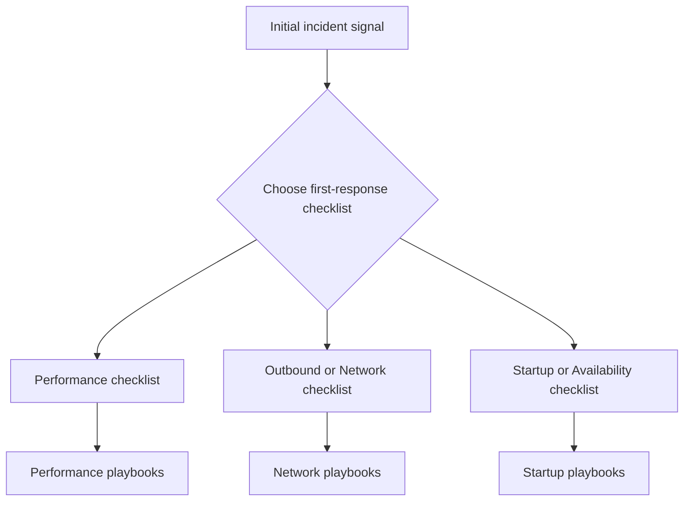
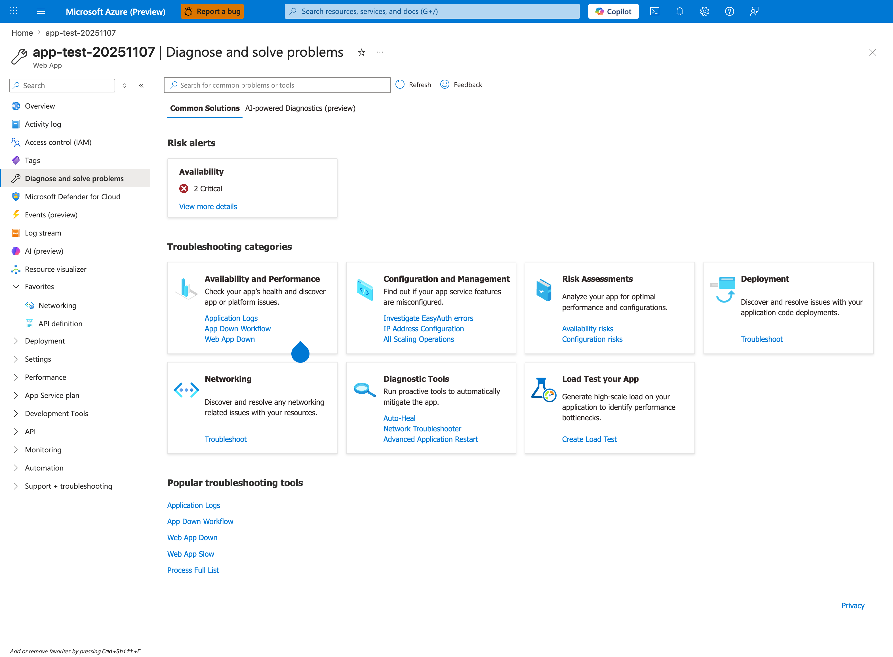

---
content_sources:
  diagrams:
    - id: troubleshooting-first-10-minutes-index-diagram-1
      type: graph
      source: self-generated
      justification: Self-generated troubleshooting diagram synthesized from Microsoft Learn diagnostics and Azure App Service incident guidance for this guide.
      based_on:
        - https://learn.microsoft.com/en-us/azure/app-service/troubleshoot-diagnostic-logs
        - https://learn.microsoft.com/en-us/azure/app-service/troubleshoot-http-502-http-503
---
# Checklists

Fast triage guides for the first 10 minutes of an investigation.

These checklists help you quickly narrow down the problem category and identify which playbook to follow for deeper analysis.

<!-- diagram-id: troubleshooting-first-10-minutes-index-diagram-1 -->

```mermaid
graph TD
    A[Initial incident signal] --> B{Choose first-response checklist}
    B --> C[Performance checklist]
    B --> D[Outbound or Network checklist]
    B --> E[Startup or Availability checklist]
    C --> F[Performance playbooks]
    D --> G[Network playbooks]
    E --> H[Startup playbooks]
```

| Checklist | When to Use |
|-----------|-------------|
| [Performance](performance.md) | Slow responses, high latency, elevated error rates |
| [Outbound / Network](outbound-network.md) | Outbound connection failures, DNS issues, SNAT |
| [Startup / Availability](startup-availability.md) | Container won't start, site down, deployment failures |

## Portal views

Each checklist row above has a corresponding entry surface in the Azure Portal. The following blades render rows that overlap with the checklist's "When to Use" wording without leaving the Portal navigation.

### Portal view: Startup / Availability checklist

Purpose: Show the Portal entry point to the App Service detectors.

Look for: The `Troubleshooting categories` cards, such as `Availability and Performance`, and the search box.

Expected result: Choose the category that matches the symptom to open its detectors.

**[Observed]** `app-test-20251107 | Diagnose and solve problems` `Web App` `Search for common problems or tools` `Refresh` `Feedback` `Common Solutions` `AI-powered Diagnostics (preview)` `Risk alerts` `Availability` `2 Critical` `View more details` `Troubleshooting categories` `Availability and Performance` `Check your app's health and discover app or platform issues.` `Application Logs` `App Down Workflow` `Web App Down` `Configuration and Management` `Find out if your app service features are misconfigured.` `Investigate EasyAuth errors` `IP Address Configuration` `All Scaling Operations` `Risk Assessments` `Analyze your app for optimal performance and configurations.` `Availability risks` `Configuration risks` `Deployment` `Discover and resolve issues with your application code deployments.` `Troubleshoot` `Networking` `Discover and resolve any networking related issues with your resources.` `Diagnostic Tools` `Run proactive tools to automatically mitigate the app.` `Auto-Heal` `Network Troubleshooter` `Advanced Application Restart` `Load Test your App` `Generate high-scale load on your application to identify performance bottlenecks.` `Create Load Test` `Popular troubleshooting tools` `Application Logs` `App Down Workflow` `Web App Down` `Web App Slow` `Process Full List`.

**[Inferred]** The `Availability and Performance` category card lists the links `Application Logs`, `App Down Workflow`, and `Web App Down`. The `Popular troubleshooting tools` section at the bottom repeats `App Down Workflow` and `Web App Down`, and additionally lists `Web App Slow` and `Process Full List`. These link names are consistent with the topics listed in the [Startup / Availability](startup-availability.md) checklist row above ("Container won't start, site down, deployment failures") and the [Performance](performance.md) checklist row ("Slow responses").

**[Not Proven]** Additional alert detail and detector detail beyond the visible summaries is not shown on this view.

## See Also

- [Performance Checklist](performance.md)
- [Outbound / Network Checklist](outbound-network.md)
- [Startup / Availability Checklist](startup-availability.md)

## Sources

- [Microsoft Learn source 1](https://learn.microsoft.com/en-us/azure/app-service/troubleshoot-diagnostic-logs)
- [Microsoft Learn source 2](https://learn.microsoft.com/en-us/azure/app-service/troubleshoot-http-502-http-503)
