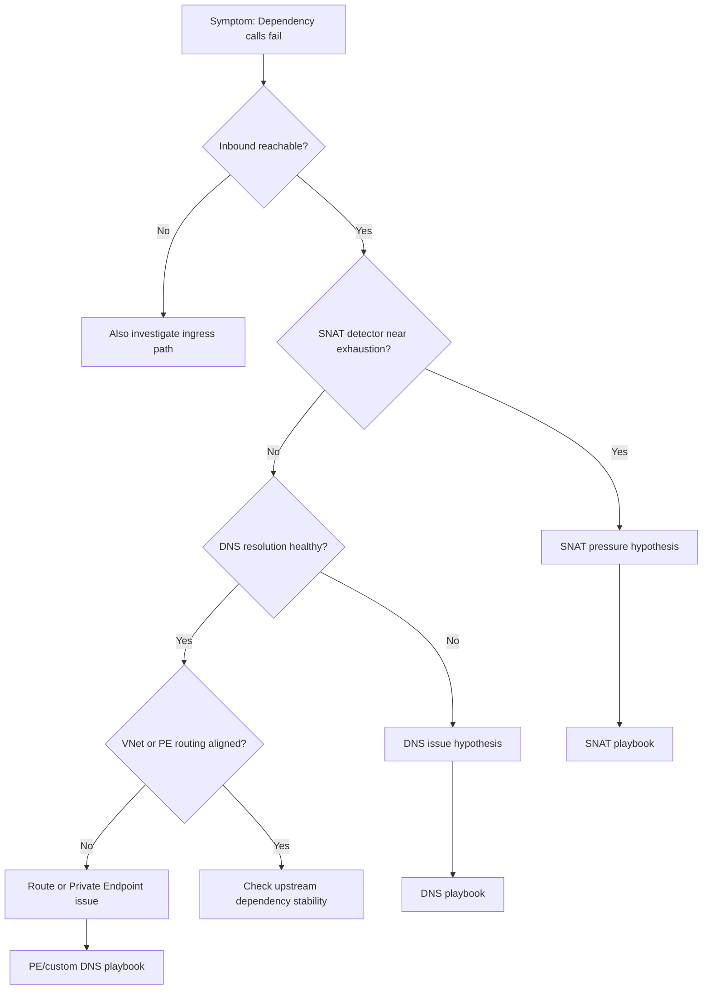

---
hide:
  - toc
---

# First 10 Minutes: Outbound / Network

## Quick Context
Use this checklist when Azure App Service Linux can serve some traffic but fails calling dependencies (timeouts, connection failures, DNS errors). In the first 10 minutes, determine whether the issue is SNAT pressure, DNS resolution, routing/Private Endpoint configuration, or upstream dependency instability.



## Step 1: Classify inbound vs outbound symptom first
Avoid losing time on ingress when the failure is dependency egress.
- Quick check:
    - Inbound issue: clients cannot reach your app endpoint.    - Outbound issue: app endpoint is reachable, but dependency calls fail.- Validate with app logs or synthetic call path.
- Good signal: clear isolation to outbound-only failure.
- Bad signal: mixed signals (both inbound and outbound), requiring parallel checks.

## Step 2: Check SNAT Port Exhaustion detector
SNAT exhaustion is one of the most common App Service Linux outbound failure causes under load.
- Portal path: **App Service -> Diagnose and solve problems -> Availability and Performance -> SNAT Port Exhaustion**
- Good signal: utilization is comfortably below limits during incident.
- Bad signal: near/at exhaustion when failures occur.

## Step 3: Check TCP Connections metric trend
High connection churn with poor reuse often precedes SNAT incidents.
- Portal path: **App Service -> Metrics -> TCP Connections**
- Azure CLI:

```bash
az monitor metrics list --resource "$APP_ID" --metric "TcpConnections" --interval PT1M --aggregation Average Maximum
```

- Good signal: stable connection profile.
- Bad signal: sharp step-ups aligned to timeouts/failures.

## Step 4: Check VNet integration status (if used)
Misconfigured or unhealthy integration causes asymmetric dependency failures.
- Portal path: **App Service -> Networking -> VNet integration**
- Azure CLI:

```bash
az webapp vnet-integration list --resource-group "$RG" --name "$APP_NAME"
```

- Good signal: expected subnet integration and healthy state.
- Bad signal: disconnected/misconfigured integration, wrong subnet, or route mismatch.

## Step 5: Validate DNS resolution from Kudu/SSH
Prove whether failures happen before connect (resolution) or after connect (network/dependency).
- Portal path: **App Service -> Development Tools -> SSH** (or Kudu SSH)
- Commands:

```bash
nslookup <dependency-fqdn>
nslookup <dependency-private-endpoint-fqdn>
```

- Good signal: consistent, expected DNS answer.
- Bad signal: NXDOMAIN, intermittent SERVFAIL, or wrong IP family/target.

## Step 6: Check Private Endpoint + DNS mapping (if applicable)
Private Endpoint without correct DNS zone linkage can silently route to wrong targets.
- Portal path:
    - **Dependency resource -> Networking -> Private endpoint connections**    - **Private DNS zones -> Virtual network links**- Good signal: approved Private Endpoint and correct private DNS zone links.
- Bad signal: pending/rejected endpoint, missing DNS link, or public IP resolution when private expected.

## Step 7: Check NAT Gateway attachment and health (if applicable)
If NAT Gateway is expected but not applied, outbound behavior may differ from design.
- Portal path: **VNet -> Subnets -> <integration subnet> -> NAT Gateway**
- Azure CLI:

```bash
az network vnet subnet show --resource-group "$RG" --vnet-name "$VNET_NAME" --name "$SUBNET_NAME"
```

- Good signal: correct NAT Gateway association and healthy outbound path.
- Bad signal: no NAT association when expected, or wrong subnet association.

## Step 8: Confirm timeout/error signatures in console logs
Use log signatures to separate DNS, connect, and upstream timeout patterns.
- KQL:

```kql
AppServiceConsoleLogs
| where TimeGenerated > ago(1h)
| where ResultDescription has_any ("timeout", "timed out", "ENOTFOUND", "Name or service not known", "connection refused", "ECONNRESET")
| project TimeGenerated, ResultDescription
| order by TimeGenerated desc
```

- Good signal: no concentrated outbound error pattern.
- Bad signal: repeated DNS or connect-timeout errors in incident window.

## Decision Points
After these checks, you should be able to:
- Narrow to 1-2 hypotheses:
    - **SNAT pressure**: detector + TCP connection trend support exhaustion    - **DNS issue**: nslookup failures or wrong resolution path    - **Route/Private Endpoint issue**: VNet/PE/DNS zone mismatch- Choose next playbook:
    - SNAT -> connection reuse/SNAT playbook    - DNS -> DNS resolution playbook    - Route/PE -> Private Endpoint and custom DNS playbook
## Next Steps
- [SNAT or Application Issue?](../playbooks/outbound-network/snat-or-application-issue.md)
- [DNS Resolution (VNet-Integrated)](../playbooks/outbound-network/dns-resolution-vnet-integrated-app-service.md)
- [Private Endpoint / Custom DNS Confusion](../playbooks/outbound-network/private-endpoint-custom-dns-route-confusion.md)

## See Also

- [SNAT or Application Issue](../playbooks/outbound-network/snat-or-application-issue.md)
- [DNS Resolution (VNet-integrated App Service)](../playbooks/outbound-network/dns-resolution-vnet-integrated-app-service.md)

## Sources

- [Troubleshoot outbound connection errors in Azure App Service](https://learn.microsoft.com/en-us/azure/app-service/troubleshoot-intermittent-outbound-connection-errors)
- [Azure App Service networking features](https://learn.microsoft.com/en-us/azure/app-service/networking-features)
- [Azure App Service diagnostics overview](https://learn.microsoft.com/en-us/azure/app-service/overview-diagnostics)
