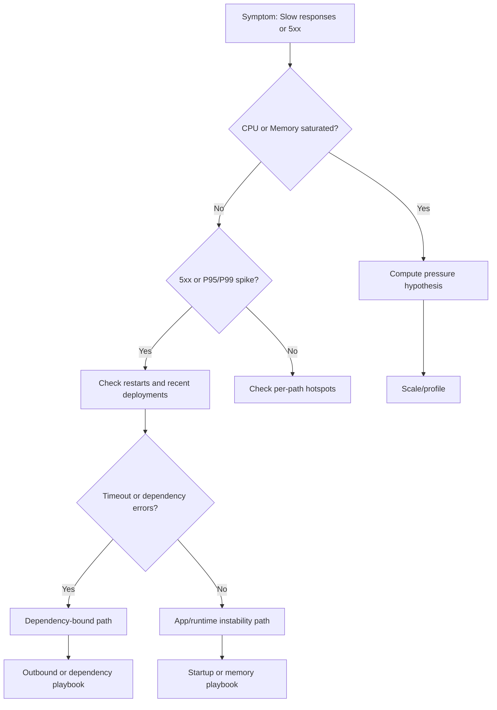

---
hide:
  - toc
content_sources:
  diagrams:
    - id: troubleshooting-first-10-minutes-performance-diagram-1
      type: graph
      source: self-generated
      justification: "Self-generated troubleshooting diagram synthesized from Microsoft Learn diagnostics and Azure App Service incident guidance for this guide."
      based_on:
        - https://learn.microsoft.com/en-us/azure/app-service/troubleshoot-diagnostic-logs
        - https://learn.microsoft.com/en-us/azure/app-service/troubleshoot-http-502-http-503
---
# First 10 Minutes: Performance

## Quick Context
Use this checklist when users report slow responses, intermittent 5xx, or throughput drops on Azure App Service Linux. In the first 10 minutes, establish whether the primary pressure is compute (CPU/memory), app/runtime instability (restarts/deployments), or dependency/network latency.

<!-- diagram-id: troubleshooting-first-10-minutes-performance-diagram-1 -->


## Step 1: Check App Service Plan CPU and Memory saturation first
Start with platform resource pressure because it can invalidate all app-level conclusions.
- Portal path: **App Service Plan -> Metrics -> Add metric: CPU Percentage, Memory Percentage** (scope by instance if available)
- Azure CLI:

```bash
az monitor metrics list --resource "$APP_SERVICE_PLAN_ID" --metric "CpuPercentage" "MemoryPercentage" --interval PT1M --aggregation Average
```

- Good signal: CPU and memory mostly stable, no sustained saturation during incident.
- Bad signal: CPU consistently above ~80-90% or memory high/flat with no recovery.

## Step 2: Check HTTP error-rate spike (5xx)
Confirm whether performance complaints are tied to server-side failures.
- KQL (Log Analytics):

```kql
AppServiceHTTPLogs
| where TimeGenerated > ago(1h)
| summarize Total=count(), Errors5xx=countif(ScStatus >= 500), ErrorRate=100.0 * countif(ScStatus >= 500) / count() by bin(TimeGenerated, 5m)
| order by TimeGenerated asc
```

- Good signal: 5xx rate near baseline, no sustained spike.
- Bad signal: sharp 5xx rise aligned with latency complaints.

## Step 3: Check response-time distribution (P50/P95/P99)
Average latency can hide tail-impact incidents.
- KQL:

```kql
AppServiceHTTPLogs
| where TimeGenerated > ago(1h)
| summarize P50=percentile(TimeTaken, 50), P95=percentile(TimeTaken, 95), P99=percentile(TimeTaken, 99), Count=count() by bin(TimeGenerated, 5m)
| render timechart
```

- Good signal: P95/P99 proportional and stable.
- Bad signal: P99 diverges sharply while P50 stays normal (queueing/contention/dependency symptoms).

## Step 4: Check recent restart activity
Restarts can look like random latency/error bursts.
- KQL:

```kql
AppServicePlatformLogs
| where TimeGenerated > ago(6h)
| where OperationName has_any ("restart", "Restart", "ContainerRestart", "stop", "start", "fail")
| project TimeGenerated, OperationName, ContainerId
| order by TimeGenerated desc
```

- Good signal: no restart cluster during incident window.
- Bad signal: frequent restart/start-fail loop matching error spikes.

## Step 5: Check recent deployments or config changes
Many regressions begin right after image/config updates.
- Portal path: **App Service -> Deployment Center -> Logs** and **App Service -> Configuration -> Last modified**
- Azure CLI examples:

```bash
az webapp deployment list-publishing-profiles --resource-group "$RG" --name "$APP_NAME"
az webapp config appsettings list --resource-group "$RG" --name "$APP_NAME"
```

- Good signal: no impactful change near incident start.
- Bad signal: incident starts immediately after deployment or critical setting change.

## Step 6: Check SNAT Port Exhaustion detector
Performance incidents often mask outbound connection pressure.
- Portal path: **App Service -> Diagnose and solve problems -> Availability and Performance -> SNAT Port Exhaustion**
- Good signal: detector does not show near-exhaustion during incident.
- Bad signal: near/at exhaustion with corresponding timeout growth.

## Step 7: Check dependency health and timeout signatures
Differentiate app compute pressure from downstream dependency slowness.
- If Application Insights exists: inspect dependency duration/failure trend in the same time window.
- If not, query console timeout patterns:

```kql
AppServiceConsoleLogs
| where TimeGenerated > ago(1h)
| where ResultDescription has_any ("timeout", "timed out", "connection refused", "ENOTFOUND", "ECONNRESET")
| project TimeGenerated, ResultDescription
| order by TimeGenerated desc
```

- Good signal: no dependency timeout burst.
- Bad signal: repeated downstream timeout/connection errors aligned with latency spikes.

## Step 8: Correlate per-path hotspots quickly
Identify whether a small set of endpoints is driving the incident.
- KQL:

```kql
AppServiceHTTPLogs
| where TimeGenerated > ago(1h)
| summarize AvgTime=avg(TimeTaken), P95=percentile(TimeTaken, 95), Count=count(), Errors5xx=countif(ScStatus >= 500) by CsUriStem
| top 20 by P95 desc
```

- Good signal: no single path dominates tail latency.
- Bad signal: specific endpoints show extreme P95/P99 or elevated 5xx.

## Decision Points
After these checks, you should be able to:
- Narrow to 1-2 hypotheses:
    - **CPU-bound**: sustained CPU saturation with broad latency increase    - **Memory-bound**: high memory pressure plus restart/worker degradation patterns    - **Dependency-bound**: timeout-heavy console/dependency signals with normal CPU- Select immediate direction:
    - CPU-bound -> scale up and profile hot paths    - Dependency-bound -> dependency/network playbook    - Memory-bound -> memory pressure playbook
## Next Steps
- [Slow Response but Low CPU](../playbooks/performance/slow-response-but-low-cpu.md)
- [Memory Pressure & Worker Degradation](../playbooks/performance/memory-pressure-and-worker-degradation.md)
- [Intermittent 5xx Under Load](../playbooks/performance/intermittent-5xx-under-load.md)
- [SNAT or Application Issue?](../playbooks/outbound-network/snat-or-application-issue.md)

## See Also

- [Slow Response but Low CPU](../playbooks/performance/slow-response-but-low-cpu.md)
- [Latency Trend by Status Code](../kql/http/latency-trend-by-status-code.md)

## Sources

- [Troubleshoot slow app performance in Azure App Service](https://learn.microsoft.com/en-us/azure/app-service/troubleshoot-performance-degradation)
- [Monitor Azure App Service](https://learn.microsoft.com/en-us/azure/app-service/monitor-app-service)
- [Azure App Service diagnostics overview](https://learn.microsoft.com/en-us/azure/app-service/overview-diagnostics)
