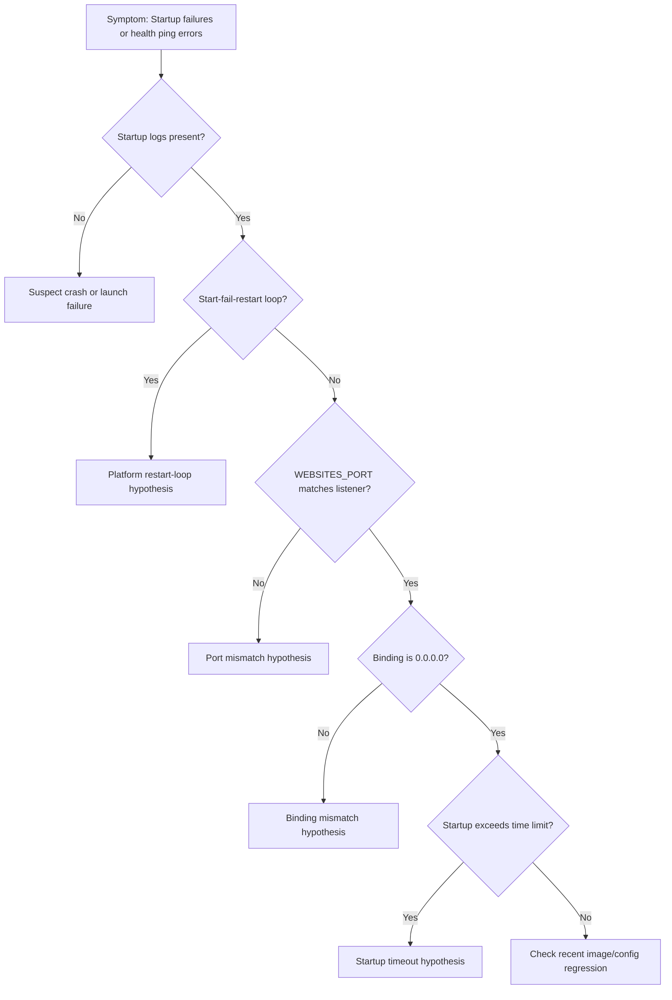

---
hide:
  - toc
content_validation:
  status: verified
  last_reviewed: "2026-04-12"
  reviewer: ai-agent
  core_claims:
    - claim: "Health check pings a path that you choose on all instances of an App Service app at 1-minute intervals."
      source: "https://learn.microsoft.com/azure/app-service/monitor-instances-health-check"
      verified: true
    - claim: "If an instance doesn't return a 200-299 response after repeated failed health checks, App Service marks it unhealthy and removes it from the load balancer."
      source: "https://learn.microsoft.com/azure/app-service/monitor-instances-health-check"
      verified: true
content_sources:
  diagrams:
    - id: troubleshooting-first-10-minutes-startup-availability-diagram-1
      type: graph
      source: self-generated
      justification: "Self-generated troubleshooting diagram synthesized from Microsoft Learn diagnostics and Azure App Service incident guidance for this guide."
      based_on:
        - https://learn.microsoft.com/en-us/azure/app-service/troubleshoot-diagnostic-logs
        - https://learn.microsoft.com/en-us/azure/app-service/troubleshoot-http-502-http-503
---
# First 10 Minutes: Startup / Availability

## Quick Context
Use this checklist when an Azure App Service Linux app does not come up cleanly after deployment/restart, returns startup-related 5xx, or fails health pings. In the first 10 minutes, establish whether this is a startup crash, wrong port/binding, startup timeout, or recent image/config regression.

<!-- diagram-id: troubleshooting-first-10-minutes-startup-availability-diagram-1 -->


## Step 1: Check AppServiceConsoleLogs for startup output
First question: is the containerized app producing any startup logs at all?
- KQL:

```kql
AppServiceConsoleLogs
| where TimeGenerated > ago(1h)
| project TimeGenerated, ResultDescription
| order by TimeGenerated desc
```

- Good signal: clear startup sequence logs (framework boot, server start, listening message).
- Bad signal: no output, repeated fatal exceptions, or immediate process exits.

## Step 2: Check platform events for container start/fail loop
Platform logs confirm if App Service can start and keep the container alive.
- KQL:

```kql
AppServicePlatformLogs
| where TimeGenerated > ago(6h)
| where OperationName has_any ("Container", "start", "Start", "fail", "Fail", "restart", "Restart")
| project TimeGenerated, OperationName, ContainerId
| order by TimeGenerated desc
```

- Good signal: normal start with no immediate fail/restart cycle.
- Bad signal: rapid start-fail-restart patterns.

## Step 3: Verify WEBSITES_PORT matches actual listener port
App Service health pings fail if platform expects a different port than the app listens on.
- Portal path: **App Service -> Configuration -> Application settings -> WEBSITES_PORT**
- CLI:

```bash
az webapp config appsettings list --resource-group "$RG" --name "$APP_NAME"
```

- Good signal: WEBSITES_PORT equals app server listen port.
- Bad signal: mismatch (for example app listens on 8080, WEBSITES_PORT is 8000).

## Step 4: Verify binding address is 0.0.0.0 (not 127.0.0.1)
Binding to loopback prevents App Service front-end probe from reaching the process.
- Check startup logs for bind/listen line.
- Common bad pattern: `Listening on 127.0.0.1:<port>`.
- Good signal: `0.0.0.0:<port>` listener.
- Bad signal: loopback-only bind.

## Step 5: Check WEBSITES_CONTAINER_START_TIME_LIMIT
Large images, migrations, or cold startup overhead can exceed default timeout.
- Portal path: **App Service -> Configuration -> Application settings -> WEBSITES_CONTAINER_START_TIME_LIMIT**
- CLI:

```bash
az webapp config appsettings list --resource-group "$RG" --name "$APP_NAME" --query "[?name=='WEBSITES_CONTAINER_START_TIME_LIMIT']"
```

- Good signal: timeout value fits startup profile.
- Bad signal: container initialization consistently exceeds limit.

## Step 6: Check recent image/config changes
Confirm if failure started after deployment, base image update, or setting change.
- Portal path: **Deployment Center -> Logs** and **Configuration -> Last modified**
- CLI examples:

```bash
az webapp config container show --resource-group "$RG" --name "$APP_NAME"
az webapp deployment source show --resource-group "$RG" --name "$APP_NAME"
```

- Good signal: no risky change near first failure timestamp.
- Bad signal: issue starts immediately after image tag/config update.

## Step 7: SSH into container and verify process state
Direct process check quickly distinguishes crash-loop from healthy process with routing issue.
- Portal path: **App Service -> Development Tools -> SSH**
- Commands inside container:

```bash
ps -ef
ss -lntp
```

- Good signal: expected app process running and listening on configured port/address.
- Bad signal: no app process, repeated exits, or wrong listen socket.

## Step 8: Pull startup error signatures from console logs
Extract concrete crash reasons to choose the next deep-dive playbook.
- KQL:

```kql
AppServiceConsoleLogs
| where TimeGenerated > ago(1h)
| where ResultDescription has_any ("error", "exception", "failed", "traceback", "EADDRINUSE", "address already in use")
| project TimeGenerated, ResultDescription
| order by TimeGenerated desc
```

- Good signal: no repeated fatal startup signatures.
- Bad signal: repeatable stack traces or bind errors explaining startup failure.

## Decision Points
After these checks, you should be able to:
- Narrow to 1-2 hypotheses:
    - **Port mismatch** -> fix WEBSITES_PORT or app listen port    - **Binding mismatch** -> bind to `0.0.0.0`    - **Startup timeout** -> increase time limit and reduce startup work    - **Crash on boot** -> investigate stack trace/runtime dependency error- Select immediate corrective path before full deep dive.

## Next Steps
- [Container Didn't Respond to HTTP Pings](../playbooks/startup-availability/container-didnt-respond-to-http-pings.md)
- [Warm-up vs Health Check](../playbooks/startup-availability/warmup-vs-health-check.md)
- [Slot Swap Failed During Warm-up](../playbooks/startup-availability/slot-swap-failed-during-warmup.md)

## See Also

- [Container Didn't Respond to HTTP Pings](../playbooks/startup-availability/container-didnt-respond-to-http-pings.md)
- [Startup Errors](../kql/console/startup-errors.md)

## Sources

- [Configure a custom container for Azure App Service](https://learn.microsoft.com/en-us/azure/app-service/configure-custom-container)
- [Enable diagnostic logging for apps in Azure App Service](https://learn.microsoft.com/en-us/azure/app-service/troubleshoot-diagnostic-logs)
- [Azure App Service diagnostics overview](https://learn.microsoft.com/en-us/azure/app-service/overview-diagnostics)
