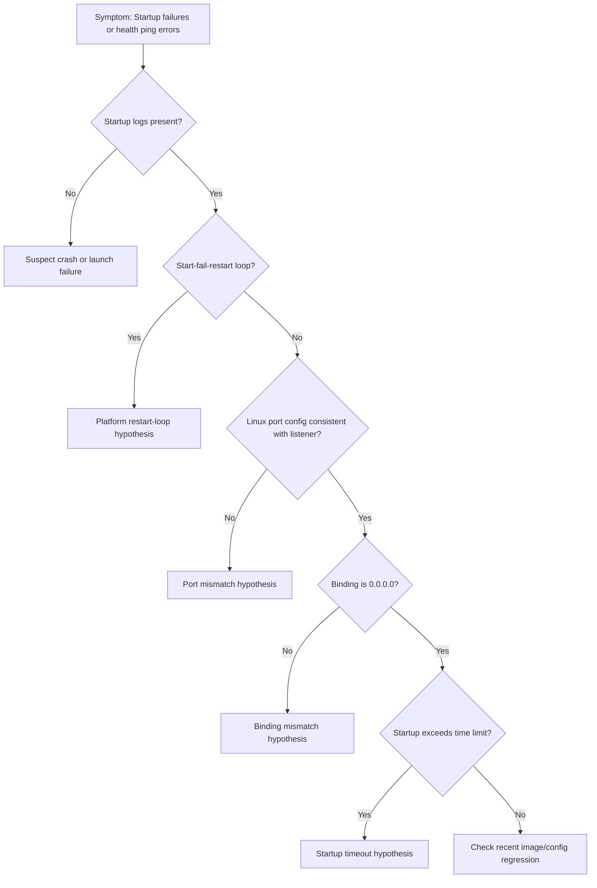

---
content_validation:
  status: verified
  last_reviewed: "2026-04-12"
  reviewer: agent
  core_claims:
    - claim: "Health check pings a path that you choose on all instances of an App Service app at 1-minute intervals."
      source: "https://learn.microsoft.com/en-us/azure/app-service/monitor-instances-health-check"
      verified: true
    - claim: "If an instance doesn't return a 200-299 response after repeated failed health checks, App Service marks it unhealthy and removes it from the load balancer."
      source: "https://learn.microsoft.com/en-us/azure/app-service/monitor-instances-health-check"
      verified: true
content_sources:
  diagrams:
    - id: troubleshooting-first-10-minutes-startup-availability-diagram-1
      type: graph
      source: self-generated
      justification: "Self-generated troubleshooting diagram synthesized from Microsoft Learn diagnostics and Azure App Service incident guidance for this guide."
      based_on:
        - https://learn.microsoft.com/en-us/azure/app-service/troubleshoot-diagnostic-logs
        - https://learn.microsoft.com/en-us/azure/app-service/troubleshoot-http-502-http-503
---
# First 10 Minutes: Startup / Availability

## Quick Context
Use this checklist when an Azure App Service Linux app does not come up cleanly after deployment/restart, returns startup-related 5xx, or fails health pings. In the first 10 minutes, establish whether this is a startup crash, wrong port/binding, startup timeout, or recent image/config regression.

<!-- diagram-id: troubleshooting-first-10-minutes-startup-availability-diagram-1 -->

```mermaid
graph TD
    A[Symptom: Startup failures or health ping errors] --> B{Startup logs present?}
    B -- No --> C[Suspect crash or launch failure]
    B -- Yes --> D{Start-fail-restart loop?}
    D -- Yes --> E[Platform restart-loop hypothesis]
    D -- No --> F{Linux port config consistent with listener?}
    F -- No --> G[Port mismatch hypothesis]
    F -- Yes --> H{Binding is 0.0.0.0?}
    H -- No --> I[Binding mismatch hypothesis]
    H -- Yes --> J{Startup exceeds time limit?}
    J -- Yes --> K[Startup timeout hypothesis]
    J -- No --> L[Check recent image/config regression]
```

## Step 1: Check AppServiceConsoleLogs for startup output
First question: is the containerized app producing any startup logs at all?

#### Portal view: Web App Down detector confirms the availability symptom

![Web App Down detector blade under Diagnose and solve problems for app-test-20251107 | Availability and Performance. The left navigation lists detectors including Overview (selected), Application Changes, Application Logs, Container Issues, CPU Usage, Health Check feature, Http 4xx errors, Linux - Host Disk Space Usage, Linux - Number of Running Containers, Linux CPU Drill Down, Linux Memory Drill Down, Linux Swap Space Low, Memory Usage, Process Full List, Process List, Site Status History, SNAT Failed Connection Endpoints, SNAT Port Exhaustion, TCP Connections, Testing in Production (TIP), Web App Down (highlighted), Web App Restarted, Web App Slow, Web App Troubleshooter, and App Down Workflow. The top toolbar has a Search box, AI-powered Diagnostics (preview), Refresh, Feedback, and Get Resiliency Score report. The detector body shows the title Web App Down - Investigate common issues with Linux and containerized apps that are having availability issues or experiencing downtime, two filter pills Time Range (UTC): Last 24 Hours and Downtime(UTC): Drag and select a time window on the graph, a Troubleshoot App Performance and Availability section, and a View Availability dropdown on the right. The availability chart shows App Availability (blue) and Platform Availability (green) at 100% across the full 24-hour window from 06-06 14:00 to 06-07 12:00, with an Organic SLA of 100% and the message No downtimes were identified between 06-Jun-26 01:15 PM UTC and 07-Jun-26 01:00 PM UTC.](../../assets/troubleshooting/diagnose-and-solve/02-detector-web-app-down.png)

Before running the KQL query below, confirm the symptom is observable from the platform's perspective using the `Web App Down` detector. The `App Availability` and `Platform Availability` lines distinguish your app's HTTP availability from the platform infrastructure — when `App Availability` drops but `Platform Availability` stays at 100%, the failure is in your container or code, not the App Service platform. The `Drag and select a time window on the graph` action runs the full availability diagnostic against the selected window and surfaces correlated detector results. When `Organic SLA: 100%` and the chart is flat, the symptom has not been observed by the platform yet — proceed to the console logs below to look for in-progress startup failures.

- KQL:

```kql
AppServiceConsoleLogs
| where TimeGenerated > ago(1h)
| project TimeGenerated, ResultDescription
| order by TimeGenerated desc
```

#### Portal view: Log stream for real-time startup output

![Log stream blade for app-test-20251107 Web App with command bar buttons Log Level, Stop, Copy, and Clear. The Logs radio selector has Runtime selected and Platform unselected. The Instances dropdown shows a single worker instance and the Lookback period is set to Last 30 minutes. The streaming console pane shows live INFO-level entries from azure.core.pipeline.policies.http_logging_policy with Request URL https://koreacentral-0.in.applicationinsights.azure.com//v2.1/track, Request method POST, request and response headers (Content-Type application/json, Content-Length, Accept, Server Microsoft-HTTPAPI/2.0), x-ms-client-request-id 00000000-0000-0000-0000-000000000000, and Transmission succeeded Item received 3 Items accepted 3 confirmations.](../../assets/troubleshooting/log-stream/01-log-stream.png)

The Log stream blade is the real-time complement to the historical KQL query above and the fastest way to confirm whether the container is producing any startup output at all. The `Runtime` radio captures stdout/stderr from your application — this is where Python tracebacks, Node.js `Error: listen EADDRINUSE`, and Java `BindException` appear within seconds of restart. The `Platform` radio shows App Service platform messages (container lifecycle, health probe results). If Log stream is silent during a restart cycle, the container is failing before any logging framework initializes — proceed to Step 2 to check platform events. The `az webapp log tail` CLI below produces the same stream without browser-side UI lag.

- Good signal: clear startup sequence logs (framework boot, server start, listening message).
- Bad signal: no output, repeated fatal exceptions, or immediate process exits.

## Step 2: Check platform events for container start/fail loop
Platform logs confirm if App Service can start and keep the container alive.
- KQL:

```kql
AppServicePlatformLogs
| where TimeGenerated > ago(6h)
| where OperationName has_any ("Container", "start", "Start", "fail", "Fail", "restart", "Restart")
| project TimeGenerated, OperationName, ContainerId
| order by TimeGenerated desc
```

- Good signal: normal start with no immediate fail/restart cycle.
- Bad signal: rapid start-fail-restart patterns.

## Step 3: Verify Linux port configuration against the actual listener
For Linux custom containers, startup reachability is more nuanced than a simple `WEBSITES_PORT` mismatch model. Check the actual listener together with both `WEBSITES_PORT` and the runtime-injected `PORT` value. See [Container HTTP Pings Lab](../lab-guides/container-http-pings.md) for experimental evidence on Linux port behavior.
- Portal path: **App Service -> Configuration -> Application settings -> WEBSITES_PORT**
- CLI:

```bash
az webapp config appsettings list --resource-group "$RG" --name "$APP_NAME"
```

| Command | Purpose |
|---------|---------|
| `az webapp config appsettings list --resource-group "$RG" --name "$APP_NAME"` | Lists the app settings currently applied to this web app so you can inspect runtime or deployment configuration. |
| `--resource-group "$RG" --name "$APP_NAME"` | Looks up the resource in this resource group. |
| `--name "$APP_NAME"` | Targets this web app. |

- Good signal: the app binds to `0.0.0.0` on the port App Service exposes through `PORT`, and any configured `WEBSITES_PORT` does not contradict that listener.
- Bad signal: logs show a different port or localhost-only binding than the effective Linux startup path can reach.

## Step 4: Verify binding address is 0.0.0.0 (not 127.0.0.1)
Binding to loopback prevents App Service front-end probe from reaching the process.
- Check startup logs for bind/listen line.
- Common bad pattern: `Listening on 127.0.0.1:<port>`.
- Good signal: `0.0.0.0:<port>` listener.
- Bad signal: loopback-only bind.

## Step 5: Check WEBSITES_CONTAINER_START_TIME_LIMIT
Large images, migrations, or cold startup overhead can exceed default timeout.
- Portal path: **App Service -> Configuration -> Application settings -> WEBSITES_CONTAINER_START_TIME_LIMIT**
- CLI:

```bash
az webapp config appsettings list --resource-group "$RG" --name "$APP_NAME" --query "[?name=='WEBSITES_CONTAINER_START_TIME_LIMIT']"
```

| Command | Purpose |
|---------|---------|
| `az webapp config appsettings list --resource-group "$RG" --name "$APP_NAME" --query "[?name=='WEBSITES_CONTAINER_START_TIME_LIMIT']"` | Lists only the `WEBSITES_CONTAINER_START_TIME_LIMIT` app setting so you can compare startup tolerance with observed startup time. |
| `--resource-group "$RG" --name "$APP_NAME" --query "[?name=='WEBSITES_CONTAINER_START_TIME_LIMIT']"` | Looks up the resource in this resource group. |
| `--name "$APP_NAME" --query "[?name=='WEBSITES_CONTAINER_START_TIME_LIMIT']"` | Targets this web app. |
| `--query "[?name=='WEBSITES_CONTAINER_START_TIME_LIMIT']"` | Filters the app-settings list to the `WEBSITES_CONTAINER_START_TIME_LIMIT` entry only. |

- Good signal: timeout value fits startup profile.
- Bad signal: container initialization consistently exceeds limit.

## Step 6: Check recent image/config changes
Confirm if failure started after deployment, base image update, or setting change.
- Portal path: **Deployment Center -> Logs** and **Configuration -> Last modified**
- CLI examples:

```bash
az webapp config container show --resource-group "$RG" --name "$APP_NAME"
az webapp deployment source show --resource-group "$RG" --name "$APP_NAME"
```

| Command | Purpose |
|---------|---------|
| `az webapp config container show --resource-group "$RG" --name "$APP_NAME"` | Shows the current container image configuration so you can verify image/tag/source details involved in startup behavior. |
| `--resource-group "$RG" --name "$APP_NAME"` | Looks up the resource in this resource group. |
| `--name "$APP_NAME"` | Targets this web app. |
| `az webapp deployment source show --resource-group "$RG" --name "$APP_NAME"` | Shows the configured deployment source so you can confirm how this app is being deployed. |
| `--resource-group "$RG" --name "$APP_NAME"` | Looks up the resource in this resource group. |
| `--name "$APP_NAME"` | Targets this web app. |

- Good signal: no risky change near first failure timestamp.
- Bad signal: issue starts immediately after image tag/config update.

## Step 7: SSH into container and verify process state
Direct process check quickly distinguishes crash-loop from healthy process with routing issue.
- Portal path: **App Service -> Development Tools -> SSH**
- Commands inside container:

```bash
ps -ef
ss -lntp
```

- Good signal: expected app process running and listening on configured port/address.
- Bad signal: no app process, repeated exits, or wrong listen socket.

## Step 8: Pull startup error signatures from console logs
Extract concrete crash reasons to choose the next deep-dive playbook.
- KQL:

```kql
AppServiceConsoleLogs
| where TimeGenerated > ago(1h)
| where ResultDescription has_any ("error", "exception", "failed", "traceback", "EADDRINUSE", "address already in use")
| project TimeGenerated, ResultDescription
| order by TimeGenerated desc
```

- Good signal: no repeated fatal startup signatures.
- Bad signal: repeatable stack traces or bind errors explaining startup failure.

## Decision Points
After these checks, you should be able to:
- Narrow to 1-2 hypotheses:
    - **Port/listener contract issue** -> verify `PORT`, `WEBSITES_PORT`, and actual bind behavior together
    - **Binding mismatch** -> bind to `0.0.0.0`
    - **Startup timeout** -> increase time limit and reduce startup work
    - **Crash on boot** -> investigate stack trace/runtime dependency error
    - Select immediate corrective path before full deep dive.

## Next Steps
- [Container Didn't Respond to HTTP Pings](../playbooks/startup-availability/container-didnt-respond-to-http-pings.md)
- [Warm-up vs Health Check](../playbooks/startup-availability/warmup-vs-health-check.md)
- [Slot Swap Failed During Warm-up](../playbooks/startup-availability/slot-swap-failed-during-warmup.md)

## See Also

- [Container Didn't Respond to HTTP Pings](../playbooks/startup-availability/container-didnt-respond-to-http-pings.md)
- [Startup Errors](../kql/console/startup-errors.md)

## Sources

- [Configure a custom container for Azure App Service](https://learn.microsoft.com/en-us/azure/app-service/configure-custom-container)
- [Enable diagnostic logging for apps in Azure App Service](https://learn.microsoft.com/en-us/azure/app-service/troubleshoot-diagnostic-logs)
- [Azure App Service diagnostics overview](https://learn.microsoft.com/en-us/azure/app-service/overview-diagnostics)
