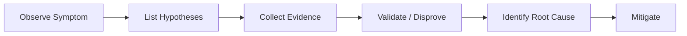

# App Service OSS Troubleshooting

A hypothesis-driven troubleshooting guide for Azure App Service OSS workloads.

---

## What This Is

A practical field guide for troubleshooting real-world issues on Azure App Service Linux.

This is **not** a general Azure tutorial. It is designed to help engineers move from **symptom** to **validated interpretation** faster.

## How It Works

Every playbook follows this flow:

1. **Start from the symptom** — what the engineer actually observes
2. **List competing hypotheses** — multiple plausible causes
3. **Collect evidence** — metrics, logs, detectors, configuration
4. **Validate or disprove** each hypothesis with specific signals
5. **Identify the most likely root cause** pattern
6. **Apply mitigations** — immediate and long-term

## Topics

### Performance
- [Slow Response but Low CPU](playbooks/performance/slow-response-but-low-cpu.md)
- [Memory Pressure & Worker Degradation](playbooks/performance/memory-pressure-and-worker-degradation.md)
- [Intermittent 5xx Under Load](playbooks/performance/intermittent-5xx-under-load.md)
- [No Space Left on Device](playbooks/performance/no-space-left-on-device.md)
- [Slow Start / Cold Start](playbooks/performance/slow-start-cold-start.md)

### Outbound / Network
- [SNAT or Application Issue?](playbooks/outbound-network/snat-or-application-issue.md)
- [DNS Resolution (VNet-Integrated)](playbooks/outbound-network/dns-resolution-vnet-integrated-app-service.md)
- [Private Endpoint / Custom DNS Confusion](playbooks/outbound-network/private-endpoint-custom-dns-route-confusion.md)

### Startup / Availability
- [Container Didn't Respond to HTTP Pings](playbooks/startup-availability/container-didnt-respond-to-http-pings.md)
- [Warm-up vs Health Check](playbooks/startup-availability/warmup-vs-health-check.md)
- [Slot Swap Failed During Warm-up](playbooks/startup-availability/slot-swap-failed-during-warmup.md)
- [Deployment Succeeded but Startup Failed](playbooks/startup-availability/deployment-succeeded-startup-failed.md)
- [Failed to Forward Request](playbooks/startup-availability/failed-to-forward-request.md)
- [Slot Swap Config Drift](playbooks/startup-availability/slot-swap-config-drift.md)

## Quick Start

| Need | Start Here |
|------|-----------|
| First 10 minutes of a performance issue | [Performance Checklist](first-10-minutes/performance.md) |
| First 10 minutes of a network issue | [Network Checklist](first-10-minutes/outbound-network.md) |
| First 10 minutes of a startup failure | [Startup Checklist](first-10-minutes/startup-availability.md) |
| Reusable KQL queries | [Query Library](kql/index.md) |

## Hands-on Labs

Deploy reproduction environments to your Azure subscription and observe real symptoms:

- [Memory Pressure](lab-guides/memory-pressure.md)
- [Intermittent 5xx Under Load](lab-guides/intermittent-5xx.md)
- [Container HTTP Pings](lab-guides/container-http-pings.md)
- [SNAT Exhaustion](lab-guides/snat-exhaustion.md)
- [DNS Resolution (VNet)](lab-guides/dns-vnet-resolution.md)
- [No Space Left on Device](lab-guides/no-space-left-on-device.md)
- [Deployment Succeeded but Startup Failed](lab-guides/deployment-succeeded-startup-failed.md)
- [Failed to Forward Request](lab-guides/failed-to-forward-request.md)
- [Slot Swap Config Drift](lab-guides/slot-swap-config-drift.md)
- [Slow Start / Cold Start](lab-guides/slow-start-cold-start.md)

## Methodology

- [Troubleshooting Method](methodology/troubleshooting-method.md)
- [Detector Map](methodology/detector-map.md)
