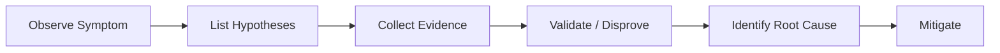
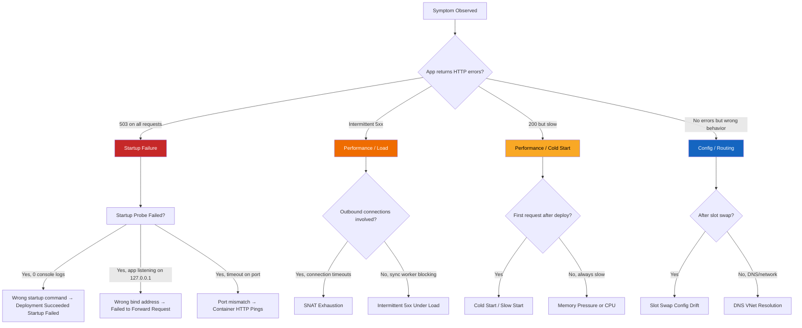

---
hide:
  - toc
content_sources:
  diagrams:
    - id: troubleshooting-index-diagram-1
      type: graph
      source: self-generated
      justification: "Self-generated troubleshooting diagram synthesized from Microsoft Learn diagnostics and Azure App Service incident guidance for this guide."
      based_on:
        - https://learn.microsoft.com/en-us/azure/app-service/troubleshoot-diagnostic-logs
        - https://learn.microsoft.com/en-us/azure/app-service/troubleshoot-http-502-http-503
    - id: troubleshooting-index-diagram-2
      type: graph
      source: self-generated
      justification: "Self-generated troubleshooting diagram synthesized from Microsoft Learn diagnostics and Azure App Service incident guidance for this guide."
      based_on:
        - https://learn.microsoft.com/en-us/azure/app-service/troubleshoot-diagnostic-logs
        - https://learn.microsoft.com/en-us/azure/app-service/troubleshoot-http-502-http-503
---
# App Service OSS Troubleshooting

A hypothesis-driven troubleshooting guide for Azure App Service OSS workloads.

---

## What This Is

A practical field guide for troubleshooting real-world issues on Azure App Service Linux.

This is **not** a general Azure tutorial. It is designed to help engineers move from **symptom** to **validated interpretation** faster.

## How It Works

<!-- diagram-id: troubleshooting-index-diagram-1 -->

Every playbook follows this flow:

1. **Start from the symptom** — what the engineer actually observes
2. **List competing hypotheses** — multiple plausible causes
3. **Collect evidence** — metrics, logs, detectors, configuration
4. **Validate or disprove** each hypothesis with specific signals
5. **Identify the most likely root cause** pattern
6. **Apply mitigations** — immediate and long-term

## Start Here

| Your Situation | Go To |
|---|---|
| First incident, no idea where to start | [Architecture Overview](architecture-overview.md) |
| Need to identify the failure category | [Decision Tree](decision-tree.md) |
| Want 60-second symptom-to-playbook cards | [Quick Diagnosis Cards](quick-diagnosis-cards.md) |
| Want to understand what evidence to collect | [Evidence Map](evidence-map.md) |
| Need a mental framework for diagnosis | [Mental Model](mental-model.md) |
| Already know the symptom category | Jump to [Playbooks](#topics) below |
| Need KQL queries to investigate | [KQL Query Library](kql/index.md) |
| Want hands-on practice | [Labs](#hands-on-labs) below |

## Quick Decision Tree

Use this to route to the right playbook in under 60 seconds:

<!-- diagram-id: troubleshooting-index-diagram-2 -->

## Hosting Mode: Where to Look First

Different hosting modes have different observation points. Use this table to prioritize your investigation:

| Symptom | Linux Code | Linux Container | Windows Code |
|---|---|---|---|
| **Startup fails** | `AppServiceConsoleLogs` — Oryx build output, runtime startup | `AppServiceConsoleLogs` — Docker logs, `ENTRYPOINT`/`CMD` output | Application Event Logs, `WEBSITE_RUN_FROM_PACKAGE` extraction |
| **Wrong port/binding** | Check `--bind` in startup command (Gunicorn, etc.) | Check `WEBSITES_PORT`, `PORT` env var, `EXPOSE` in Dockerfile | Typically auto-configured; check `web.config` for IIS settings |
| **Missing dependencies** | Oryx build logs, `requirements.txt` / `package.json` | Image build logs; dependencies baked into image | NuGet restore logs, MSBuild output |
| **Slow cold start** | Module import time, lazy loading patterns | Image pull time (check image size), container init | Assembly loading, JIT compilation |
| **Memory pressure** | `MemoryWorkingSet` metric, OOM in platform logs | `MemoryWorkingSet`, container memory limits | `MemoryWorkingSet`, w3wp process memory |
| **Outbound timeouts** | SNAT metrics, `AppServiceConsoleLogs` connection errors | Same as Linux Code | SNAT metrics, outbound connection tracking |
| **Config drift after swap** | App Settings sticky slot config | Same as Linux Code | `web.config` transforms, connection strings |
| **Filesystem issues** | `/home` (persistent) vs `/tmp` (ephemeral), `df -h` via SSH | Container filesystem (ephemeral by default), mounted volumes | `D:\home` (persistent) vs `D:\local` (ephemeral) |

!!! tip "Hosting Mode Detection"
    Use `az webapp show --query "kind"` to check hosting mode:
    
    - `app,linux` → Linux Code
    - `app,linux,container` → Linux Container  
    - `app` → Windows Code

!!! warning "Windows-Specific Gaps"
    This guide focuses on Linux workloads. Windows-specific playbooks (IIS configuration, `web.config` issues, Windows containers) are referenced but not exhaustively covered.

## Representative Log Patterns

Quick reference for recognizing common failure signatures:

| Pattern | Indicates | Playbook |
|---|---|---|
| `503` + TimeTaken > 40000ms + 0 console logs | Startup failure — app never ran | [Deployment Succeeded Startup Failed](playbooks/startup-availability/deployment-succeeded-startup-failed.md) |
| Console: `Listening at: http://127.0.0.1:8000` | Wrong bind address | [Failed to Forward Request](playbooks/startup-availability/failed-to-forward-request.md) |
| `499` + TimeTaken ~5000ms on `/slow` endpoints | Client timeout, sync worker blocking | [Intermittent 5xx Under Load](playbooks/performance/intermittent-5xx-under-load.md) |
| `499` + TimeTaken ~30000ms on `/outbound` | SNAT exhaustion or outbound timeout | [SNAT or Application Issue](playbooks/outbound-network/snat-or-application-issue.md) |
| `/resolve` returns public IP for privatelink FQDN | DNS misconfiguration (Private DNS Zone not linked) | [DNS Resolution VNet](playbooks/outbound-network/dns-resolution-vnet-integrated-app-service.md) |
| `startup_duration` > 30s in platform logs | Cold start / slow start | [Slow Start / Cold Start](playbooks/performance/slow-start-cold-start.md) |
| `/disk-status` shows /tmp > 50% | Disk pressure | [No Space Left on Device](playbooks/performance/no-space-left-on-device.md) |
| `/config` returns wrong environment values after swap | Slot swap config drift (sticky settings missing) | [Slot Swap Config Drift](playbooks/startup-availability/slot-swap-config-drift.md) |

## Topics

### Performance
- [Slow Response but Low CPU](playbooks/performance/slow-response-but-low-cpu.md)
- [Memory Pressure & Worker Degradation](playbooks/performance/memory-pressure-and-worker-degradation.md)
- [Intermittent 5xx Under Load](playbooks/performance/intermittent-5xx-under-load.md)
- [No Space Left on Device](playbooks/performance/no-space-left-on-device.md)
- [Slow Start / Cold Start](playbooks/performance/slow-start-cold-start.md)
- [CORS and Token Errors](playbooks/performance/cors-and-token-errors.md)

### Outbound / Network
- [SNAT or Application Issue?](playbooks/outbound-network/snat-or-application-issue.md)
- [DNS Resolution (VNet-Integrated)](playbooks/outbound-network/dns-resolution-vnet-integrated-app-service.md)
- [Private Endpoint / Custom DNS Confusion](playbooks/outbound-network/private-endpoint-custom-dns-route-confusion.md)

### Startup / Availability
- [Container Didn't Respond to HTTP Pings](playbooks/startup-availability/container-didnt-respond-to-http-pings.md)
- [Warm-up vs Health Check](playbooks/startup-availability/warmup-vs-health-check.md)
- [Slot Swap Failed During Warm-up](playbooks/startup-availability/slot-swap-failed-during-warmup.md)
- [Deployment Succeeded but Startup Failed](playbooks/startup-availability/deployment-succeeded-startup-failed.md)
- [Failed to Forward Request](playbooks/startup-availability/failed-to-forward-request.md)
- [Slot Swap Config Drift](playbooks/startup-availability/slot-swap-config-drift.md)
- [Auth Redirect Loop](playbooks/startup-availability/auth-redirect-loop.md)

## Quick Start

| Need | Start Here |
|------|-----------|
| First 10 minutes of a performance issue | [Performance Checklist](first-10-minutes/performance.md) |
| First 10 minutes of a network issue | [Network Checklist](first-10-minutes/outbound-network.md) |
| First 10 minutes of a startup failure | [Startup Checklist](first-10-minutes/startup-availability.md) |
| Reusable KQL queries | [Query Library](kql/index.md) |

## Hands-on Labs

Deploy reproduction environments to your Azure subscription and observe real symptoms:

- [Memory Pressure](lab-guides/memory-pressure.md)
- [Intermittent 5xx Under Load](lab-guides/intermittent-5xx.md)
- [Container HTTP Pings](lab-guides/container-http-pings.md)
- [SNAT Exhaustion](lab-guides/snat-exhaustion.md)
- [DNS Resolution (VNet)](lab-guides/dns-vnet-resolution.md)
- [No Space Left on Device](lab-guides/no-space-left-on-device.md)
- [Deployment Succeeded but Startup Failed](lab-guides/deployment-succeeded-startup-failed.md)
- [Failed to Forward Request](lab-guides/failed-to-forward-request.md)
- [Slot Swap Config Drift](lab-guides/slot-swap-config-drift.md)
- [Slow Start / Cold Start](lab-guides/slow-start-cold-start.md)

## Architecture & Methodology

- [Architecture Overview](architecture-overview.md) — How App Service components interact during failures
- [Decision Tree](decision-tree.md) — Route from symptom to playbook in 60 seconds
- [Evidence Map](evidence-map.md) — What evidence to collect for each failure type
- [Mental Model](mental-model.md) — Framework for hypothesis-driven diagnosis
- [Troubleshooting Method](methodology/troubleshooting-method.md) — Full methodology deep-dive
- [Detector Map](methodology/detector-map.md) — Platform diagnostic detectors and what they check

## See Also

- [Architecture Overview](architecture-overview.md)
- [Decision Tree](decision-tree.md)
- [Evidence Map](evidence-map.md)
