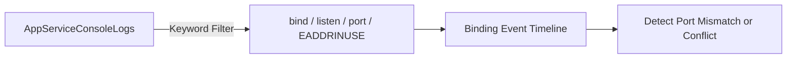

---
hide:
  - toc
---

# Container Binding Errors

**Scenario**: App starts but is unreachable, or startup fails with bind/listen issues.
**Data Source**: AppServiceConsoleLogs
**Purpose**: Detects log lines related to port binding, listen socket conflicts, and loopback binding mistakes.



## Query

```kql
AppServiceConsoleLogs
| where TimeGenerated > ago(1h)
| where ResultDescription has_any ("bind", "listen", "port", "address already in use", "EADDRINUSE", "0.0.0.0", "127.0.0.1")
| project TimeGenerated, ResultDescription
| order by TimeGenerated desc
```

## Interpretation Notes
- Normal: listener starts once on expected `0.0.0.0:<port>` with no bind conflicts.
- Abnormal: `address already in use`, repeated bind failures, or logs showing `127.0.0.1` bind only.
- Reading tip: confirm that logged port matches `WEBSITES_PORT` and container configuration.

## Limitations
- Log message formats vary by runtime/server (Gunicorn, Node, Java, etc.).
- Broad keyword matching can include benign listen information.
- This query cannot validate actual socket state inside the running container.

## See Also

- [Console Query Pack](index.md)
- [KQL Query Packs](../index.md)

## Sources

- [Enable diagnostic logging for apps in Azure App Service](https://learn.microsoft.com/en-us/azure/app-service/troubleshoot-diagnostic-logs)
- [Monitor Azure App Service](https://learn.microsoft.com/en-us/azure/app-service/monitor-app-service)
- [Kusto Query Language (KQL) overview](https://learn.microsoft.com/en-us/kusto/query/)
