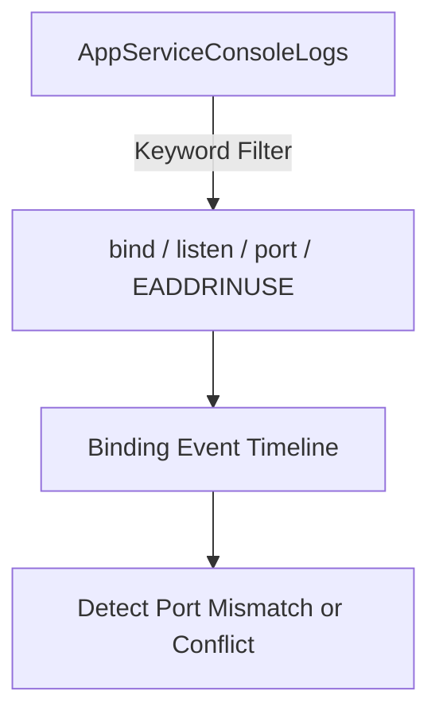

---
content_sources:
  diagrams:
    - id: troubleshooting-kql-console-container-binding-errors-diagram-1
      type: graph
      source: self-generated
      justification: "Self-generated troubleshooting diagram synthesized from Microsoft Learn diagnostics and Azure App Service incident guidance for this guide."
      based_on:
        - https://learn.microsoft.com/en-us/azure/azure-monitor/logs/get-started-queries
        - https://learn.microsoft.com/en-us/azure/app-service/troubleshoot-diagnostic-logs
---
# Container Binding Errors

**Scenario**: App starts but is unreachable, or startup fails with bind/listen issues.
**Data Source**: AppServiceConsoleLogs
**Purpose**: Detects log lines related to port binding, listen socket conflicts, and loopback binding mistakes.

<!-- diagram-id: troubleshooting-kql-console-container-binding-errors-diagram-1 -->

```mermaid
graph TD
    A[AppServiceConsoleLogs] -->|Keyword Filter| B[bind / listen / port / EADDRINUSE]
    B --> C[Binding Event Timeline]
    C --> D[Detect Port Mismatch or Conflict]
```

## Run It in the Portal

#### Portal view: Logs blade (Log Analytics query editor)

![Azure portal Logs blade for ai-test-20251107 (Application Insights) with a New Query 1 tab open, top-right controls Observability agent (New), Save, Share, Queries hub, and an inline toolbar Run + Time range: Last 24 hours + Show: 1000 results + KQL mode dropdown. The query editor shows placeholder text "Type your query here or click one of the queries to start" on line 1. Below the editor a Query history pane reads "No queries history — You haven't run any queries yet. To start, go to Queries on the side pane or type a query in the query editor." Left nav under Monitoring lists Alerts, Metrics, Diagnostic settings, Logs (selected), Workbooks, Dashboards with Grafana; the Investigate group above is collapsed.](../../../assets/troubleshooting/log-analytics/01-logs.png)

The `Logs` blade is where the container-binding query below is pasted - this capture shows the Application Insights `Logs` experience (`ai-test-20251107`), but the workspace-based Log Analytics blade renders the same `New Query 1` tab and `Run` toolbar. Replace the placeholder `Type your query here or click one of the queries to start` with the `AppServiceConsoleLogs | where ResultDescription has_any ("bind", "listen", ...)` block; tighten the inline `Time range` selector from the default `Last 24 hours` shown here to `Last hour` so it matches the `ago(1h)` filter inside the query. Because the query projects only `TimeGenerated` and `ResultDescription`, results render as a two-column tabular grid in the lower pane below the placeholder editor.

## Query

```kql
AppServiceConsoleLogs
| where TimeGenerated > ago(1h)
| where ResultDescription has_any ("bind", "listen", "port", "address already in use", "EADDRINUSE", "0.0.0.0", "127.0.0.1")
| project TimeGenerated, ResultDescription
| order by TimeGenerated desc
```

## Interpretation Notes
- Normal: listener starts once on expected `0.0.0.0:<port>` with no bind conflicts.
- Abnormal: `address already in use`, repeated bind failures, or logs showing `127.0.0.1` bind only.
- Reading tip: confirm that logged port matches `WEBSITES_PORT` and container configuration.

## Limitations
- Log message formats vary by runtime/server (Gunicorn, Node, Java, etc.).
- Broad keyword matching can include benign listen information.
- This query cannot validate actual socket state inside the running container.

## See Also

- [Console Query Pack](index.md)
- [KQL Query Packs](../index.md)

## Sources

- [Enable diagnostic logging for apps in Azure App Service](https://learn.microsoft.com/en-us/azure/app-service/troubleshoot-diagnostic-logs)
- [Monitor Azure App Service](https://learn.microsoft.com/en-us/azure/app-service/monitor-app-service)
- [Kusto Query Language (KQL) overview](https://learn.microsoft.com/en-us/kusto/query/)
