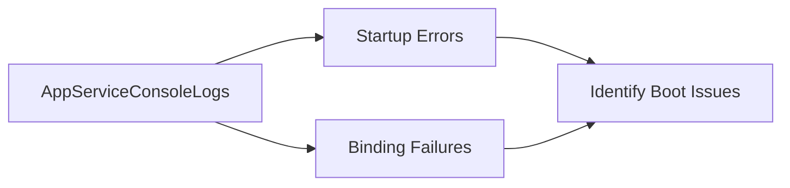

# Console Queries

Use these queries to identify startup/runtime failures from container console output in Azure App Service Linux.

## Available Queries
- [Startup Errors](startup-errors.md)
- [Container Binding Errors](container-binding-errors.md)

## See Also

- [KQL Query Library](../index.md)
- [Restart Queries](../restarts/index.md)
- [Correlation Queries](../correlation/index.md)
