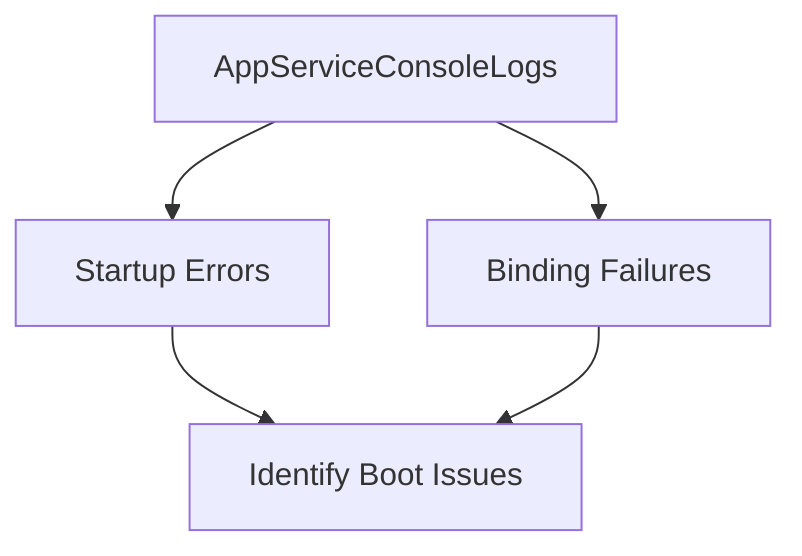

---
content_sources:
  diagrams:
  - id: troubleshooting-kql-console-index-diagram-1
    type: graph
    source: self-generated
    justification: Self-generated troubleshooting diagram synthesized from Microsoft
      Learn diagnostics and Azure App Service incident guidance for this guide.
    based_on:
    - https://learn.microsoft.com/en-us/azure/azure-monitor/logs/get-started-queries
    - https://learn.microsoft.com/en-us/azure/app-service/troubleshoot-diagnostic-logs
content_validation:
  status: verified
  last_reviewed: '2026-05-23'
  reviewer: agent
  core_claims:
  - claim: This page uses Microsoft Learn as the primary source basis for its Azure-specific
      guidance.
    source: https://learn.microsoft.com/en-us/azure/azure-monitor/logs/get-started-queries
    verified: true
---
# Console Queries

Use these queries to identify startup/runtime failures from container console output in Azure App Service Linux.

<!-- diagram-id: troubleshooting-kql-console-index-diagram-1 -->

```mermaid
graph TD
    A[AppServiceConsoleLogs] --> B[Startup Errors]
    A --> C[Binding Failures]
    B --> D[Identify Boot Issues]
    C --> D
```

## Run It in the Portal

#### Portal view: Logs blade (Log Analytics query editor)

![Azure portal Logs blade for ai-test-20251107 (Application Insights) with a New Query 1 tab open, top-right controls Observability agent (New), Save, Share, Queries hub, and an inline toolbar Run + Time range: Last 24 hours + Show: 1000 results + KQL mode dropdown. The query editor shows placeholder text "Type your query here or click one of the queries to start" on line 1. Below the editor a Query history pane reads "No queries history — You haven't run any queries yet. To start, go to Queries on the side pane or type a query in the query editor." Left nav under Monitoring lists Alerts, Metrics, Diagnostic settings, Logs (selected), Workbooks, Dashboards with Grafana; the Investigate group above is collapsed.](../../../assets/troubleshooting/log-analytics/01-logs.png)

The `Logs` blade is where the console-log queries below are pasted - this capture shows the Application Insights `Logs` experience (`ai-test-20251107`), but the workspace-based Log Analytics blade has the same `New Query 1` tab and `Run` toolbar. Both queries in this pack target `AppServiceConsoleLogs`, which becomes the first table identifier once you replace the placeholder `Type your query here or click one of the queries to start` in the editor. The default `Time range: Last 24 hours` is usually too wide for startup-error triage; tighten it via the inline `Time range` selector to align with the most recent restart-event window before running. The `No queries history` message confirms a fresh session - after the first `Run`, executed queries and their time-ordered rows appear in the lower pane.

## Available Queries
- [Startup Errors](startup-errors.md)
- [Container Binding Errors](container-binding-errors.md)

## See Also

- [KQL Query Library](../index.md)
- [Restart Queries](../restarts/index.md)
- [Correlation Queries](../correlation/index.md)

## Sources

- [Microsoft Learn source 1](https://learn.microsoft.com/en-us/azure/azure-monitor/logs/get-started-queries)
- [Microsoft Learn source 2](https://learn.microsoft.com/en-us/azure/app-service/troubleshoot-diagnostic-logs)
