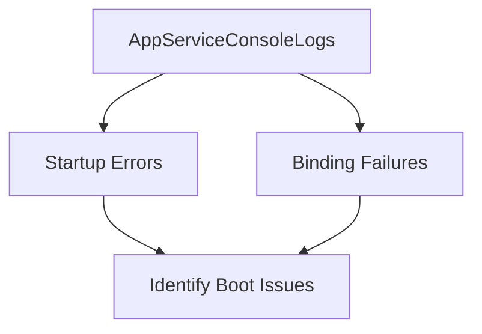

---
content_sources:
  diagrams:
  - id: troubleshooting-kql-console-index-diagram-1
    type: graph
    source: self-generated
    justification: Self-generated troubleshooting diagram synthesized from Microsoft
      Learn diagnostics and Azure App Service incident guidance for this guide.
    based_on:
    - https://learn.microsoft.com/en-us/azure/azure-monitor/logs/get-started-queries
    - https://learn.microsoft.com/en-us/azure/app-service/troubleshoot-diagnostic-logs
content_validation:
  status: verified
  last_reviewed: '2026-05-23'
  reviewer: agent
  core_claims:
  - claim: This page uses Microsoft Learn as the primary source basis for its Azure-specific
      guidance.
    source: https://learn.microsoft.com/en-us/azure/azure-monitor/logs/get-started-queries
    verified: true
---
# Console Queries

Use these queries to identify startup/runtime failures from container console output in Azure App Service Linux.

<!-- diagram-id: troubleshooting-kql-console-index-diagram-1 -->

```mermaid
graph TD
    A[AppServiceConsoleLogs] --> B[Startup Errors]
    A --> C[Binding Failures]
    B --> D[Identify Boot Issues]
    C --> D
```

## Available Queries
- [Startup Errors](startup-errors.md)
- [Container Binding Errors](container-binding-errors.md)

## Review Matrix

| Review area | Page-specific check |
|---|---|
| Scope | Confirm the guidance applies to Console Queries. |
| Source basis | Validate the recommendation against the Microsoft Learn sources in this page. |
| Evidence | Capture command output, portal state, metrics, logs, or screenshots before treating the result as proven. |

## See Also

- [KQL Query Library](../index.md)
- [Restart Queries](../restarts/index.md)
- [Correlation Queries](../correlation/index.md)

## Sources

- [Microsoft Learn source 1](https://learn.microsoft.com/en-us/azure/azure-monitor/logs/get-started-queries)
- [Microsoft Learn source 2](https://learn.microsoft.com/en-us/azure/app-service/troubleshoot-diagnostic-logs)
