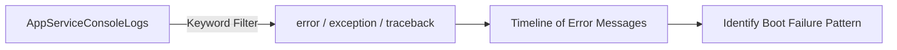

# Startup Errors

**Scenario**: Container startup fails or app never becomes healthy after deployment/restart.
**Data Source**: AppServiceConsoleLogs
**Purpose**: Surfaces recent startup/runtime error signatures from console output.



## Query

```kql
AppServiceConsoleLogs
| where TimeGenerated > ago(1h)
| where ResultDescription has_any ("error", "Error", "ERROR", "exception", "Exception", "failed", "Failed", "traceback", "Traceback")
| project TimeGenerated, ResultDescription
| order by TimeGenerated desc
```

## Interpretation Notes
- Normal: few/no fatal startup errors; expected informational logs dominate.
- Abnormal: repeated exceptions, traceback bursts, or fatal initialization messages.
- Reading tip: look for repeated identical stack traces to identify deterministic boot failures.

## Limitations
- Console log availability depends on diagnostic configuration and app logging behavior.
- Keyword search may include non-fatal lines or miss framework-specific error formats.
- This query cannot prove whether App Service health probes succeeded.

## Sources

- [Enable diagnostic logging for apps in Azure App Service](https://learn.microsoft.com/en-us/azure/app-service/troubleshoot-diagnostic-logs)
- [Monitor Azure App Service](https://learn.microsoft.com/en-us/azure/app-service/monitor-app-service)
- [Kusto Query Language (KQL) overview](https://learn.microsoft.com/en-us/kusto/query/)
