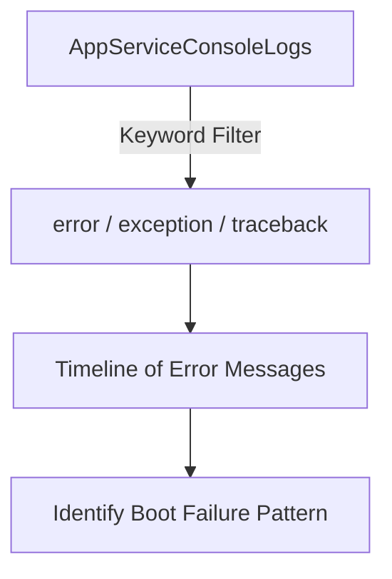

# Startup Errors

**Scenario**: Container startup fails or app never becomes healthy after deployment/restart.
**Data Source**: AppServiceConsoleLogs
**Purpose**: Surfaces recent startup/runtime error signatures from console output.

<!-- diagram-id: troubleshooting-kql-console-startup-errors-diagram-1 -->

```mermaid
graph TD
    A[AppServiceConsoleLogs] -->|Keyword Filter| B[error / exception / traceback]
    B --> C[Timeline of Error Messages]
    C --> D[Identify Boot Failure Pattern]
```

## Run It in the Portal

#### Portal view: Logs blade (Log Analytics query editor)

![Azure portal Logs blade for ai-test-20251107 (Application Insights) with a New Query 1 tab open, top-right controls Observability agent (New), Save, Share, Queries hub, and an inline toolbar Run + Time range: Last 24 hours + Show: 1000 results + KQL mode dropdown. The query editor shows placeholder text "Type your query here or click one of the queries to start" on line 1. Below the editor a Query history pane reads "No queries history — You haven't run any queries yet. To start, go to Queries on the side pane or type a query in the query editor." Left nav under Monitoring lists Alerts, Metrics, Diagnostic settings, Logs (selected), Workbooks, Dashboards with Grafana; the Investigate group above is collapsed.](../../../assets/troubleshooting/log-analytics/01-logs.png)

The `Logs` blade is where the startup-error query below is pasted - this capture shows the Application Insights `Logs` experience (`ai-test-20251107`), but the workspace-based Log Analytics blade renders the same `New Query 1` tab and `Run` toolbar. Replace the placeholder `Type your query here or click one of the queries to start` with the `AppServiceConsoleLogs | where ResultDescription has_any ...` block; then tighten the inline `Time range` selector from the default `Last 24 hours` shown here to `Last hour` so it matches the `ago(1h)` filter inside the query. The query projects two columns (`TimeGenerated`, `ResultDescription`) and orders them descending, so results render as a tabular grid in the lower pane below the placeholder editor - no timechart is produced.

## Query

```kql
AppServiceConsoleLogs
| where TimeGenerated > ago(1h)
| where ResultDescription has_any ("error", "Error", "ERROR", "exception", "Exception", "failed", "Failed", "traceback", "Traceback")
| project TimeGenerated, ResultDescription
| order by TimeGenerated desc
```

## Interpretation Notes
- Normal: few/no fatal startup errors; expected informational logs dominate.
- Abnormal: repeated exceptions, traceback bursts, or fatal initialization messages.
- Reading tip: look for repeated identical stack traces to identify deterministic boot failures.

## Limitations
- Console log availability depends on diagnostic configuration and app logging behavior.
- Keyword search may include non-fatal lines or miss framework-specific error formats.
- This query cannot prove whether App Service health probes succeeded.

## See Also

- [Console Query Pack](index.md)
- [KQL Query Packs](../index.md)

## Sources

- [Enable diagnostic logging for apps in Azure App Service](https://learn.microsoft.com/en-us/azure/app-service/troubleshoot-diagnostic-logs)
- [Monitor Azure App Service](https://learn.microsoft.com/en-us/azure/app-service/monitor-app-service)
- [Kusto Query Language (KQL) overview](https://learn.microsoft.com/en-us/kusto/query/)
