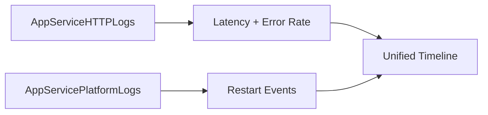

# Correlation Queries

Use these queries to correlate major signals (latency, error rate, and restart events) in one timeline.

## Available Queries
- [Latency vs Errors](latency-vs-errors.md)
- [Restarts vs Latency](restarts-vs-latency.md)

## See Also

- [KQL Query Library](../index.md)
- [HTTP Queries](../http/index.md)
- [Restart Queries](../restarts/index.md)
