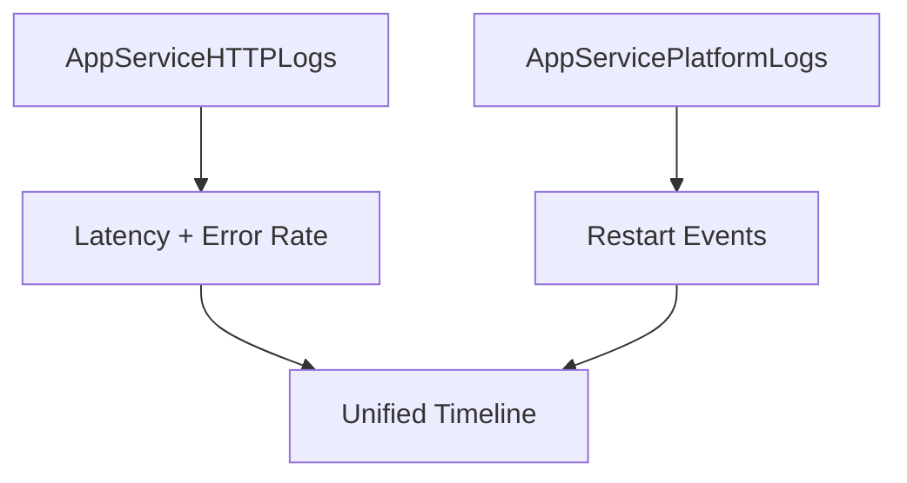

---
content_sources:
  diagrams:
  - id: troubleshooting-kql-correlation-index-diagram-1
    type: graph
    source: self-generated
    justification: Self-generated troubleshooting diagram synthesized from Microsoft
      Learn diagnostics and Azure App Service incident guidance for this guide.
    based_on:
    - https://learn.microsoft.com/en-us/azure/azure-monitor/logs/get-started-queries
    - https://learn.microsoft.com/en-us/azure/app-service/troubleshoot-diagnostic-logs
content_validation:
  status: verified
  last_reviewed: '2026-05-23'
  reviewer: agent
  core_claims:
  - claim: This page uses Microsoft Learn as the primary source basis for its Azure-specific
      guidance.
    source: https://learn.microsoft.com/en-us/azure/azure-monitor/logs/get-started-queries
    verified: true
---
# Correlation Queries

Use these queries to correlate major signals (latency, error rate, and restart events) in one timeline.

<!-- diagram-id: troubleshooting-kql-correlation-index-diagram-1 -->

```mermaid
graph TD
    A[AppServiceHTTPLogs] --> C[Latency + Error Rate]
    B[AppServicePlatformLogs] --> D[Restart Events]
    C --> E[Unified Timeline]
    D --> E
```

## Available Queries
- [Latency vs Errors](latency-vs-errors.md)
- [Restarts vs Latency](restarts-vs-latency.md)

## Review Matrix

| Review area | Page-specific check |
|---|---|
| Scope | Confirm the guidance applies to Correlation Queries. |
| Source basis | Validate the recommendation against the Microsoft Learn sources in this page. |
| Evidence | Capture command output, portal state, metrics, logs, or screenshots before treating the result as proven. |

## See Also

- [KQL Query Library](../index.md)
- [HTTP Queries](../http/index.md)
- [Restart Queries](../restarts/index.md)

## Sources

- [Microsoft Learn source 1](https://learn.microsoft.com/en-us/azure/azure-monitor/logs/get-started-queries)
- [Microsoft Learn source 2](https://learn.microsoft.com/en-us/azure/app-service/troubleshoot-diagnostic-logs)
