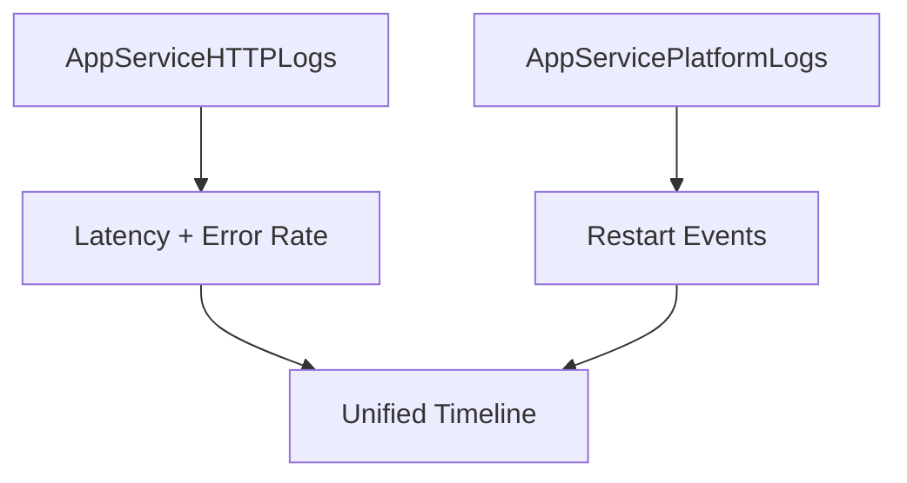

---
content_sources:
  diagrams:
    - id: troubleshooting-kql-correlation-index-diagram-1
      type: graph
      source: self-generated
      justification: Self-generated troubleshooting diagram synthesized from Microsoft Learn diagnostics and Azure App Service incident guidance for this guide.
      based_on:
        - https://learn.microsoft.com/en-us/azure/azure-monitor/logs/get-started-queries
        - https://learn.microsoft.com/en-us/azure/app-service/troubleshoot-diagnostic-logs
---
# Correlation Queries

Use these queries to correlate major signals (latency, error rate, and restart events) in one timeline.

<!-- diagram-id: troubleshooting-kql-correlation-index-diagram-1 -->

```mermaid
graph TD
    A[AppServiceHTTPLogs] --> C[Latency + Error Rate]
    B[AppServicePlatformLogs] --> D[Restart Events]
    C --> E[Unified Timeline]
    D --> E
```

## Run It in the Portal

#### Portal view: Logs blade (Log Analytics query editor)

![Azure portal Logs blade for ai-test-20251107 (Application Insights) with a New Query 1 tab open, top-right controls Observability agent (New), Save, Share, Queries hub, and an inline toolbar Run + Time range: Last 24 hours + Show: 1000 results + KQL mode dropdown. The query editor shows placeholder text "Type your query here or click one of the queries to start" on line 1. Below the editor a Query history pane reads "No queries history — You haven't run any queries yet. To start, go to Queries on the side pane or type a query in the query editor." Left nav under Monitoring lists Alerts, Metrics, Diagnostic settings, Logs (selected), Workbooks, Dashboards with Grafana; the Investigate group above is collapsed.](../../../assets/troubleshooting/log-analytics/01-logs.png)

The `Logs` blade is where the correlation queries below are pasted - this capture shows the Application Insights `Logs` experience (`ai-test-20251107`), but the workspace-based Log Analytics blade has the same `New Query 1` tab and `Run` toolbar. This pack includes one query that summarizes multiple HTTP-derived series from `AppServiceHTTPLogs` and one query that unions `AppServiceHTTPLogs` with `AppServicePlatformLogs`, so both docs below render timecharts in the lower pane after `Run`. Start from the visible `Time range: Last 24 hours` window, then tighten the inline `Time range` selector to match each query's own `ago(...)` filter when you narrow to a specific incident. The empty `Query history` pane and the placeholder `Type your query here or click one of the queries to start` confirm a fresh session.

## Available Queries
- [Latency vs Errors](latency-vs-errors.md)
- [Restarts vs Latency](restarts-vs-latency.md)

## See Also

- [KQL Query Library](../index.md)
- [HTTP Queries](../http/index.md)
- [Restart Queries](../restarts/index.md)

## Sources

- [Microsoft Learn source 1](https://learn.microsoft.com/en-us/azure/azure-monitor/logs/get-started-queries)
- [Microsoft Learn source 2](https://learn.microsoft.com/en-us/azure/app-service/troubleshoot-diagnostic-logs)
