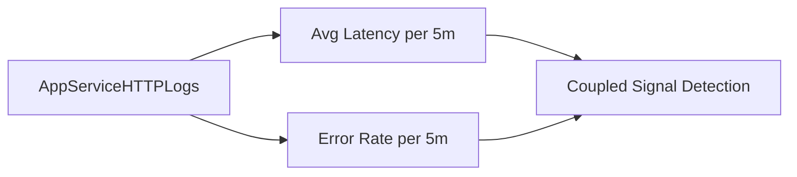

---
hide:
  - toc
---

# Latency vs Errors

**Scenario**: Need to confirm whether rising latency and 5xx error rate are coupled.
**Data Source**: AppServiceHTTPLogs
**Purpose**: Correlates average latency, error rate, and request volume over the same bins.



## Query

```kql
AppServiceHTTPLogs
| where TimeGenerated > ago(1h)
| summarize AvgLatency=avg(TimeTaken), ErrorRate=countif(ScStatus >= 500) * 100.0 / count(), TotalRequests=count() by bin(TimeGenerated, 5m)
| render timechart
```

## Interpretation Notes
- Normal: latency and error rate remain near baseline; request volume fluctuations do not trigger instability.
- Abnormal: latency and error rate rise together, especially under stable/high request volume.
- Reading tip: if latency rises first and errors follow, investigate queueing/saturation and dependency slowness.

## Limitations
- Average latency can hide tail behavior; pair with percentile queries for full picture.
- Short windows with low request count can produce volatile error-rate percentages.
- This query cannot isolate whether errors originate in app runtime, platform, or dependency.

## See Also

- [Correlation Query Pack](index.md)
- [KQL Query Packs](../index.md)

## Sources

- [Enable diagnostic logging for apps in Azure App Service](https://learn.microsoft.com/en-us/azure/app-service/troubleshoot-diagnostic-logs)
- [Monitor Azure App Service](https://learn.microsoft.com/en-us/azure/app-service/monitor-app-service)
- [Kusto Query Language (KQL) overview](https://learn.microsoft.com/en-us/kusto/query/)
