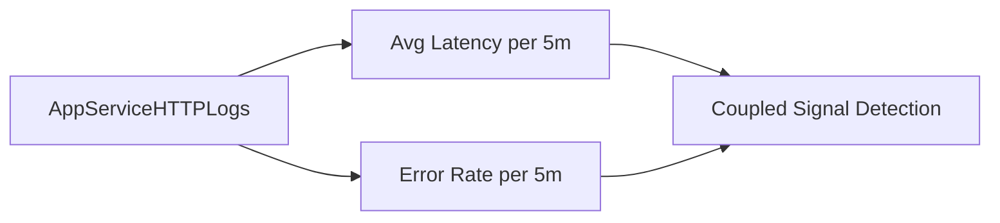

---
content_validation:
  status: verified
  last_reviewed: "2026-04-12"
  reviewer: ai-agent
  core_claims:
    - claim: "With Azure Monitor integration, you can create diagnostic settings to send logs to storage accounts, event hubs, and Log Analytics workspaces."
      source: "https://learn.microsoft.com/azure/app-service/troubleshoot-diagnostic-logs"
      verified: true
    - claim: "Log Analytics in the Azure portal lets you explore and analyze data collected by Azure Monitor Logs."
      source: "https://learn.microsoft.com/azure/azure-monitor/logs/log-analytics-tutorial"
      verified: true
    - claim: "Log Analytics in the Azure portal lets you edit and run log queries to filter records, uncover trends, analyze patterns, and gain meaningful insights into your environment."
      source: "https://learn.microsoft.com/azure/azure-monitor/logs/log-analytics-tutorial"
      verified: true
    - claim: "You can view, modify, and share visuals of query results."
      source: "https://learn.microsoft.com/azure/azure-monitor/logs/log-analytics-tutorial"
      verified: true
content_sources:
  diagrams:
    - id: troubleshooting-kql-correlation-latency-vs-errors-diagram-1
      type: graph
      source: self-generated
      justification: "Self-generated troubleshooting diagram synthesized from Microsoft Learn diagnostics and Azure App Service incident guidance for this guide."
      based_on:
        - https://learn.microsoft.com/en-us/azure/azure-monitor/logs/get-started-queries
        - https://learn.microsoft.com/en-us/azure/app-service/troubleshoot-diagnostic-logs
---
# Latency vs Errors

**Scenario**: Need to confirm whether rising latency and 5xx error rate are coupled.
**Data Source**: AppServiceHTTPLogs
**Purpose**: Correlates average latency, error rate, and request volume over the same bins.

<!-- diagram-id: troubleshooting-kql-correlation-latency-vs-errors-diagram-1 -->


## Query

```kql
AppServiceHTTPLogs
| where TimeGenerated > ago(1h)
| summarize AvgLatency=avg(TimeTaken), ErrorRate=countif(ScStatus >= 500) * 100.0 / count(), TotalRequests=count() by bin(TimeGenerated, 5m)
| render timechart
```

## Interpretation Notes
- Normal: latency and error rate remain near baseline; request volume fluctuations do not trigger instability.
- Abnormal: latency and error rate rise together, especially under stable/high request volume.
- Reading tip: if latency rises first and errors follow, investigate queueing/saturation and dependency slowness.

## Limitations
- Average latency can hide tail behavior; pair with percentile queries for full picture.
- Short windows with low request count can produce volatile error-rate percentages.
- This query cannot isolate whether errors originate in app runtime, platform, or dependency.

## See Also

- [Correlation Query Pack](index.md)
- [KQL Query Packs](../index.md)

## Sources

- [Enable diagnostic logging for apps in Azure App Service](https://learn.microsoft.com/en-us/azure/app-service/troubleshoot-diagnostic-logs)
- [Monitor Azure App Service](https://learn.microsoft.com/en-us/azure/app-service/monitor-app-service)
- [Kusto Query Language (KQL) overview](https://learn.microsoft.com/en-us/kusto/query/)
