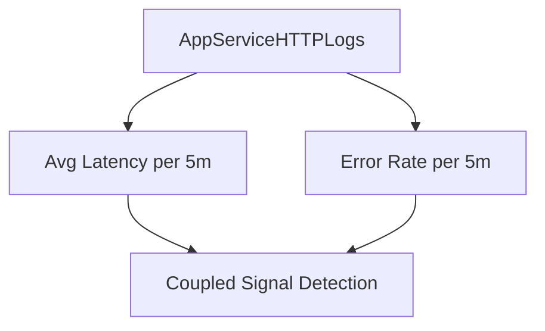

---
content_sources:
  diagrams:
    - id: troubleshooting-kql-correlation-latency-vs-errors-diagram-1
      type: graph
      source: self-generated
      justification: "Self-generated troubleshooting diagram synthesized from Microsoft Learn diagnostics and Azure App Service incident guidance for this guide."
      based_on:
        - https://learn.microsoft.com/en-us/azure/azure-monitor/logs/get-started-queries
        - https://learn.microsoft.com/en-us/azure/app-service/troubleshoot-diagnostic-logs
---
# Latency vs Errors

**Scenario**: Need to confirm whether rising latency and 5xx error rate are coupled.
**Data Source**: AppServiceHTTPLogs
**Purpose**: Correlates average latency, error rate, and request volume over the same bins.

<!-- diagram-id: troubleshooting-kql-correlation-latency-vs-errors-diagram-1 -->

```mermaid
graph TD
    A[AppServiceHTTPLogs] --> B[Avg Latency per 5m]
    A --> C[Error Rate per 5m]
    B --> D[Coupled Signal Detection]
    C --> D
```

## Run It in the Portal

#### Portal view: Logs blade (Log Analytics query editor)

![Azure portal Logs blade for ai-test-20251107 (Application Insights) with a New Query 1 tab open, top-right controls Observability agent (New), Save, Share, Queries hub, and an inline toolbar Run + Time range: Last 24 hours + Show: 1000 results + KQL mode dropdown. The query editor shows placeholder text "Type your query here or click one of the queries to start" on line 1. Below the editor a Query history pane reads "No queries history — You haven't run any queries yet. To start, go to Queries on the side pane or type a query in the query editor." Left nav under Monitoring lists Alerts, Metrics, Diagnostic settings, Logs (selected), Workbooks, Dashboards with Grafana; the Investigate group above is collapsed.](../../../assets/troubleshooting/log-analytics/01-logs.png)

The `Logs` blade is where the latency-vs-errors correlation query below is pasted - this capture shows the Application Insights `Logs` experience (`ai-test-20251107`), but the workspace-based Log Analytics blade renders the same `New Query 1` tab and `Run` toolbar. The query summarizes three series (`AvgLatency`, `ErrorRate`, `TotalRequests`) into one `| render timechart`, so once executed it draws a three-series chart in the lower pane below the placeholder editor. Tighten the inline `Time range` selector from the default `Last 24 hours` shown here to `Last hour` so it matches the `ago(1h)` filter inside the query; the empty `Query history` pane confirms this is a fresh session that the first `Run` populates.

## Query

```kql
AppServiceHTTPLogs
| where TimeGenerated > ago(1h)
| summarize AvgLatency=avg(TimeTaken), ErrorRate=countif(ScStatus >= 500) * 100.0 / count(), TotalRequests=count() by bin(TimeGenerated, 5m)
| render timechart
```

## Interpretation Notes
- Normal: latency and error rate remain near baseline; request volume fluctuations do not trigger instability.
- Abnormal: latency and error rate rise together, especially under stable/high request volume.
- Reading tip: if latency rises first and errors follow, investigate queueing/saturation and dependency slowness.

## Limitations
- Average latency can hide tail behavior; pair with percentile queries for full picture.
- Short windows with low request count can produce volatile error-rate percentages.
- This query cannot isolate whether errors originate in app runtime, platform, or dependency.

## See Also

- [Correlation Query Pack](index.md)
- [KQL Query Packs](../index.md)

## Sources

- [Enable diagnostic logging for apps in Azure App Service](https://learn.microsoft.com/en-us/azure/app-service/troubleshoot-diagnostic-logs)
- [Monitor Azure App Service](https://learn.microsoft.com/en-us/azure/app-service/monitor-app-service)
- [Kusto Query Language (KQL) overview](https://learn.microsoft.com/en-us/kusto/query/)
