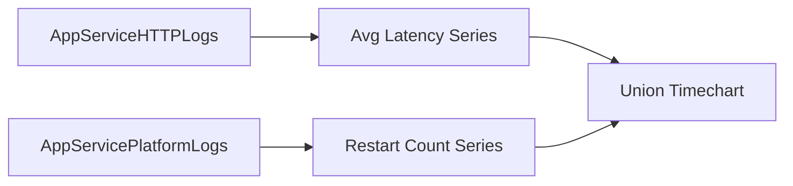

# Restarts vs Latency

**Scenario**: Determine whether restart events align with latency degradation windows.
**Data Source**: AppServiceHTTPLogs and AppServicePlatformLogs
**Purpose**: Combines latency and restart-event signals in a single timeline using `union`.



## Query

```kql
let LatencySeries =
    AppServiceHTTPLogs
    | where TimeGenerated > ago(6h)
    | summarize Value=avg(TimeTaken) by bin(TimeGenerated, 5m)
    | project TimeGenerated, Metric="AvgLatencyMs", Value=todouble(Value);
let RestartSeries =
    AppServicePlatformLogs
    | where TimeGenerated > ago(6h)
    | where OperationName has_any ("restart", "Restart", "ContainerRestart")
    | summarize Value=count() by bin(TimeGenerated, 5m)
    | project TimeGenerated, Metric="RestartEvents", Value=todouble(Value);
union LatencySeries, RestartSeries
| order by TimeGenerated asc
| render timechart
```

## Interpretation Notes
- Normal: restart events are rare and latency remains stable before/after isolated events.
- Abnormal: restart-event bins coincide with or immediately precede sustained latency increases.
- Reading tip: treat repeated restart-event clusters with simultaneous latency rise as strong instability signal.

## Limitations
- Metric scales differ (milliseconds vs event counts) and may require separate visualization for precision.
- Near-real-time ingestion delays can briefly misalign restart and latency points.
- This query cannot prove causation; correlated events may share a third underlying cause.

## See Also

- [Correlation Query Pack](index.md)
- [KQL Query Packs](../index.md)

## Sources

- [Enable diagnostic logging for apps in Azure App Service](https://learn.microsoft.com/en-us/azure/app-service/troubleshoot-diagnostic-logs)
- [Monitor Azure App Service](https://learn.microsoft.com/en-us/azure/app-service/monitor-app-service)
- [Kusto Query Language (KQL) overview](https://learn.microsoft.com/en-us/kusto/query/)
