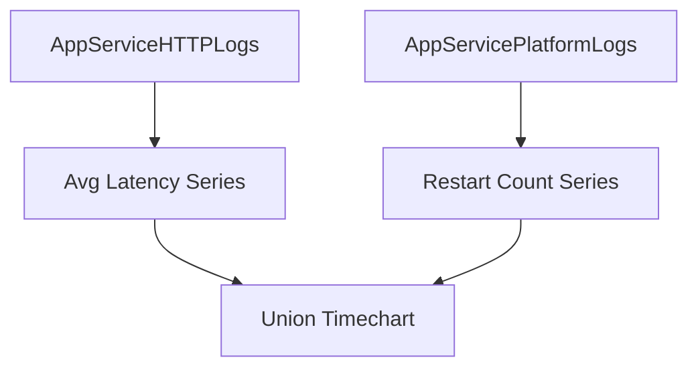

---
content_sources:
  diagrams:
    - id: troubleshooting-kql-correlation-restarts-vs-latency-diagram-1
      type: graph
      source: self-generated
      justification: "Self-generated troubleshooting diagram synthesized from Microsoft Learn diagnostics and Azure App Service incident guidance for this guide."
      based_on:
        - https://learn.microsoft.com/en-us/azure/azure-monitor/logs/get-started-queries
        - https://learn.microsoft.com/en-us/azure/app-service/troubleshoot-diagnostic-logs
---
# Restarts vs Latency

**Scenario**: Determine whether restart events align with latency degradation windows.
**Data Source**: AppServiceHTTPLogs and AppServicePlatformLogs
**Purpose**: Combines latency and restart-event signals in a single timeline using `union`.

<!-- diagram-id: troubleshooting-kql-correlation-restarts-vs-latency-diagram-1 -->

```mermaid
graph TD
    A[AppServiceHTTPLogs] --> B[Avg Latency Series]
    C[AppServicePlatformLogs] --> D[Restart Count Series]
    B --> E[Union Timechart]
    D --> E
```

## Run It in the Portal

#### Portal view: Logs blade (Log Analytics query editor)

![Azure portal Logs blade for ai-test-20251107 (Application Insights) with a New Query 1 tab open, top-right controls Observability agent (New), Save, Share, Queries hub, and an inline toolbar Run + Time range: Last 24 hours + Show: 1000 results + KQL mode dropdown. The query editor shows placeholder text "Type your query here or click one of the queries to start" on line 1. Below the editor a Query history pane reads "No queries history — You haven't run any queries yet. To start, go to Queries on the side pane or type a query in the query editor." Left nav under Monitoring lists Alerts, Metrics, Diagnostic settings, Logs (selected), Workbooks, Dashboards with Grafana; the Investigate group above is collapsed.](../../../assets/troubleshooting/log-analytics/01-logs.png)

The `Logs` blade is where the restarts-vs-latency union query below is pasted - this capture shows the Application Insights `Logs` experience (`ai-test-20251107`), but the workspace-based Log Analytics blade renders the same `New Query 1` tab and `Run` toolbar. The query is built around `let LatencySeries = ...; let RestartSeries = ...; union ...; render timechart`, so the two series render together as a single timechart in the lower pane after `Run`. Tighten the inline `Time range` selector from the default `Last 24 hours` shown here to a 6-hour window to match the `ago(6h)` filter inside each subquery (otherwise the `bin(TimeGenerated, 5m)` bucketing operates over a wider range than the interpretation notes assume).

## Query

```kql
let LatencySeries =
    AppServiceHTTPLogs
    | where TimeGenerated > ago(6h)
    | summarize Value=avg(TimeTaken) by bin(TimeGenerated, 5m)
    | project TimeGenerated, Metric="AvgLatencyMs", Value=todouble(Value);
let RestartSeries =
    AppServicePlatformLogs
    | where TimeGenerated > ago(6h)
    | where OperationName has_any ("restart", "Restart", "ContainerRestart")
    | summarize Value=count() by bin(TimeGenerated, 5m)
    | project TimeGenerated, Metric="RestartEvents", Value=todouble(Value);
union LatencySeries, RestartSeries
| order by TimeGenerated asc
| render timechart
```

## Interpretation Notes
- Normal: restart events are rare and latency remains stable before/after isolated events.
- Abnormal: restart-event bins coincide with or immediately precede sustained latency increases.
- Reading tip: treat repeated restart-event clusters with simultaneous latency rise as strong instability signal.

## Limitations
- Metric scales differ (milliseconds vs event counts) and may require separate visualization for precision.
- Near-real-time ingestion delays can briefly misalign restart and latency points.
- This query cannot prove causation; correlated events may share a third underlying cause.

## See Also

- [Correlation Query Pack](index.md)
- [KQL Query Packs](../index.md)

## Sources

- [Enable diagnostic logging for apps in Azure App Service](https://learn.microsoft.com/en-us/azure/app-service/troubleshoot-diagnostic-logs)
- [Monitor Azure App Service](https://learn.microsoft.com/en-us/azure/app-service/monitor-app-service)
- [Kusto Query Language (KQL) overview](https://learn.microsoft.com/en-us/kusto/query/)
