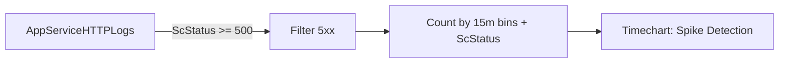

# 5xx Trend Over Time

**Scenario**: Intermittent or sustained server-side errors reported by customers.
**Data Source**: AppServiceHTTPLogs
**Purpose**: Tracks 5xx volume over time and separates by status code to detect spikes and dominant failure types.



## Query

```kql
AppServiceHTTPLogs
| where TimeGenerated > ago(24h)
| where ScStatus >= 500
| summarize Count=count() by bin(TimeGenerated, 15m), ScStatus
| render timechart
```

## Interpretation Notes
- Normal: low baseline 5xx with occasional isolated blips.
- Abnormal: sustained or bursty 5xx clusters, especially if one status code dominates (for example 502/503/500).
- Reading tip: align spikes with deployments, restarts, and dependency incidents.

## Limitations
- Data freshness may lag a few minutes depending on ingestion.
- In low-volume apps, a small number of errors can appear as large percentage impact.
- This query cannot determine whether the error originated in app code, platform, or downstream dependency.

## References

- [Enable diagnostic logging for apps in Azure App Service](https://learn.microsoft.com/en-us/azure/app-service/troubleshoot-diagnostic-logs)
- [Monitor Azure App Service](https://learn.microsoft.com/en-us/azure/app-service/monitor-app-service)
- [Kusto Query Language (KQL) overview](https://learn.microsoft.com/en-us/kusto/query/)
