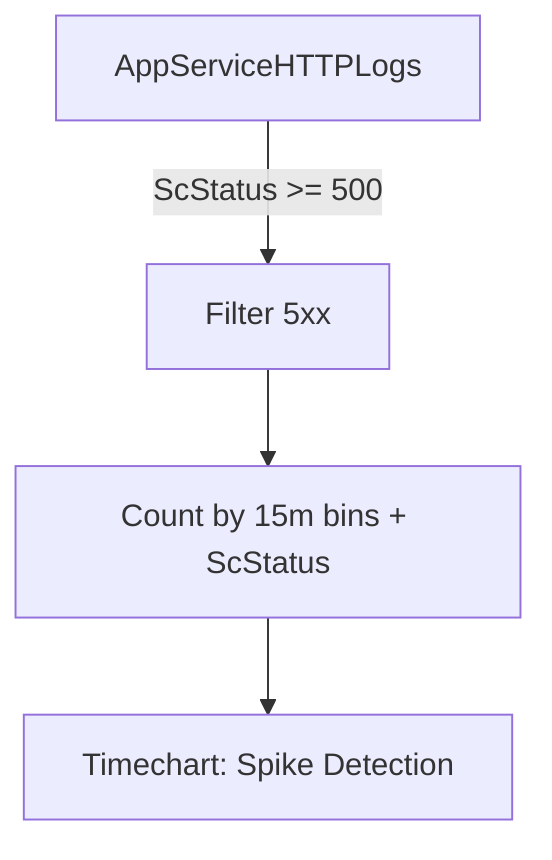

# 5xx Trend Over Time

**Scenario**: Intermittent or sustained server-side errors reported by customers.
**Data Source**: AppServiceHTTPLogs
**Purpose**: Tracks 5xx volume over time and separates by status code to detect spikes and dominant failure types.

<!-- diagram-id: troubleshooting-kql-http-5xx-trend-over-time-diagram-1 -->

```mermaid
graph TD
    A[AppServiceHTTPLogs] -->|ScStatus >= 500| B[Filter 5xx]
    B --> C[Count by 15m bins + ScStatus]
    C --> D[Timechart: Spike Detection]
```

## Run It in the Portal

#### Portal view: Logs blade (Log Analytics query editor)

![Azure portal Logs blade for ai-test-20251107 (Application Insights) with a New Query 1 tab open, top-right controls Observability agent (New), Save, Share, Queries hub, and an inline toolbar Run + Time range: Last 24 hours + Show: 1000 results + KQL mode dropdown. The query editor shows placeholder text "Type your query here or click one of the queries to start" on line 1. Below the editor a Query history pane reads "No queries history — You haven't run any queries yet. To start, go to Queries on the side pane or type a query in the query editor." Left nav under Monitoring lists Alerts, Metrics, Diagnostic settings, Logs (selected), Workbooks, Dashboards with Grafana; the Investigate group above is collapsed.](../../../assets/troubleshooting/log-analytics/01-logs.png)

The `Logs` blade is where the 5xx trend query below is pasted - this capture shows the Application Insights `Logs` experience (`ai-test-20251107`), but the workspace-based Log Analytics blade renders the same `New Query 1` tab and `Run` toolbar. Replace the placeholder `Type your query here or click one of the queries to start` with the `AppServiceHTTPLogs | where ScStatus >= 500 | summarize ...` block; the inline `Time range: Last 24 hours` selector already matches the `ago(24h)` filter inside the query, so no adjustment is required for the default lookback. After `Run`, the timechart produced by `| render timechart` appears inline in the lower pane below the placeholder editor. The `No queries history` message confirms a fresh session - once executed, this query can be recalled or saved via the `Queries hub` button in the top-right.

## Query

```kql
AppServiceHTTPLogs
| where TimeGenerated > ago(24h)
| where ScStatus >= 500
| summarize Count=count() by bin(TimeGenerated, 15m), ScStatus
| render timechart
```

## Interpretation Notes
- Normal: low baseline 5xx with occasional isolated blips.
- Abnormal: sustained or bursty 5xx clusters, especially if one status code dominates (for example 502/503/500).
- Reading tip: align spikes with deployments, restarts, and dependency incidents.

## Limitations
- Data freshness may lag a few minutes depending on ingestion.
- In low-volume apps, a small number of errors can appear as large percentage impact.
- This query cannot determine whether the error originated in app code, platform, or downstream dependency.

## See Also

- [HTTP Query Pack](index.md)
- [KQL Query Packs](../index.md)

## Sources

- [Enable diagnostic logging for apps in Azure App Service](https://learn.microsoft.com/en-us/azure/app-service/troubleshoot-diagnostic-logs)
- [Monitor Azure App Service](https://learn.microsoft.com/en-us/azure/app-service/monitor-app-service)
- [Kusto Query Language (KQL) overview](https://learn.microsoft.com/en-us/kusto/query/)
