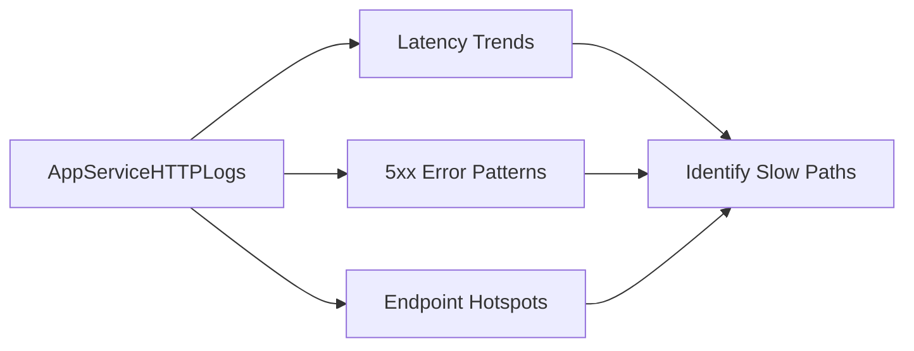

# HTTP Queries

Use these queries to quickly establish request latency patterns, error concentration, and endpoint-level hotspots on Azure App Service Linux.

## Available Queries
- [Latency Trend by Status Code](latency-trend-by-status-code.md)
- [5xx Trend Over Time](5xx-trend-over-time.md)
- [Slowest Requests by Path](slowest-requests-by-path.md)

## See Also

- [KQL Query Library](../index.md)
- [Console Queries](../console/index.md)
- [Correlation Queries](../correlation/index.md)
