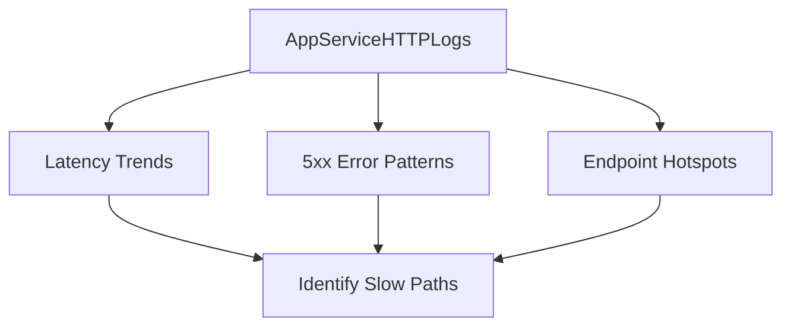

---
content_sources:
  diagrams:
    - id: troubleshooting-kql-http-index-diagram-1
      type: graph
      source: self-generated
      justification: Self-generated troubleshooting diagram synthesized from Microsoft Learn diagnostics and Azure App Service incident guidance for this guide.
      based_on:
        - https://learn.microsoft.com/en-us/azure/azure-monitor/logs/get-started-queries
        - https://learn.microsoft.com/en-us/azure/app-service/troubleshoot-diagnostic-logs
---
# HTTP Queries

Use these queries to quickly establish request latency patterns, error concentration, and endpoint-level hotspots on Azure App Service Linux.

<!-- diagram-id: troubleshooting-kql-http-index-diagram-1 -->

```mermaid
graph TD
    A[AppServiceHTTPLogs] --> B[Latency Trends]
    A --> C[5xx Error Patterns]
    A --> D[Endpoint Hotspots]
    B --> E[Identify Slow Paths]
    C --> E
    D --> E
```

## Run It in the Portal

#### Portal view: Logs blade (Log Analytics query editor)

![Azure portal Logs blade for ai-test-20251107 (Application Insights) with a New Query 1 tab open, top-right controls Observability agent (New), Save, Share, Queries hub, and an inline toolbar Run + Time range: Last 24 hours + Show: 1000 results + KQL mode dropdown. The query editor shows placeholder text "Type your query here or click one of the queries to start" on line 1. Below the editor a Query history pane reads "No queries history — You haven't run any queries yet. To start, go to Queries on the side pane or type a query in the query editor." Left nav under Monitoring lists Alerts, Metrics, Diagnostic settings, Logs (selected), Workbooks, Dashboards with Grafana; the Investigate group above is collapsed.](../../../assets/troubleshooting/log-analytics/01-logs.png)

The `Logs` blade is where all three HTTP queries in this pack are pasted - this capture shows the Application Insights `Logs` experience (`ai-test-20251107`), but the workspace-based Log Analytics blade renders the same `New Query 1` tab, `Run` toolbar, and `Time range: Last 24 hours` selector. Each query in the pack starts from `AppServiceHTTPLogs`, so the empty `Query history` pane (currently showing `No queries history`) will fill with `AppServiceHTTPLogs | where ...` entries after the first `Run`. Keep `Show: 1000 results` selected so latency-percentile bins and status-code distributions are not truncated in the lower result pane; the timechart visualizations produced by `| render timechart` appear inline once the query completes.

## Available Queries
- [Latency Trend by Status Code](latency-trend-by-status-code.md)
- [5xx Trend Over Time](5xx-trend-over-time.md)
- [Slowest Requests by Path](slowest-requests-by-path.md)

## See Also

- [KQL Query Library](../index.md)
- [Console Queries](../console/index.md)
- [Correlation Queries](../correlation/index.md)

## Sources

- [Microsoft Learn source 1](https://learn.microsoft.com/en-us/azure/azure-monitor/logs/get-started-queries)
- [Microsoft Learn source 2](https://learn.microsoft.com/en-us/azure/app-service/troubleshoot-diagnostic-logs)
