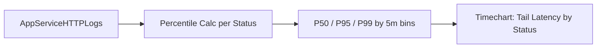

---
content_validation:
  status: verified
  last_reviewed: "2026-04-12"
  reviewer: ai-agent
  core_claims:
    - claim: "With Azure Monitor integration, you can create diagnostic settings to send logs to storage accounts, event hubs, and Log Analytics workspaces."
      source: "https://learn.microsoft.com/azure/app-service/troubleshoot-diagnostic-logs"
      verified: true
    - claim: "Log Analytics in the Azure portal lets you explore and analyze data collected by Azure Monitor Logs."
      source: "https://learn.microsoft.com/azure/azure-monitor/logs/log-analytics-tutorial"
      verified: true
    - claim: "Log Analytics in the Azure portal lets you edit and run log queries to filter records, uncover trends, analyze patterns, and gain meaningful insights into your environment."
      source: "https://learn.microsoft.com/azure/azure-monitor/logs/log-analytics-tutorial"
      verified: true
    - claim: "You can view, modify, and share visuals of query results."
      source: "https://learn.microsoft.com/azure/azure-monitor/logs/log-analytics-tutorial"
      verified: true
content_sources:
  diagrams:
    - id: troubleshooting-kql-http-latency-trend-by-status-code-diagram-1
      type: graph
      source: self-generated
      justification: "Self-generated troubleshooting diagram synthesized from Microsoft Learn diagnostics and Azure App Service incident guidance for this guide."
      based_on:
        - https://learn.microsoft.com/en-us/azure/azure-monitor/logs/get-started-queries
        - https://learn.microsoft.com/en-us/azure/app-service/troubleshoot-diagnostic-logs
---
# Latency Trend by Status Code

**Scenario**: Performance degradation where you need to distinguish normal successful traffic from failing traffic latency.
**Data Source**: AppServiceHTTPLogs
**Purpose**: Shows P50/P95/P99 latency trends split by HTTP status code to identify whether specific status groups are driving tail latency.

<!-- diagram-id: troubleshooting-kql-http-latency-trend-by-status-code-diagram-1 -->


## Query

```kql
AppServiceHTTPLogs
| where TimeGenerated > ago(1h)
| summarize P50=percentile(TimeTaken, 50), P95=percentile(TimeTaken, 95), P99=percentile(TimeTaken, 99), Count=count() by bin(TimeGenerated, 5m), ScStatus
| render timechart
```

## Interpretation Notes
- Normal: P95/P99 remain relatively stable and do not diverge sharply from P50 for dominant status codes.
- Abnormal: large P95/P99 spikes concentrated in 5xx (or specific 4xx/5xx) indicate error-path slowness or retries.
- Reading tip: compare high-volume status codes first; low-count status groups can look noisy.

## Limitations
- Data freshness depends on Diagnostic Settings and Log Analytics ingestion latency.
- Low-traffic periods can distort percentiles because sample size is small.
- This query cannot identify the exact dependency/code path causing latency.

## See Also

- [HTTP Query Pack](index.md)
- [KQL Query Packs](../index.md)

## Sources

- [Enable diagnostic logging for apps in Azure App Service](https://learn.microsoft.com/en-us/azure/app-service/troubleshoot-diagnostic-logs)
- [Monitor Azure App Service](https://learn.microsoft.com/en-us/azure/app-service/monitor-app-service)
- [Kusto Query Language (KQL) overview](https://learn.microsoft.com/en-us/kusto/query/)
