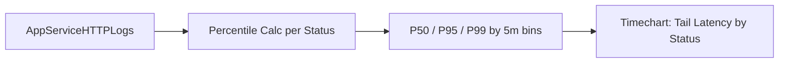

# Latency Trend by Status Code

**Scenario**: Performance degradation where you need to distinguish normal successful traffic from failing traffic latency.
**Data Source**: AppServiceHTTPLogs
**Purpose**: Shows P50/P95/P99 latency trends split by HTTP status code to identify whether specific status groups are driving tail latency.



## Query

```kql
AppServiceHTTPLogs
| where TimeGenerated > ago(1h)
| summarize P50=percentile(TimeTaken, 50), P95=percentile(TimeTaken, 95), P99=percentile(TimeTaken, 99), Count=count() by bin(TimeGenerated, 5m), ScStatus
| render timechart
```

## Interpretation Notes
- Normal: P95/P99 remain relatively stable and do not diverge sharply from P50 for dominant status codes.
- Abnormal: large P95/P99 spikes concentrated in 5xx (or specific 4xx/5xx) indicate error-path slowness or retries.
- Reading tip: compare high-volume status codes first; low-count status groups can look noisy.

## Limitations
- Data freshness depends on Diagnostic Settings and Log Analytics ingestion latency.
- Low-traffic periods can distort percentiles because sample size is small.
- This query cannot identify the exact dependency/code path causing latency.

## Sources

- [Enable diagnostic logging for apps in Azure App Service](https://learn.microsoft.com/en-us/azure/app-service/troubleshoot-diagnostic-logs)
- [Monitor Azure App Service](https://learn.microsoft.com/en-us/azure/app-service/monitor-app-service)
- [Kusto Query Language (KQL) overview](https://learn.microsoft.com/en-us/kusto/query/)
