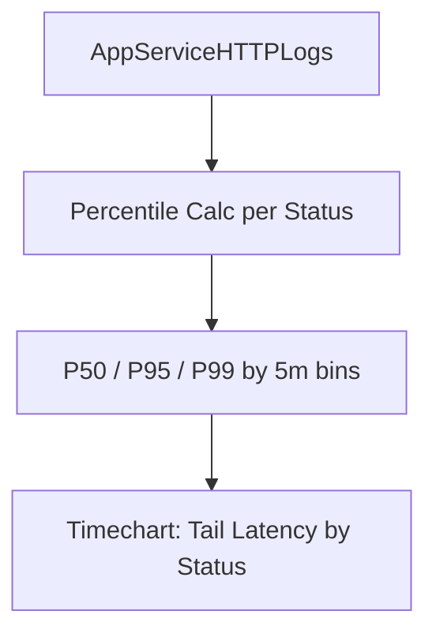

---
content_validation:
  status: verified
  last_reviewed: "2026-04-12"
  reviewer: agent
  core_claims:
    - claim: "With Azure Monitor integration, you can create diagnostic settings to send logs to storage accounts, event hubs, and Log Analytics workspaces."
      source: "https://learn.microsoft.com/azure/app-service/troubleshoot-diagnostic-logs"
      verified: true
    - claim: "Log Analytics in the Azure portal lets you explore and analyze data collected by Azure Monitor Logs."
      source: "https://learn.microsoft.com/en-us/azure/azure-monitor/logs/log-analytics-overviewlog-analytics-tutorial"
      verified: true
    - claim: "Log Analytics in the Azure portal lets you edit and run log queries to filter records, uncover trends, analyze patterns, and gain meaningful insights into your environment."
      source: "https://learn.microsoft.com/en-us/azure/azure-monitor/logs/log-analytics-overviewlog-analytics-tutorial"
      verified: true
    - claim: "You can view, modify, and share visuals of query results."
      source: "https://learn.microsoft.com/en-us/azure/azure-monitor/logs/log-analytics-overviewlog-analytics-tutorial"
      verified: true
content_sources:
  diagrams:
    - id: troubleshooting-kql-http-latency-trend-by-status-code-diagram-1
      type: graph
      source: self-generated
      justification: "Self-generated troubleshooting diagram synthesized from Microsoft Learn diagnostics and Azure App Service incident guidance for this guide."
      based_on:
        - https://learn.microsoft.com/en-us/azure/azure-monitor/logs/get-started-queries
        - https://learn.microsoft.com/en-us/azure/app-service/troubleshoot-diagnostic-logs
---
# Latency Trend by Status Code

**Scenario**: Performance degradation where you need to distinguish normal successful traffic from failing traffic latency.
**Data Source**: AppServiceHTTPLogs
**Purpose**: Shows P50/P95/P99 latency trends split by HTTP status code to identify whether specific status groups are driving tail latency.

<!-- diagram-id: troubleshooting-kql-http-latency-trend-by-status-code-diagram-1 -->

```mermaid
graph TD
    A[AppServiceHTTPLogs] --> B[Percentile Calc per Status]
    B --> C[P50 / P95 / P99 by 5m bins]
    C --> D[Timechart: Tail Latency by Status]
```

## Run It in the Portal

#### Portal view: Logs blade (Log Analytics query editor)

![Azure portal Logs blade for ai-test-20251107 (Application Insights) with a New Query 1 tab open, top-right controls Observability agent (New), Save, Share, Queries hub, and an inline toolbar Run + Time range: Last 24 hours + Show: 1000 results + KQL mode dropdown. The query editor shows placeholder text "Type your query here or click one of the queries to start" on line 1. Below the editor a Query history pane reads "No queries history — You haven't run any queries yet. To start, go to Queries on the side pane or type a query in the query editor." Left nav under Monitoring lists Alerts, Metrics, Diagnostic settings, Logs (selected), Workbooks, Dashboards with Grafana; the Investigate group above is collapsed.](../../../assets/troubleshooting/log-analytics/01-logs.png)

The `Logs` blade is where the latency-trend query below is pasted - this capture shows the Application Insights `Logs` experience (`ai-test-20251107`), but the workspace-based Log Analytics blade renders the same `New Query 1` tab and `Run` toolbar. Replace the placeholder `Type your query here or click one of the queries to start` with the `AppServiceHTTPLogs | summarize P50, P95, P99 ...` block; then tighten the inline `Time range` selector from the default `Last 24 hours` shown here to `Last hour` so it matches the `ago(1h)` filter inside the query (otherwise the percentile bins span a wider window than the interpretation notes assume). The `Show: 1000 results` cap is sufficient for 5-minute bin output over an hour, and the timechart produced by `| render timechart` appears inline in the lower pane after `Run`.

## Query

```kql
AppServiceHTTPLogs
| where TimeGenerated > ago(1h)
| summarize P50=percentile(TimeTaken, 50), P95=percentile(TimeTaken, 95), P99=percentile(TimeTaken, 99), Count=count() by bin(TimeGenerated, 5m), ScStatus
| render timechart
```

## Interpretation Notes
- Normal: P95/P99 remain relatively stable and do not diverge sharply from P50 for dominant status codes.
- Abnormal: large P95/P99 spikes concentrated in 5xx (or specific 4xx/5xx) indicate error-path slowness or retries.
- Reading tip: compare high-volume status codes first; low-count status groups can look noisy.

## Limitations
- Data freshness depends on Diagnostic Settings and Log Analytics ingestion latency.
- Low-traffic periods can distort percentiles because sample size is small.
- This query cannot identify the exact dependency/code path causing latency.

## See Also

- [HTTP Query Pack](index.md)
- [KQL Query Packs](../index.md)

## Sources

- [Enable diagnostic logging for apps in Azure App Service](https://learn.microsoft.com/en-us/azure/app-service/troubleshoot-diagnostic-logs)
- [Monitor Azure App Service](https://learn.microsoft.com/en-us/azure/app-service/monitor-app-service)
- [Kusto Query Language (KQL) overview](https://learn.microsoft.com/en-us/kusto/query/)
