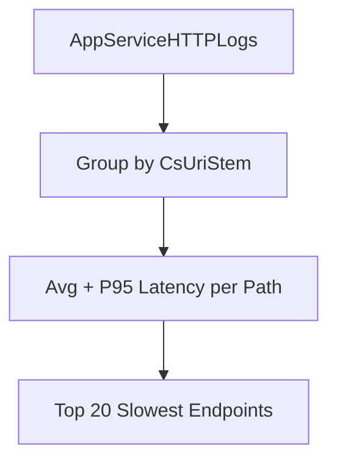

---
content_validation:
  status: verified
  last_reviewed: "2026-04-12"
  reviewer: ai-agent
  core_claims:
    - claim: "With Azure Monitor integration, you can create diagnostic settings to send logs to storage accounts, event hubs, and Log Analytics workspaces."
      source: "https://learn.microsoft.com/azure/app-service/troubleshoot-diagnostic-logs"
      verified: true
    - claim: "Log Analytics in the Azure portal lets you explore and analyze data collected by Azure Monitor Logs."
      source: "https://learn.microsoft.com/azure/azure-monitor/logs/log-analytics-tutorial"
      verified: true
    - claim: "Log Analytics in the Azure portal lets you edit and run log queries to filter records, uncover trends, analyze patterns, and gain meaningful insights into your environment."
      source: "https://learn.microsoft.com/azure/azure-monitor/logs/log-analytics-tutorial"
      verified: true
    - claim: "You can view, modify, and share visuals of query results."
      source: "https://learn.microsoft.com/azure/azure-monitor/logs/log-analytics-tutorial"
      verified: true
content_sources:
  diagrams:
    - id: troubleshooting-kql-http-slowest-requests-by-path-diagram-1
      type: graph
      source: self-generated
      justification: "Self-generated troubleshooting diagram synthesized from Microsoft Learn diagnostics and Azure App Service incident guidance for this guide."
      based_on:
        - https://learn.microsoft.com/en-us/azure/azure-monitor/logs/get-started-queries
        - https://learn.microsoft.com/en-us/azure/app-service/troubleshoot-diagnostic-logs
---
# Slowest Requests by Path

**Scenario**: Users report slowness, but only for some endpoints.
**Data Source**: AppServiceHTTPLogs
**Purpose**: Ranks request paths by tail latency to identify endpoint-level hotspots.

<!-- diagram-id: troubleshooting-kql-http-slowest-requests-by-path-diagram-1 -->


## Query

```kql
AppServiceHTTPLogs
| where TimeGenerated > ago(1h)
| summarize AvgTime=avg(TimeTaken), P95=percentile(TimeTaken, 95), Count=count() by CsUriStem
| top 20 by P95 desc
```

## Interpretation Notes
- Normal: top paths have expected P95 relative to their workload type and stable request counts.
- Abnormal: one/few paths show disproportionately high P95 with meaningful request volume.
- Reading tip: prioritize paths with both high P95 and non-trivial Count to avoid chasing one-off outliers.

## Limitations
- Freshness depends on logging pipeline delay.
- Paths with very low count can produce unstable percentile values.
- This query cannot reveal internal function-level bottlenecks inside a path.

## See Also

- [HTTP Query Pack](index.md)
- [KQL Query Packs](../index.md)

## Sources

- [Enable diagnostic logging for apps in Azure App Service](https://learn.microsoft.com/en-us/azure/app-service/troubleshoot-diagnostic-logs)
- [Monitor Azure App Service](https://learn.microsoft.com/en-us/azure/app-service/monitor-app-service)
- [Kusto Query Language (KQL) overview](https://learn.microsoft.com/en-us/kusto/query/)
