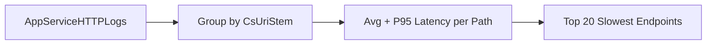

# Slowest Requests by Path

**Scenario**: Users report slowness, but only for some endpoints.
**Data Source**: AppServiceHTTPLogs
**Purpose**: Ranks request paths by tail latency to identify endpoint-level hotspots.



## Query

```kql
AppServiceHTTPLogs
| where TimeGenerated > ago(1h)
| summarize AvgTime=avg(TimeTaken), P95=percentile(TimeTaken, 95), Count=count() by CsUriStem
| top 20 by P95 desc
```

## Interpretation Notes
- Normal: top paths have expected P95 relative to their workload type and stable request counts.
- Abnormal: one/few paths show disproportionately high P95 with meaningful request volume.
- Reading tip: prioritize paths with both high P95 and non-trivial Count to avoid chasing one-off outliers.

## Limitations
- Freshness depends on logging pipeline delay.
- Paths with very low count can produce unstable percentile values.
- This query cannot reveal internal function-level bottlenecks inside a path.

## See Also

- [HTTP Query Pack](index.md)
- [KQL Query Packs](../index.md)

## Sources

- [Enable diagnostic logging for apps in Azure App Service](https://learn.microsoft.com/en-us/azure/app-service/troubleshoot-diagnostic-logs)
- [Monitor Azure App Service](https://learn.microsoft.com/en-us/azure/app-service/monitor-app-service)
- [Kusto Query Language (KQL) overview](https://learn.microsoft.com/en-us/kusto/query/)
