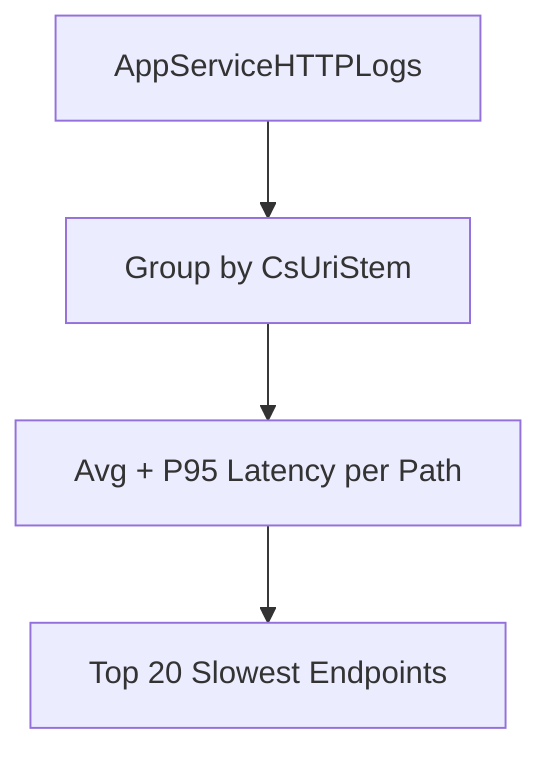

---
content_sources:
  diagrams:
    - id: troubleshooting-kql-http-slowest-requests-by-path-diagram-1
      type: graph
      source: self-generated
      justification: "Self-generated troubleshooting diagram synthesized from Microsoft Learn diagnostics and Azure App Service incident guidance for this guide."
      based_on:
        - https://learn.microsoft.com/en-us/azure/azure-monitor/logs/get-started-queries
        - https://learn.microsoft.com/en-us/azure/app-service/troubleshoot-diagnostic-logs
---
# Slowest Requests by Path

**Scenario**: Users report slowness, but only for some endpoints.
**Data Source**: AppServiceHTTPLogs
**Purpose**: Ranks request paths by tail latency to identify endpoint-level hotspots.

<!-- diagram-id: troubleshooting-kql-http-slowest-requests-by-path-diagram-1 -->

```mermaid
graph TD
    A[AppServiceHTTPLogs] --> B[Group by CsUriStem]
    B --> C[Avg + P95 Latency per Path]
    C --> D[Top 20 Slowest Endpoints]
```

## Run It in the Portal

#### Portal view: Logs blade (Log Analytics query editor)

![Azure portal Logs blade for ai-test-20251107 (Application Insights) with a New Query 1 tab open, top-right controls Observability agent (New), Save, Share, Queries hub, and an inline toolbar Run + Time range: Last 24 hours + Show: 1000 results + KQL mode dropdown. The query editor shows placeholder text "Type your query here or click one of the queries to start" on line 1. Below the editor a Query history pane reads "No queries history — You haven't run any queries yet. To start, go to Queries on the side pane or type a query in the query editor." Left nav under Monitoring lists Alerts, Metrics, Diagnostic settings, Logs (selected), Workbooks, Dashboards with Grafana; the Investigate group above is collapsed.](../../../assets/troubleshooting/log-analytics/01-logs.png)

The `Logs` blade is where the slowest-paths query below is pasted - this capture shows the Application Insights `Logs` experience (`ai-test-20251107`), but the workspace-based Log Analytics blade renders the same `New Query 1` tab and `Run` toolbar. The query terminates in `top 20 by P95 desc` - a ranking far smaller than the `Show: 1000 results` cap visible on the inline toolbar - so its output renders as a 20-row table (not a timechart) in the lower pane below the placeholder editor. Tighten the inline `Time range` selector from the default `Last 24 hours` shown here to `Last hour` so it matches the `ago(1h)` filter inside the query (otherwise the P95 percentile is computed over a wider window than the interpretation notes assume). The `No queries history` message confirms a fresh session.

## Query

```kql
AppServiceHTTPLogs
| where TimeGenerated > ago(1h)
| summarize AvgTime=avg(TimeTaken), P95=percentile(TimeTaken, 95), Count=count() by CsUriStem
| top 20 by P95 desc
```

## Interpretation Notes
- Normal: top paths have expected P95 relative to their workload type and stable request counts.
- Abnormal: one/few paths show disproportionately high P95 with meaningful request volume.
- Reading tip: prioritize paths with both high P95 and non-trivial Count to avoid chasing one-off outliers.

## Limitations
- Freshness depends on logging pipeline delay.
- Paths with very low count can produce unstable percentile values.
- This query cannot reveal internal function-level bottlenecks inside a path.

## See Also

- [HTTP Query Pack](index.md)
- [KQL Query Packs](../index.md)

## Sources

- [Enable diagnostic logging for apps in Azure App Service](https://learn.microsoft.com/en-us/azure/app-service/troubleshoot-diagnostic-logs)
- [Monitor Azure App Service](https://learn.microsoft.com/en-us/azure/app-service/monitor-app-service)
- [Kusto Query Language (KQL) overview](https://learn.microsoft.com/en-us/kusto/query/)
