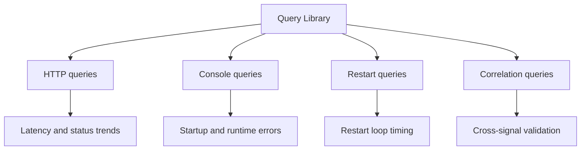

---
hide:
  - toc
content_sources:
  diagrams:
    - id: troubleshooting-kql-index-diagram-1
      type: graph
      source: self-generated
      justification: "Self-generated troubleshooting diagram synthesized from Microsoft Learn diagnostics and Azure App Service incident guidance for this guide."
      based_on:
        - https://learn.microsoft.com/en-us/azure/azure-monitor/logs/get-started-queries
        - https://learn.microsoft.com/en-us/azure/app-service/troubleshoot-diagnostic-logs
---
# Query Library

Reusable KQL queries for Azure App Service Linux investigations.

Use these queries to accelerate evidence collection before entering deep playbook analysis.

<!-- diagram-id: troubleshooting-kql-index-diagram-1 -->

## Categories

| Category | Focus | Index |
|----------|-------|-------|
| HTTP | Latency, status-code trends, slow endpoints | [HTTP Queries](http/index.md) |
| Console | Startup/runtime error signatures from container output | [Console Queries](console/index.md) |
| Restarts | Container restart timing and startup loop detection | [Restart Queries](restarts/index.md) |
| Correlation | Cross-signal views (latency, errors, restart events) | [Correlation Queries](correlation/index.md) |

## Usage Notes
- Default time windows are intentionally short (1h to 24h) for first-response triage.
- Adjust `ago(...)` windows and bin size for low-traffic or long-burn incidents.
- Validate table availability in your Log Analytics workspace before use.

## See Also

- [HTTP Queries](http/index.md)
- [Console Queries](console/index.md)
- [Correlation Queries](correlation/index.md)
