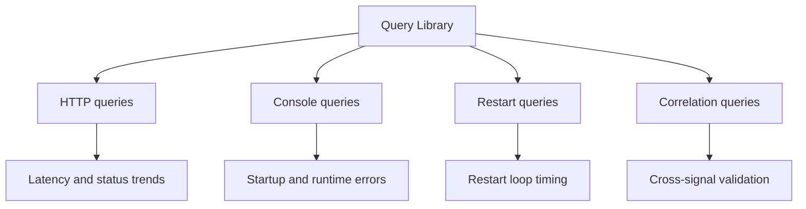

---
content_sources:
  diagrams:
    - id: troubleshooting-kql-index-diagram-1
      type: graph
      source: self-generated
      justification: Self-generated troubleshooting diagram synthesized from Microsoft Learn diagnostics and Azure App Service incident guidance for this guide.
      based_on:
        - https://learn.microsoft.com/en-us/azure/azure-monitor/logs/get-started-queries
        - https://learn.microsoft.com/en-us/azure/app-service/troubleshoot-diagnostic-logs
---
# Query Library

Reusable KQL queries for Azure App Service Linux investigations.

Use these queries to accelerate evidence collection before entering deep playbook analysis.

<!-- diagram-id: troubleshooting-kql-index-diagram-1 -->

```mermaid
graph TD
    A[Query Library] --> B[HTTP queries]
    A --> C[Console queries]
    A --> D[Restart queries]
    A --> E[Correlation queries]
    B --> F[Latency and status trends]
    C --> G[Startup and runtime errors]
    D --> H[Restart loop timing]
    E --> I[Cross-signal validation]
```

## Run It in the Portal

#### Portal view: Logs blade (Log Analytics query editor)

![Azure portal Logs blade for ai-test-20251107 (Application Insights) with a New Query 1 tab open, top-right controls Observability agent (New), Save, Share, Queries hub, and an inline toolbar Run + Time range: Last 24 hours + Show: 1000 results + KQL mode dropdown. The query editor shows placeholder text "Type your query here or click one of the queries to start" on line 1. Below the editor a Query history pane reads "No queries history — You haven't run any queries yet. To start, go to Queries on the side pane or type a query in the query editor." Left nav under Monitoring lists Alerts, Metrics, Diagnostic settings, Logs (selected), Workbooks, Dashboards with Grafana; the Investigate group above is collapsed.](../../assets/troubleshooting/log-analytics/01-logs.png)

The `Logs` blade is the single entry point for every query in this library - this capture shows the Application Insights `Logs` experience (`ai-test-20251107`), but the workspace-based Log Analytics blade renders the same `New Query 1` tab, `Run` toolbar, and `KQL mode` dropdown. The placeholder `Type your query here or click one of the queries to start` and the empty `Query history` pane confirm a fresh session: paste any of the snippets from the HTTP, Console, Restart, or Correlation packs below into the editor to populate it. The default `Time range: Last 24 hours` matches the wider triage windows in this library; tighten it via the inline `Time range` selector when running short-burn queries with `ago(1h)` filters. The `Queries hub` button in the top-right is the visible entry point for saving or reopening investigation snippets once you start running the library queries.

## Categories

| Category | Focus | Index |
|----------|-------|-------|
| HTTP | Latency, status-code trends, slow endpoints | [HTTP Queries](http/index.md) |
| Console | Startup/runtime error signatures from container output | [Console Queries](console/index.md) |
| Restarts | Container restart timing and startup loop detection | [Restart Queries](restarts/index.md) |
| Correlation | Cross-signal views (latency, errors, restart events) | [Correlation Queries](correlation/index.md) |

## Usage Notes
- Default time windows are intentionally short (1h to 24h) for first-response triage.
- Adjust `ago(...)` windows and bin size for low-traffic or long-burn incidents.
- Validate table availability in your Log Analytics workspace before use.

## See Also

- [HTTP Queries](http/index.md)
- [Console Queries](console/index.md)
- [Correlation Queries](correlation/index.md)

## Sources

- [Microsoft Learn source 1](https://learn.microsoft.com/en-us/azure/azure-monitor/logs/get-started-queries)
- [Microsoft Learn source 2](https://learn.microsoft.com/en-us/azure/app-service/troubleshoot-diagnostic-logs)
