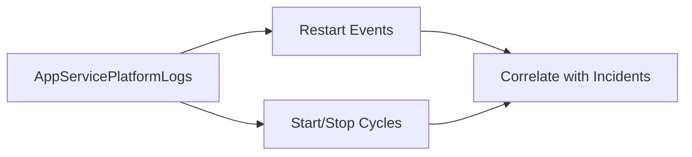

---
content_sources:
  diagrams:
    - id: troubleshooting-kql-restarts-index-diagram-1
      type: graph
      source: self-generated
      justification: "Self-generated troubleshooting diagram synthesized from Microsoft Learn diagnostics and Azure App Service incident guidance for this guide."
      based_on:
        - https://learn.microsoft.com/en-us/azure/azure-monitor/logs/get-started-queries
        - https://learn.microsoft.com/en-us/azure/app-service/troubleshoot-diagnostic-logs
---
# Restart Queries

Use these queries to confirm restart timing, startup loops, and restart correlation with incident windows.

<!-- diagram-id: troubleshooting-kql-restarts-index-diagram-1 -->

## Available Queries
- [Restart Timing Correlation](restart-timing-correlation.md)
- [Repeated Startup Attempts](repeated-startup-attempts.md)

## See Also

- [KQL Query Library](../index.md)
- [Console Queries](../console/index.md)
- [Correlation Queries](../correlation/index.md)
