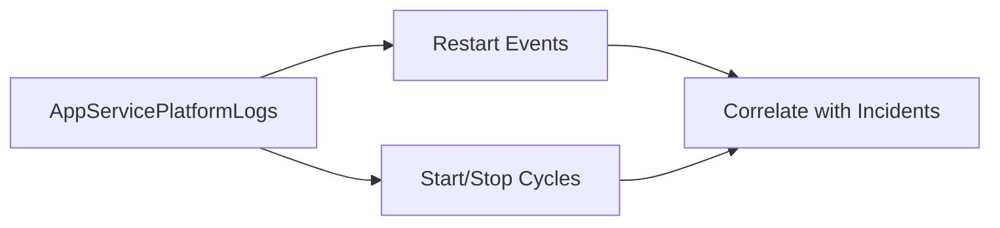

# Restart Queries

Use these queries to confirm restart timing, startup loops, and restart correlation with incident windows.

## Available Queries
- [Restart Timing Correlation](restart-timing-correlation.md)
- [Repeated Startup Attempts](repeated-startup-attempts.md)

## See Also

- [KQL Query Library](../index.md)
- [Console Queries](../console/index.md)
- [Correlation Queries](../correlation/index.md)
