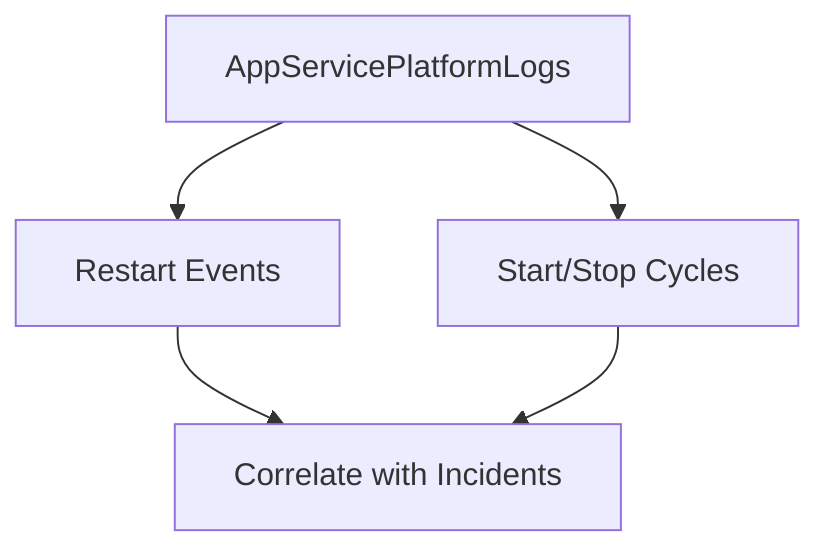

---
content_sources:
  diagrams:
    - id: troubleshooting-kql-restarts-index-diagram-1
      type: graph
      source: self-generated
      justification: Self-generated troubleshooting diagram synthesized from Microsoft Learn diagnostics and Azure App Service incident guidance for this guide.
      based_on:
        - https://learn.microsoft.com/en-us/azure/azure-monitor/logs/get-started-queries
        - https://learn.microsoft.com/en-us/azure/app-service/troubleshoot-diagnostic-logs
---
# Restart Queries

Use these queries to confirm restart timing, startup loops, and restart correlation with incident windows.

<!-- diagram-id: troubleshooting-kql-restarts-index-diagram-1 -->

```mermaid
graph TD
    A[AppServicePlatformLogs] --> B[Restart Events]
    A --> C[Start/Stop Cycles]
    B --> D[Correlate with Incidents]
    C --> D
```

## Run It in the Portal

#### Portal view: Logs blade (Log Analytics query editor)

![Azure portal Logs blade for ai-test-20251107 (Application Insights) with a New Query 1 tab open, top-right controls Observability agent (New), Save, Share, Queries hub, and an inline toolbar Run + Time range: Last 24 hours + Show: 1000 results + KQL mode dropdown. The query editor shows placeholder text "Type your query here or click one of the queries to start" on line 1. Below the editor a Query history pane reads "No queries history — You haven't run any queries yet. To start, go to Queries on the side pane or type a query in the query editor." Left nav under Monitoring lists Alerts, Metrics, Diagnostic settings, Logs (selected), Workbooks, Dashboards with Grafana; the Investigate group above is collapsed.](../../../assets/troubleshooting/log-analytics/01-logs.png)

The `Logs` blade is where the restart-investigation queries below are pasted - this capture shows the Application Insights `Logs` experience (`ai-test-20251107`), but the workspace-based Log Analytics blade has the same `New Query 1` tab and `Run` toolbar. Both restart queries target `AppServicePlatformLogs`, which becomes the leading table identifier once the placeholder `Type your query here or click one of the queries to start` is replaced. The default `Time range: Last 24 hours` covers most restart-loop detection windows; for tight restart cycles use the inline `Time range` selector to drop to `Last hour`. The `No queries history` message and the empty `Query history` pane confirm this is a fresh session - the first `Run` populates both the result pane and the history.

## Available Queries
- [Restart Timing Correlation](restart-timing-correlation.md)
- [Repeated Startup Attempts](repeated-startup-attempts.md)

## See Also

- [KQL Query Library](../index.md)
- [Console Queries](../console/index.md)
- [Correlation Queries](../correlation/index.md)

## Sources

- [Microsoft Learn source 1](https://learn.microsoft.com/en-us/azure/azure-monitor/logs/get-started-queries)
- [Microsoft Learn source 2](https://learn.microsoft.com/en-us/azure/app-service/troubleshoot-diagnostic-logs)
