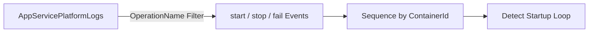

# Repeated Startup Attempts

**Scenario**: Suspected start/fail loop where the container repeatedly attempts startup.
**Data Source**: AppServicePlatformLogs
**Purpose**: Shows start/stop/fail operation sequences to detect rapid startup cycling.



## Query

```kql
AppServicePlatformLogs
| where TimeGenerated > ago(6h)
| where OperationName has_any ("start", "Start", "stop", "Stop", "fail", "Fail")
| project TimeGenerated, OperationName, ContainerId
| order by TimeGenerated desc
```

## Interpretation Notes
- Normal: start events are infrequent and not followed by immediate fail/stop patterns.
- Abnormal: repeated start -> fail/stop loops within short intervals.
- Reading tip: check whether ContainerId changes each cycle (new container attempts) or remains constant.

## Limitations
- Ingestion delay can make rapid loops appear incomplete in near-real-time.
- Keyword matching may include non-startup operations that contain similar text.
- This query cannot show application stack traces causing the failure loop.

## References

- [Enable diagnostic logging for apps in Azure App Service](https://learn.microsoft.com/en-us/azure/app-service/troubleshoot-diagnostic-logs)
- [Monitor Azure App Service](https://learn.microsoft.com/en-us/azure/app-service/monitor-app-service)
- [Kusto Query Language (KQL) overview](https://learn.microsoft.com/en-us/kusto/query/)
