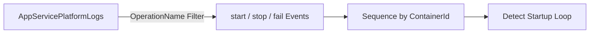

---
content_validation:
  status: verified
  last_reviewed: "2026-04-12"
  reviewer: ai-agent
  core_claims:
    - claim: "With Azure Monitor integration, you can create diagnostic settings to send logs to storage accounts, event hubs, and Log Analytics workspaces."
      source: "https://learn.microsoft.com/azure/app-service/troubleshoot-diagnostic-logs"
      verified: true
    - claim: "Log Analytics in the Azure portal lets you explore and analyze data collected by Azure Monitor Logs."
      source: "https://learn.microsoft.com/azure/azure-monitor/logs/log-analytics-tutorial"
      verified: true
    - claim: "Log Analytics in the Azure portal lets you edit and run log queries to filter records, uncover trends, analyze patterns, and gain meaningful insights into your environment."
      source: "https://learn.microsoft.com/azure/azure-monitor/logs/log-analytics-tutorial"
      verified: true
content_sources:
  diagrams:
    - id: troubleshooting-kql-restarts-repeated-startup-attempts-diagram-1
      type: graph
      source: self-generated
      justification: "Self-generated troubleshooting diagram synthesized from Microsoft Learn diagnostics and Azure App Service incident guidance for this guide."
      based_on:
        - https://learn.microsoft.com/en-us/azure/azure-monitor/logs/get-started-queries
        - https://learn.microsoft.com/en-us/azure/app-service/troubleshoot-diagnostic-logs
---
# Repeated Startup Attempts

**Scenario**: Suspected start/fail loop where the container repeatedly attempts startup.
**Data Source**: AppServicePlatformLogs
**Purpose**: Shows start/stop/fail operation sequences to detect rapid startup cycling.

<!-- diagram-id: troubleshooting-kql-restarts-repeated-startup-attempts-diagram-1 -->


## Query

```kql
AppServicePlatformLogs
| where TimeGenerated > ago(6h)
| where OperationName has_any ("start", "Start", "stop", "Stop", "fail", "Fail")
| project TimeGenerated, OperationName, ContainerId
| order by TimeGenerated desc
```

## Interpretation Notes
- Normal: start events are infrequent and not followed by immediate fail/stop patterns.
- Abnormal: repeated start -> fail/stop loops within short intervals.
- Reading tip: check whether ContainerId changes each cycle (new container attempts) or remains constant.

## Limitations
- Ingestion delay can make rapid loops appear incomplete in near-real-time.
- Keyword matching may include non-startup operations that contain similar text.
- This query cannot show application stack traces causing the failure loop.

## See Also

- [Restarts Query Pack](index.md)
- [KQL Query Packs](../index.md)

## Sources

- [Enable diagnostic logging for apps in Azure App Service](https://learn.microsoft.com/en-us/azure/app-service/troubleshoot-diagnostic-logs)
- [Monitor Azure App Service](https://learn.microsoft.com/en-us/azure/app-service/monitor-app-service)
- [Kusto Query Language (KQL) overview](https://learn.microsoft.com/en-us/kusto/query/)
