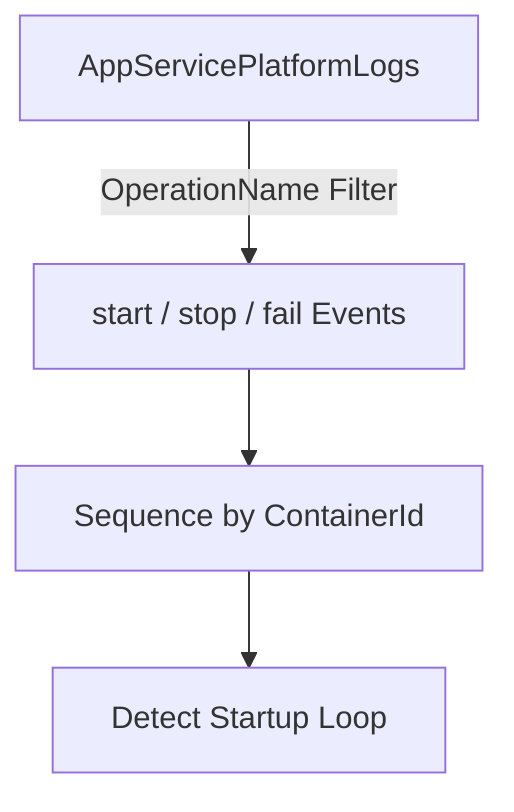

---
content_sources:
  diagrams:
    - id: troubleshooting-kql-restarts-repeated-startup-attempts-diagram-1
      type: graph
      source: self-generated
      justification: "Self-generated troubleshooting diagram synthesized from Microsoft Learn diagnostics and Azure App Service incident guidance for this guide."
      based_on:
        - https://learn.microsoft.com/en-us/azure/azure-monitor/logs/get-started-queries
        - https://learn.microsoft.com/en-us/azure/app-service/troubleshoot-diagnostic-logs
---
# Repeated Startup Attempts

**Scenario**: Suspected start/fail loop where the container repeatedly attempts startup.
**Data Source**: AppServicePlatformLogs
**Purpose**: Shows start/stop/fail operation sequences to detect rapid startup cycling.

<!-- diagram-id: troubleshooting-kql-restarts-repeated-startup-attempts-diagram-1 -->

```mermaid
graph TD
    A[AppServicePlatformLogs] -->|OperationName Filter| B[start / stop / fail Events]
    B --> C[Sequence by ContainerId]
    C --> D[Detect Startup Loop]
```

## Run It in the Portal

#### Portal view: Logs blade (Log Analytics query editor)

![Azure portal Logs blade for ai-test-20251107 (Application Insights) with a New Query 1 tab open, top-right controls Observability agent (New), Save, Share, Queries hub, and an inline toolbar Run + Time range: Last 24 hours + Show: 1000 results + KQL mode dropdown. The query editor shows placeholder text "Type your query here or click one of the queries to start" on line 1. Below the editor a Query history pane reads "No queries history — You haven't run any queries yet. To start, go to Queries on the side pane or type a query in the query editor." Left nav under Monitoring lists Alerts, Metrics, Diagnostic settings, Logs (selected), Workbooks, Dashboards with Grafana; the Investigate group above is collapsed.](../../../assets/troubleshooting/log-analytics/01-logs.png)

The `Logs` blade is where the repeated-startup-attempts query below is pasted - this capture shows the Application Insights `Logs` experience (`ai-test-20251107`), but the workspace-based Log Analytics blade renders the same `New Query 1` tab and `Run` toolbar. Replace the placeholder `Type your query here or click one of the queries to start` with the `AppServicePlatformLogs | where OperationName has_any ("start", "Start", ...)` block; tighten the inline `Time range` selector from the default `Last 24 hours` shown here to `Last 6 hours` so it matches the `ago(6h)` filter inside the query. The query projects `TimeGenerated`, `OperationName`, and `ContainerId`, so results render as a three-column tabular grid in the lower pane - scan the `ContainerId` column to verify whether a rapid loop is producing new containers each cycle or reusing one.

## Query

```kql
AppServicePlatformLogs
| where TimeGenerated > ago(6h)
| where OperationName has_any ("start", "Start", "stop", "Stop", "fail", "Fail")
| project TimeGenerated, OperationName, ContainerId
| order by TimeGenerated desc
```

## Interpretation Notes
- Normal: start events are infrequent and not followed by immediate fail/stop patterns.
- Abnormal: repeated start -> fail/stop loops within short intervals.
- Reading tip: check whether ContainerId changes each cycle (new container attempts) or remains constant.

## Limitations
- Ingestion delay can make rapid loops appear incomplete in near-real-time.
- Keyword matching may include non-startup operations that contain similar text.
- This query cannot show application stack traces causing the failure loop.

## See Also

- [Restarts Query Pack](index.md)
- [KQL Query Packs](../index.md)

## Sources

- [Enable diagnostic logging for apps in Azure App Service](https://learn.microsoft.com/en-us/azure/app-service/troubleshoot-diagnostic-logs)
- [Monitor Azure App Service](https://learn.microsoft.com/en-us/azure/app-service/monitor-app-service)
- [Kusto Query Language (KQL) overview](https://learn.microsoft.com/en-us/kusto/query/)
