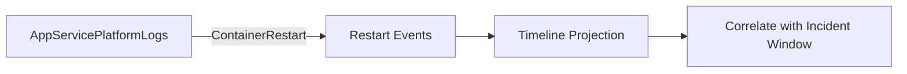

# Restart Timing Correlation

**Scenario**: Latency/error spikes appear to align with restarts.
**Data Source**: AppServicePlatformLogs
**Purpose**: Lists restart-related platform events to correlate with incident timelines.



## Query

```kql
AppServicePlatformLogs
| where TimeGenerated > ago(24h)
| where OperationName == "ContainerRestart" or OperationName has "restart"
| project TimeGenerated, OperationName, ContainerId
| order by TimeGenerated desc
```

## Interpretation Notes
- Normal: occasional isolated restart events with no repeating cadence.
- Abnormal: clustered restart events during user-facing degradation windows.
- Reading tip: correlate event timestamps against 5xx spikes and P95/P99 increases.

## Limitations
- Platform log availability and naming can vary by environment/configuration.
- Some restart-like behaviors may be represented by related operation names not captured by this filter.
- This query cannot identify the root cause of restart (app crash vs platform action) by itself.

## References

- [Enable diagnostic logging for apps in Azure App Service](https://learn.microsoft.com/en-us/azure/app-service/troubleshoot-diagnostic-logs)
- [Monitor Azure App Service](https://learn.microsoft.com/en-us/azure/app-service/monitor-app-service)
- [Kusto Query Language (KQL) overview](https://learn.microsoft.com/en-us/kusto/query/)
