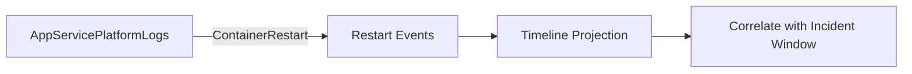

---
hide:
  - toc
title: Restart Timing Correlation
slug: restart-timing-correlation
doc_type: kql
section: troubleshooting
topics:
  - kql
  - restarts
  - correlation
products:
  - azure-app-service
used_in:
  - memory-pressure-and-worker-degradation
summary: KQL query to correlate restart events with latency and error spikes.
status: stable
last_reviewed: 2026-04-08
content_validation:
  status: verified
  last_reviewed: "2026-04-12"
  reviewer: ai-agent
  core_claims:
    - claim: "With Azure Monitor integration, you can create diagnostic settings to send logs to storage accounts, event hubs, and Log Analytics workspaces."
      source: "https://learn.microsoft.com/azure/app-service/troubleshoot-diagnostic-logs"
      verified: true
    - claim: "Log Analytics in the Azure portal lets you explore and analyze data collected by Azure Monitor Logs."
      source: "https://learn.microsoft.com/azure/azure-monitor/logs/log-analytics-tutorial"
      verified: true
    - claim: "Log Analytics in the Azure portal lets you edit and run log queries to filter records, uncover trends, analyze patterns, and gain meaningful insights into your environment."
      source: "https://learn.microsoft.com/azure/azure-monitor/logs/log-analytics-tutorial"
      verified: true
    - claim: "You can view, modify, and share visuals of query results."
      source: "https://learn.microsoft.com/azure/azure-monitor/logs/log-analytics-tutorial"
      verified: true
content_sources:
  diagrams:
    - id: troubleshooting-kql-restarts-restart-timing-correlation-diagram-1
      type: graph
      source: self-generated
      justification: "Self-generated troubleshooting diagram synthesized from Microsoft Learn diagnostics and Azure App Service incident guidance for this guide."
      based_on:
        - https://learn.microsoft.com/en-us/azure/azure-monitor/logs/get-started-queries
        - https://learn.microsoft.com/en-us/azure/app-service/troubleshoot-diagnostic-logs
---
# Restart Timing Correlation

**Scenario**: Latency/error spikes appear to align with restarts.
**Data Source**: AppServicePlatformLogs
**Purpose**: Lists restart-related platform events to correlate with incident timelines.

<!-- diagram-id: troubleshooting-kql-restarts-restart-timing-correlation-diagram-1 -->


## Query

```kql
AppServicePlatformLogs
| where TimeGenerated > ago(24h)
| where OperationName == "ContainerRestart" or OperationName has "restart"
| project TimeGenerated, OperationName, ContainerId
| order by TimeGenerated desc
```

## Interpretation Notes
- Normal: occasional isolated restart events with no repeating cadence.
- Abnormal: clustered restart events during user-facing degradation windows.
- Reading tip: correlate event timestamps against 5xx spikes and P95/P99 increases.

## Limitations
- Platform log availability and naming can vary by environment/configuration.
- Some restart-like behaviors may be represented by related operation names not captured by this filter.
- This query cannot identify the root cause of restart (app crash vs platform action) by itself.

## See Also

- [Restarts Query Pack](index.md)
- [KQL Query Packs](../index.md)

## Sources

- [Enable diagnostic logging for apps in Azure App Service](https://learn.microsoft.com/en-us/azure/app-service/troubleshoot-diagnostic-logs)
- [Monitor Azure App Service](https://learn.microsoft.com/en-us/azure/app-service/monitor-app-service)
- [Kusto Query Language (KQL) overview](https://learn.microsoft.com/en-us/kusto/query/)
