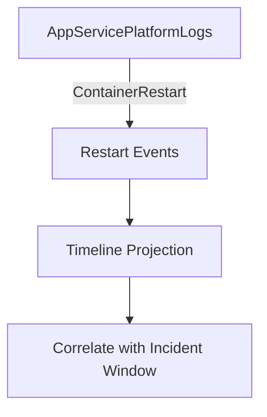

# Restart Timing Correlation

**Scenario**: Latency/error spikes appear to align with restarts.
**Data Source**: AppServicePlatformLogs
**Purpose**: Lists restart-related platform events to correlate with incident timelines.

<!-- diagram-id: troubleshooting-kql-restarts-restart-timing-correlation-diagram-1 -->

```mermaid
graph TD
    A[AppServicePlatformLogs] -->|ContainerRestart| B[Restart Events]
    B --> C[Timeline Projection]
    C --> D[Correlate with Incident Window]
```

## Run It in the Portal

#### Portal view: Logs blade (Log Analytics query editor)

![Azure portal Logs blade for ai-test-20251107 (Application Insights) with a New Query 1 tab open, top-right controls Observability agent (New), Save, Share, Queries hub, and an inline toolbar Run + Time range: Last 24 hours + Show: 1000 results + KQL mode dropdown. The query editor shows placeholder text "Type your query here or click one of the queries to start" on line 1. Below the editor a Query history pane reads "No queries history — You haven't run any queries yet. To start, go to Queries on the side pane or type a query in the query editor." Left nav under Monitoring lists Alerts, Metrics, Diagnostic settings, Logs (selected), Workbooks, Dashboards with Grafana; the Investigate group above is collapsed.](../../../assets/troubleshooting/log-analytics/01-logs.png)

The `Logs` blade is where the restart-timing query below is pasted - this capture shows the Application Insights `Logs` experience (`ai-test-20251107`), but the workspace-based Log Analytics blade renders the same `New Query 1` tab and `Run` toolbar. Replace the placeholder `Type your query here or click one of the queries to start` with the `AppServicePlatformLogs | where OperationName == "ContainerRestart" or OperationName has "restart"` block; the inline `Time range: Last 24 hours` selector already matches the `ago(24h)` filter inside the query, so no adjustment is required. The query projects three columns (`TimeGenerated`, `OperationName`, `ContainerId`) and orders them descending, so results render as a tabular grid in the lower pane below the placeholder editor - the timeline shape is read by scanning the `TimeGenerated` column rather than from a chart.

## Query

```kql
AppServicePlatformLogs
| where TimeGenerated > ago(24h)
| where OperationName == "ContainerRestart" or OperationName has "restart"
| project TimeGenerated, OperationName, ContainerId
| order by TimeGenerated desc
```

## Interpretation Notes
- Normal: occasional isolated restart events with no repeating cadence.
- Abnormal: clustered restart events during user-facing degradation windows.
- Reading tip: correlate event timestamps against 5xx spikes and P95/P99 increases.

## Limitations
- Platform log availability and naming can vary by environment/configuration.
- Some restart-like behaviors may be represented by related operation names not captured by this filter.
- This query cannot identify the root cause of restart (app crash vs platform action) by itself.

## See Also

- [Restarts Query Pack](index.md)
- [KQL Query Packs](../index.md)

## Sources

- [Enable diagnostic logging for apps in Azure App Service](https://learn.microsoft.com/en-us/azure/app-service/troubleshoot-diagnostic-logs)
- [Monitor Azure App Service](https://learn.microsoft.com/en-us/azure/app-service/monitor-app-service)
- [Kusto Query Language (KQL) overview](https://learn.microsoft.com/en-us/kusto/query/)
