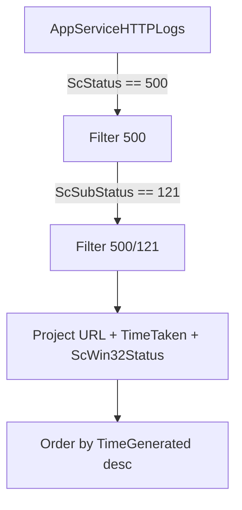

# 500/121 Timeout Signature Detection

**Scenario**: Client-reported HTTP 500 errors on Windows App Service (Java SE, Python on Windows, Node on Windows), suspected to be the `httpPlatformHandler` timeout signature.
**Data Source**: `AppServiceHTTPLogs`
**Purpose**: Enumerate every request that IIS terminated with `500.121.*` so you can eyeball the URL distribution, per-request `TimeTaken`, and `ScWin32Status` extension distribution before running the aggregation queries.

<!-- diagram-id: troubleshooting-kql-windows-500-121-diagram-1 -->


## Run It in the Portal

#### Portal view: Logs blade (Log Analytics query editor)

![Azure portal Logs blade for ai-test-20251107 (Application Insights) with a New Query 1 tab open, top-right controls Observability agent (New), Save, Share, Queries hub, and an inline toolbar Run + Time range: Last 24 hours + Show: 1000 results + KQL mode dropdown. The query editor shows placeholder text "Type your query here or click one of the queries to start" on line 1. Below the editor a Query history pane reads "No queries history — You haven't run any queries yet. To start, go to Queries on the side pane or type a query in the query editor." Left nav under Monitoring lists Alerts, Metrics, Diagnostic settings, Logs (selected), Workbooks, Dashboards with Grafana; the Investigate group above is collapsed.](../../../assets/troubleshooting/log-analytics/01-logs.png)

Paste the query below into the `New Query 1` editor and press `Run`. The default `Time range: Last 24 hours` selector matches the `ago(24h)` filter in the query. The result grid populates with one row per `500/121` request; if the app is behaving normally you should see **zero** rows. Any non-zero result is a real timeout event worth investigating.

## Query

```kusto
AppServiceHTTPLogs
| where TimeGenerated > ago(24h)
| where ScStatus == 500 and ScSubStatus == 121
| project
    TimeGenerated,
    CsUriStem,
    CsMethod,
    TimeTaken_ms = TimeTaken,
    ScStatus,
    ScSubStatus,
    ScWin32Status,
    CsBytes,
    ScBytes,
    CIp
| order by TimeGenerated desc
```

## Interpretation Notes

- **Zero rows**: No httpPlatformHandler timeout activity in the last 24 hours. This is the expected steady state.
- **A handful of rows on the same URL**: A specific slow endpoint is repeatedly hitting the front-end 230s ceiling. Route to endpoint-level analysis (query dependency latency, look for blocking I/O in the handler).
- **Many rows spread across many URLs, all `ScWin32Status = 0`**: The whole app is slow and requests are hitting the 230s absolute limit. Look at plan SKU vs load, GC pauses, or downstream saturation. See the [timeout cluster statistics](timeout-cluster-statistics.md) query to confirm the 230s clustering.
- **Rows with `ScWin32Status = 64`**: Adaptive-extension activity. See the [ScWin32Status .0 vs .64 distribution](scwin32status-adaptive-extension.md) query to quantify the ratio.
- **`TimeTaken` values well below 230000 ms**: The cut is happening earlier than the front-end limit. Check whether `httpPlatformHandler.requestTimeout` has been reduced via a custom `web.config`, or whether the app is issuing an internal 500 that IIS is annotating with the same sub-status.

Lab 1 of the Windows Java httpPlatformHandler timeout lab (to be published under `docs/troubleshooting/lab-guides/` once Lab 2 completes) demonstrated 10/10 rows with mean `TimeTaken = 230001 ms`, standard deviation 5 ms - a textbook front-end 230s cut with no adaptive-extension activity under serialized load.

## Limitations

- `AppServiceHTTPLogs` ingestion lag is typically 2-5 minutes. Rows for very recent requests may not appear immediately.
- `AppServiceHTTPLogs` does not distinguish between the httpPlatformHandler reuse of `500.121` and a genuine FastCGI-hosted app's `500.121`. On Windows App Service Java SE the signal is unambiguously httpPlatformHandler because there is no FastCGI worker in the stack; on other language runtimes (PHP, Python on Windows classic) FastCGI **may** be involved and additional context is needed.
- The query lists individual requests but does not aggregate. For statistical characterization of the timing distribution, use the [timeout cluster statistics](timeout-cluster-statistics.md) query.
- If the App Service is behind an upstream reverse proxy (Application Gateway, Front Door, or a custom nginx), the client-observed status code may be `502` or `504` even when this query returns `500/121` at the IIS layer. Correlate with upstream logs.

## See Also

- [Windows httpPlatformHandler KQL pack](index.md)
- [Timeout cluster statistics](timeout-cluster-statistics.md)
- [ScWin32Status .0 vs .64 distribution](scwin32status-adaptive-extension.md)
- [Backend orphan-work timeline](backend-orphan-timeline.md)

## Sources

- [`AppServiceHTTPLogs` schema reference](https://learn.microsoft.com/en-us/azure/azure-monitor/reference/tables/appservicehttplogs)
- [`httpPlatformHandler` configuration reference](https://learn.microsoft.com/en-us/iis/extensions/httpplatformhandler/httpplatformhandler-configuration-reference)
- [App Service front-end 230-second request timeout](https://learn.microsoft.com/en-us/troubleshoot/azure/app-service/web-request-times-out-app-service)
- [IIS status codes (500.121 sub-status meaning)](https://learn.microsoft.com/en-us/troubleshoot/developer/webapps/iis/www-administration-management/http-status-code)
