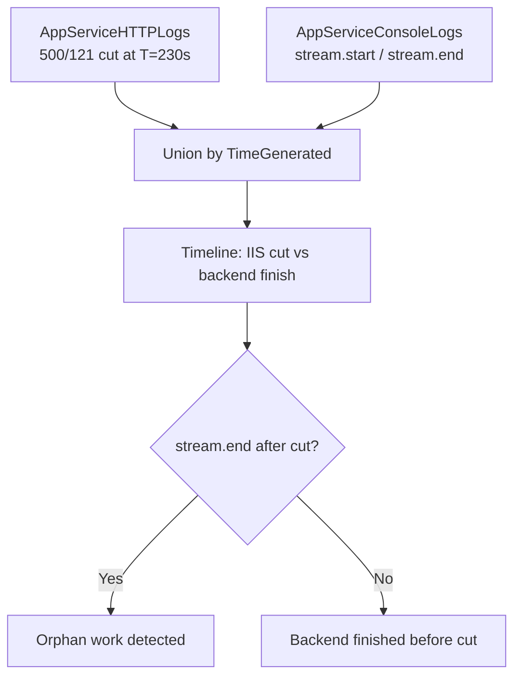

# Backend Orphan-Work Timeline

**Scenario**: You need to prove that a Windows App Service Java process continues doing work after IIS has already returned `500.121.*` to the client. This is critical for capacity planning and for understanding why "just increase timeouts" is not always a safe fix.
**Data Source**: `AppServiceHTTPLogs` + `AppServiceConsoleLogs`
**Purpose**: Union IIS request-completion events (`500/121` cuts) with backend Java stdout markers (`stream.start`, `stream.end`, or your application's equivalent) into a single time-ordered timeline. The gap between an IIS cut and the subsequent backend completion marker is the **orphan-work window**.

<!-- diagram-id: troubleshooting-kql-windows-backend-orphan-diagram-1 -->


## Run It in the Portal

#### Portal view: Logs blade (Log Analytics query editor)

![Azure portal Logs blade for ai-test-20251107 (Application Insights) with a New Query 1 tab open, top-right controls Observability agent (New), Save, Share, Queries hub, and an inline toolbar Run + Time range: Last 24 hours + Show: 1000 results + KQL mode dropdown. The query editor shows placeholder text "Type your query here or click one of the queries to start" on line 1. Below the editor a Query history pane reads "No queries history — You haven't run any queries yet. To start, go to Queries on the side pane or type a query in the query editor." Left nav under Monitoring lists Alerts, Metrics, Diagnostic settings, Logs (selected), Workbooks, Dashboards with Grafana; the Investigate group above is collapsed.](../../../assets/troubleshooting/log-analytics/01-logs.png)

Paste the query below into the `New Query 1` editor and press `Run`. This query produces a merged timeline; expect to see interleaved rows from both tables. Sort by the `event_ts` column ascending to read the sequence of events in real time order.

## Query

Replace the two `has_any` string literals with your application's actual stdout markers if you have not adopted the `stream.start` / `stream.end` naming convention.

```kusto
let window_start = ago(2h);
let http_cuts = AppServiceHTTPLogs
    | where TimeGenerated > window_start
    | where ScStatus == 500 and ScSubStatus == 121
    | project
        event_ts = TimeGenerated,
        event_type = "iis_cut",
        detail = strcat(
            CsUriStem,
            "  TimeTaken=", tostring(TimeTaken), " ms",
            "  ScWin32Status=", tostring(ScWin32Status)
        );
let console_markers = AppServiceConsoleLogs
    | where TimeGenerated > window_start
    | where ResultDescription has_any ("stream.start", "stream.end", "stream.interrupted")
    | project
        event_ts = TimeGenerated,
        event_type = "backend_marker",
        detail = ResultDescription;
union http_cuts, console_markers
| order by event_ts asc
```

## Interpretation Notes

A well-formed orphan-work incident produces this pattern:

```
event_ts                  event_type       detail
------------------------  --------------   -------------------------------------------------
2026-07-01T10:38:20.775Z  backend_marker   stream.start seconds=300 bounded=300 ...
2026-07-01T10:42:11.834Z  iis_cut          /stream/300  TimeTaken=230005 ms  ScWin32Status=0
2026-07-01T10:43:20.784Z  backend_marker   stream.end   seconds=300 chunkCount=11 elapsedMs=300008
```

Reading top to bottom:

1. The Java process signals `stream.start` (T = 0).
2. **~230 seconds later**, IIS emits the `500/121` cut with `TimeTaken = 230005 ms`. The client is disconnected at this moment.
3. **~69 seconds after the IIS cut** (i.e. at T = 300s), the Java process signals `stream.end` with `chunkCount = 11` and `elapsedMs = 300008` - the request-handler thread ran to completion despite the client being long gone.

This sequence, observed live in Lab 1 of the Windows Java httpPlatformHandler timeout lab (to be published under `docs/troubleshooting/lab-guides/` once Lab 2 completes), proves three important things:

1. **The front-end 230s limit is an ABSOLUTE request-duration limit on Windows App Service Java SE**, not an idle timeout. Streaming responses do not reset it, so streaming is **not** a workaround for exceeding 230s.
2. **IIS + `httpPlatformHandler` do not stream chunks to the client on Java SE**. Even though the backend generated 11 chunks over 5 minutes, the client received zero chunks - the whole response is buffered until either the backend completes (in which case the client gets the full body) or IIS cuts at 230s (in which case the client gets a canonical `500.121` error page instead of any partial data).
3. **Backend threads continue to consume CPU, memory, database connections, and downstream service quota after the client is disconnected.** For capacity planning, plan for `(peak concurrent requests) x (P99 backend duration)`, not `x (front-end 230s ceiling)`.

If the timeline shows the `backend_marker` (stream.end) **before** the `iis_cut`, the request completed successfully and the `500/121` you are seeing is from a different request in the same window - narrow the query with `| where CsUriStem == "..."` or a shorter `window_start`.

## Limitations

- The query relies on your application emitting distinctive stdout markers. Applications that do not log request boundaries will produce a timeline with only IIS cut events and no backend context.
- `AppServiceConsoleLogs` and `AppServiceHTTPLogs` have independent ingestion pipelines and may exhibit slightly different lag. In practice the ordering by `TimeGenerated` is accurate to within a few hundred milliseconds.
- The query does not join events into single logical requests. It produces a merged timeline for **eyeball correlation**. For precise per-request joining, add a correlation ID (e.g. `HttpRequestId`) to your backend log format and use a proper `join` operator.
- If the app is under load, both tables will produce many rows and the interleaved output can be hard to read. Narrow `window_start` to a 5-15 minute window around a specific incident.
- Console-log volume on chatty apps can be large. Consider adding `| where TimeGenerated > ago(30m)` and specific `has_any` filters that match only your request-lifecycle markers, not general application log noise.

## See Also

- [Windows httpPlatformHandler KQL pack](index.md)
- [500/121 timeout signature detection](500-121-timeout-signature.md)
- [Timeout cluster statistics](timeout-cluster-statistics.md)
- [ScWin32Status .0 vs .64 distribution](scwin32status-adaptive-extension.md)

## Sources

- [`AppServiceHTTPLogs` schema reference](https://learn.microsoft.com/en-us/azure/azure-monitor/reference/tables/appservicehttplogs)
- [`AppServiceConsoleLogs` schema reference](https://learn.microsoft.com/en-us/azure/azure-monitor/reference/tables/appserviceconsolelogs)
- [KQL `union` operator](https://learn.microsoft.com/en-us/kusto/query/union-operator)
- [App Service front-end 230-second request timeout](https://learn.microsoft.com/en-us/troubleshoot/azure/app-service/web-request-times-out-app-service)
