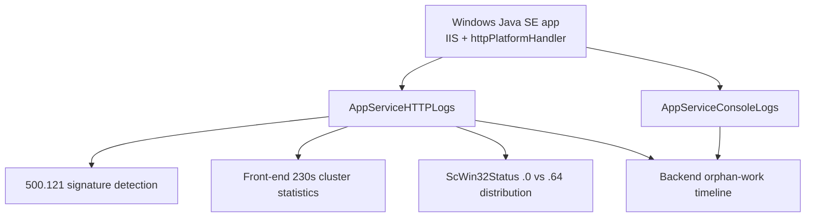

# Windows httpPlatformHandler Queries

Reusable KQL queries for Azure App Service **Windows** Java SE apps running under IIS + `httpPlatformHandler`. Every query in this pack was validated during Lab 1 of the Windows Java httpPlatformHandler timeout lab (published under `docs/troubleshooting/lab-guides/` once Lab 2 completes).

Unlike the [Linux-oriented HTTP query pack](../http/index.md), these queries target the Windows-specific IIS sub-status codes (`500.121.0`, `500.121.64`), the `ScWin32Status` field that only Windows populates, and the correlation between IIS request-log cuts and Java process console markers.

<!-- diagram-id: troubleshooting-kql-windows-httpplatformhandler-index-diagram-1 -->

## When to Use This Pack

Reach for these queries when **any** of the following holds:

- Symptom is an intermittent or systematic HTTP 500 on a Windows App Service (Java SE, Python on Windows, Node on Windows) with `ScSubStatus = 121`.
- Client-observed cutoff sits near **230 seconds** and you need to prove it is the App Service front-end absolute limit, not the httpPlatformHandler `requestTimeout` or an application timer.
- Client reports `500.121.64` bursts under load and you need to confirm adaptive-extension activity vs raw `.0` cuts.
- You need to correlate IIS request-log cuts with backend Java process activity to prove orphan work after the client is disconnected.

If the symptom is on **Linux App Service**, use the [HTTP query pack](../http/index.md) or the [Console query pack](../console/index.md) instead - `ScSubStatus = 121` is a Windows-only signal.

## Run It in the Portal

#### Portal view: Logs blade (Log Analytics query editor)

![Azure portal Logs blade for ai-test-20251107 (Application Insights) with a New Query 1 tab open, top-right controls Observability agent (New), Save, Share, Queries hub, and an inline toolbar Run + Time range: Last 24 hours + Show: 1000 results + KQL mode dropdown. The query editor shows placeholder text "Type your query here or click one of the queries to start" on line 1. Below the editor a Query history pane reads "No queries history — You haven't run any queries yet. To start, go to Queries on the side pane or type a query in the query editor." Left nav under Monitoring lists Alerts, Metrics, Diagnostic settings, Logs (selected), Workbooks, Dashboards with Grafana; the Investigate group above is collapsed.](../../../assets/troubleshooting/log-analytics/01-logs.png)

The `Logs` blade is the entry point for every query in this pack. Paste any of the snippets below into the `New Query 1` editor and press `Run`. All queries in this pack rely on either `AppServiceHTTPLogs` or `AppServiceConsoleLogs` - both tables are provisioned automatically when App Service Diagnostic Settings are routed to a Log Analytics workspace, so no additional Portal configuration is required beyond the workspace itself. The default `Time range: Last 24 hours` selector matches most of the `ago(24h)` filters in the queries; tighten it via the inline selector for burst-window investigations.

## Available Queries

| Query | Purpose |
|---|---|
| [500/121 timeout signature detection](500-121-timeout-signature.md) | List every httpPlatformHandler timeout event (`500/121`) with URL, TimeTaken, and status details. |
| [Timeout cluster statistics](timeout-cluster-statistics.md) | Aggregate `TimeTaken` mean/stdev/min/max across `500/121` rows to confirm the front-end 230s cluster. |
| [ScWin32Status .0 vs .64 distribution](scwin32status-adaptive-extension.md) | Count `500.121.0` (normal front-end cut) vs `500.121.64` (adaptive-extension fire) to detect concurrency pressure. |
| [Backend orphan-work timeline](backend-orphan-timeline.md) | Union `AppServiceHTTPLogs` cuts with `AppServiceConsoleLogs` stream markers to visualize IIS <-> backend divergence. |

## Usage Notes

- The `500.121` sub-status is documented as "The FastCGI process has timed out" but is reused by `httpPlatformHandler` on Windows App Service. Do **not** interpret it as a literal FastCGI event on Java SE apps.
- `ScWin32Status = 64` in the presence of `ScStatus/ScSubStatus = 500/121` means the platform-side adaptive-extension logic fired. On the current App Service front-end this is a **derived** signal - it is not documented in the public IIS status-code reference.
- `AppServiceConsoleLogs` captures stdout/stderr from the Java process regardless of whether the client is still connected. This is what makes the backend-orphan-work query possible.
- All queries default to `ago(24h)`. Widen to `ago(7d)` for slow-burn incidents, narrow to `ago(1h)` for burst-window investigations.

## See Also

- KQL Query Library index: [KQL Query Library](../index.md)
- Linux HTTP query pack: [HTTP Queries](../http/index.md)
- Linux Console query pack: [Console Queries](../console/index.md)

The final Windows Java httpPlatformHandler timeout lab guide will be published under `docs/troubleshooting/lab-guides/` once Lab 2 completes.

## Sources

- [App Service front-end 230-second request timeout](https://learn.microsoft.com/en-us/troubleshoot/azure/app-service/web-request-times-out-app-service)
- [`httpPlatformHandler` configuration reference](https://learn.microsoft.com/en-us/iis/extensions/httpplatformhandler/httpplatformhandler-configuration-reference)
- [`AppServiceHTTPLogs` schema reference](https://learn.microsoft.com/en-us/azure/azure-monitor/reference/tables/appservicehttplogs)
- [`AppServiceConsoleLogs` schema reference](https://learn.microsoft.com/en-us/azure/azure-monitor/reference/tables/appserviceconsolelogs)
- [Enable diagnostic logging for apps in Azure App Service](https://learn.microsoft.com/en-us/azure/app-service/troubleshoot-diagnostic-logs)
