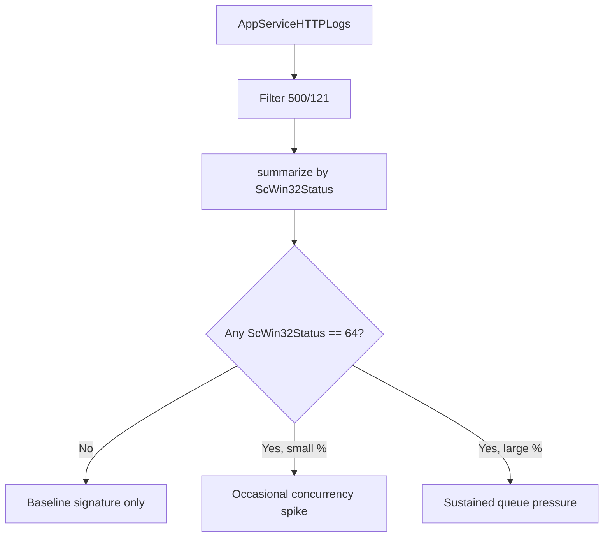

# ScWin32Status .0 vs .64 Distribution

**Scenario**: You are investigating `500.121` timeouts on Windows App Service and want to distinguish quiet baseline cuts from concurrency-induced bursts.
**Data Source**: `AppServiceHTTPLogs`
**Purpose**: Quantify the ratio of `ScWin32Status = 0` (normal front-end cut) to `ScWin32Status = 64` (adaptive-extension fire). A significant `.64` fraction indicates queue pressure or loopback saturation, not merely a slow request.

<!-- diagram-id: troubleshooting-kql-windows-scwin32status-diagram-1 -->


## Run It in the Portal

#### Portal view: Logs blade (Log Analytics query editor)

![Azure portal Logs blade for ai-test-20251107 (Application Insights) with a New Query 1 tab open, top-right controls Observability agent (New), Save, Share, Queries hub, and an inline toolbar Run + Time range: Last 24 hours + Show: 1000 results + KQL mode dropdown. The query editor shows placeholder text "Type your query here or click one of the queries to start" on line 1. Below the editor a Query history pane reads "No queries history — You haven't run any queries yet. To start, go to Queries on the side pane or type a query in the query editor." Left nav under Monitoring lists Alerts, Metrics, Diagnostic settings, Logs (selected), Workbooks, Dashboards with Grafana; the Investigate group above is collapsed.](../../../assets/troubleshooting/log-analytics/01-logs.png)

Paste the query below into the `New Query 1` editor and press `Run`. The result grid returns one row per distinct `ScWin32Status` value present in the filtered set. If the app has been quiet you may see only a single row (`ScWin32Status = 0`); a second row with `ScWin32Status = 64` is what you are looking for.

## Query

```kusto
AppServiceHTTPLogs
| where TimeGenerated > ago(24h)
| where ScStatus == 500 and ScSubStatus == 121
| summarize
    count_ = count(),
    earliest = min(TimeGenerated),
    latest = max(TimeGenerated)
    by ScWin32Status
| extend percent_of_500_121 = round(100.0 * count_ / toscalar(
        AppServiceHTTPLogs
        | where TimeGenerated > ago(24h)
        | where ScStatus == 500 and ScSubStatus == 121
        | count
    ), 2)
| order by count_ desc
```

## Interpretation Notes

The `ScWin32Status` extension on `500.121` is a Windows App Service platform signal:

| `ScWin32Status` | Meaning |
|---|---|
| `0` | Normal front-end 230s absolute cut. The request was already at the front-end ceiling and there was no additional adaptive extension activity. |
| `64` | Adaptive-extension fire. The platform observed request-queue pressure or loopback saturation and augmented the raw 230s cut with an extension marker. Under load this becomes the dominant sub-status observed by production teams as `500.121.64`. |

Read your result against this decision table:

| `.0` % | `.64` % | Interpretation |
|---|---|---|
| ~100% | ~0% | **Serialized baseline**. Requests are being cut at 230s without concurrency pressure. Same as Lab 1 baseline. |
| 60-90% | 10-40% | Occasional queue pressure. Look at the timestamps in the `earliest` / `latest` columns - if the `.64` rows cluster into a short window, correlate with a deployment, traffic spike, or downstream slowdown. |
| < 50% | > 50% | **Sustained queue pressure or loopback saturation**. The dominant failure mode is no longer "slow request hits front-end ceiling"; it is "many requests queue in front of the httpPlatformHandler at once". Route to Lab 2 methodology (open-model load reproduction, mitigation candidates: `httpPlatformHandler.requestTimeout` extension, custom Auto-Heal, plan scale-out). |

Lab 1 of the Windows Java httpPlatformHandler timeout lab (to be published under `docs/troubleshooting/lab-guides/` once Lab 2 completes) confirmed the top row: 10/10 rows with `ScWin32Status = 0` under serialized (queue depth 1) load, zero `.64` rows. This established that `.64` is **not** noise in the baseline signature - any `.64` observed in production is a real signal of concurrency-induced pressure.

## Limitations

- `ScWin32Status = 64` in the presence of `500/121` is a **derived** platform signal. It is not enumerated in the public IIS status-code reference; the interpretation above is based on empirical observation from Lab 1 and production ticket data.
- The percentage math uses two independent queries against the same table. If new rows are ingested between the outer and inner query evaluation the percentages will be slightly off (typically < 1% error).
- `ScWin32Status` values other than `0` and `64` may appear on `500/121` rows in future platform updates. Treat unknown values as "investigate further" rather than assuming they mean `.64`.
- The query returns only aggregates. For per-request context, cross-reference with the [500/121 timeout signature detection](500-121-timeout-signature.md) query filtered by the same time range.

## See Also

- [Windows httpPlatformHandler KQL pack](index.md)
- [500/121 timeout signature detection](500-121-timeout-signature.md)
- [Timeout cluster statistics](timeout-cluster-statistics.md)
- [Backend orphan-work timeline](backend-orphan-timeline.md)

## Sources

- [`AppServiceHTTPLogs` schema reference](https://learn.microsoft.com/en-us/azure/azure-monitor/reference/tables/appservicehttplogs)
- [App Service front-end 230-second request timeout](https://learn.microsoft.com/en-us/troubleshoot/azure/app-service/web-request-times-out-app-service)
- [`httpPlatformHandler` configuration reference](https://learn.microsoft.com/en-us/iis/extensions/httpplatformhandler/httpplatformhandler-configuration-reference)
- [KQL `countif` aggregation](https://learn.microsoft.com/en-us/kusto/query/countif-aggregation-function)
