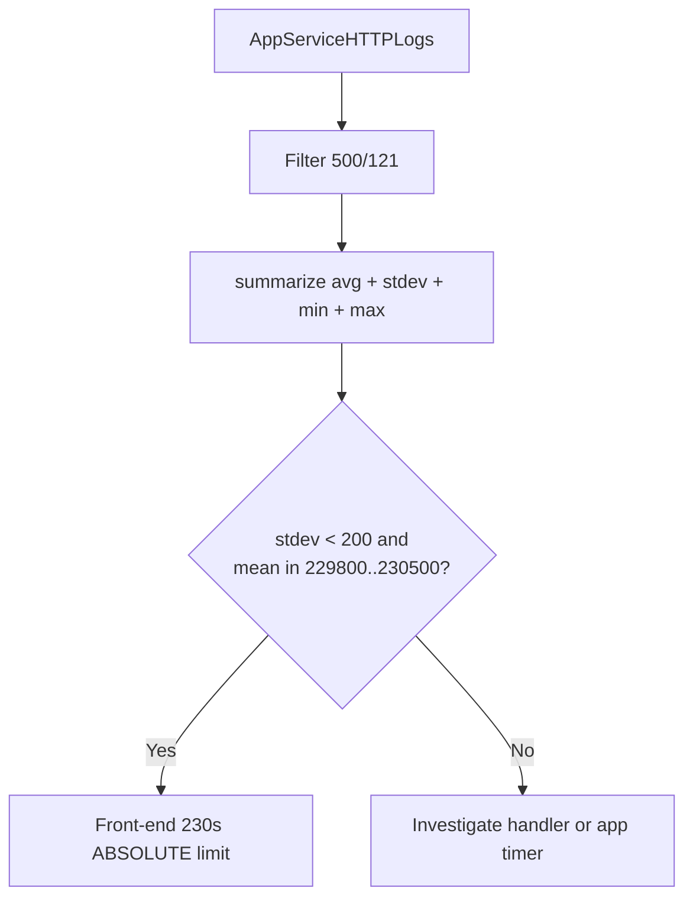

# Timeout Cluster Statistics

**Scenario**: You have confirmed via the [500/121 timeout signature detection](500-121-timeout-signature.md) query that `httpPlatformHandler` timeout events are present, and you now need to prove **which timer** is doing the cut.
**Data Source**: `AppServiceHTTPLogs`
**Purpose**: Compute `avg`, `stdev`, `min`, and `max` of `TimeTaken` across `500/121` rows. A tight cluster (stdev < 200 ms) near 230000 ms is the platform front-end absolute limit; a looser cluster or a cluster near a lower value (e.g. 120000 ms) suggests `httpPlatformHandler.requestTimeout` or an application timer.

<!-- diagram-id: troubleshooting-kql-windows-timeout-cluster-diagram-1 -->


## Run It in the Portal

#### Portal view: Logs blade (Log Analytics query editor)

![Azure portal Logs blade for ai-test-20251107 (Application Insights) with a New Query 1 tab open, top-right controls Observability agent (New), Save, Share, Queries hub, and an inline toolbar Run + Time range: Last 24 hours + Show: 1000 results + KQL mode dropdown. The query editor shows placeholder text "Type your query here or click one of the queries to start" on line 1. Below the editor a Query history pane reads "No queries history — You haven't run any queries yet. To start, go to Queries on the side pane or type a query in the query editor." Left nav under Monitoring lists Alerts, Metrics, Diagnostic settings, Logs (selected), Workbooks, Dashboards with Grafana; the Investigate group above is collapsed.](../../../assets/troubleshooting/log-analytics/01-logs.png)

Paste the query below into the `New Query 1` editor and press `Run`. The result is a single row with 7 columns. In production, widen `ago(24h)` to `ago(7d)` if 24 hours produced fewer than 10 `500/121` rows - statistical measures are unreliable below ~10 samples.

## Query

```kusto
AppServiceHTTPLogs
| where TimeGenerated > ago(24h)
| where ScStatus == 500 and ScSubStatus == 121
| summarize
    sample_count = count(),
    mean_TimeTaken_ms = avg(TimeTaken),
    stdev_TimeTaken_ms = stdev(TimeTaken),
    min_TimeTaken_ms = min(TimeTaken),
    max_TimeTaken_ms = max(TimeTaken),
    win32_zero_count = countif(ScWin32Status == 0),
    win32_64_count = countif(ScWin32Status == 64)
```

## Interpretation Notes

Read the result against this decision table:

| `mean_TimeTaken_ms` | `stdev_TimeTaken_ms` | Interpretation |
|---|---|---|
| 229800 to 230500 | < 200 | **App Service front-end 230s absolute limit.** Cannot be extended per-app; must be redesigned around 230s (streaming, async job pattern, chunked responses that produce output before 230s). |
| 229800 to 230500 | 200 to 2000 | Front-end 230s **plus** app-side variability (GC pauses, downstream jitter). Same mitigation direction as above; investigate variability separately. |
| 118000 to 122000 | < 500 | `httpPlatformHandler.requestTimeout` default (120s) is winning. Extend it via `web.config` or `applicationHost.xdt` if the app genuinely needs longer. See the [httpPlatformHandler configuration reference](https://learn.microsoft.com/en-us/iis/extensions/httpplatformhandler/httpplatformhandler-configuration-reference). |
| < 60000 | Any | An application-level timer (Spring MVC async, `HttpClient.Timeout`, connection pool) or a downstream service is cutting the request. IIS is annotating the 500 with the httpPlatformHandler sub-status because the process signalled the cut, not because IIS itself timed out. |
| Anything else | Very high | Look at the `min` and `max` separately - you likely have two or more independent failure modes mixed in the same result set. Add `| summarize ... by CsUriStem` to disaggregate by URL. |

Lab 1 of the Windows Java httpPlatformHandler timeout lab (to be published under `docs/troubleshooting/lab-guides/` once Lab 2 completes) confirmed the top row of this table: mean 230001.3 ms, stdev 5.44 ms across 10 serialized probes on Windows Java SE 17 with `httpPlatformHandler` at defaults - a textbook front-end absolute cut.

The two `win32_*` columns are a fast preview of the [ScWin32Status .0 vs .64 distribution](scwin32status-adaptive-extension.md) query - if `win32_64_count` is nonzero, adaptive-extension activity is present and the raw mean should be interpreted with caution.

## Limitations

- With fewer than 10 samples the stdev is unstable and can produce misleading conclusions. Widen the time window before drawing conclusions from small samples.
- The single-row aggregation masks bimodal distributions. If you suspect two failure modes (e.g. front-end cuts **and** shorter handler cuts), group by `CsUriStem` or `ScWin32Status` explicitly.
- `TimeTaken` in `AppServiceHTTPLogs` is IIS server-side wall time. Client-observed time is typically 100-1000 ms longer due to TCP teardown and network RTT.
- The 230000 ms front-end limit is documented as "approximately 230 seconds" in Microsoft Learn and is subject to platform update. Recheck against [the current App Service documentation](https://learn.microsoft.com/en-us/troubleshoot/azure/app-service/web-request-times-out-app-service) if your measurements shift over time.

## See Also

- [Windows httpPlatformHandler KQL pack](index.md)
- [500/121 timeout signature detection](500-121-timeout-signature.md)
- [ScWin32Status .0 vs .64 distribution](scwin32status-adaptive-extension.md)
- [Backend orphan-work timeline](backend-orphan-timeline.md)

## Sources

- [`AppServiceHTTPLogs` schema reference](https://learn.microsoft.com/en-us/azure/azure-monitor/reference/tables/appservicehttplogs)
- [App Service front-end 230-second request timeout](https://learn.microsoft.com/en-us/troubleshoot/azure/app-service/web-request-times-out-app-service)
- [`httpPlatformHandler` configuration reference](https://learn.microsoft.com/en-us/iis/extensions/httpplatformhandler/httpplatformhandler-configuration-reference)
- [KQL `summarize` operator](https://learn.microsoft.com/en-us/kusto/query/summarize-operator)
