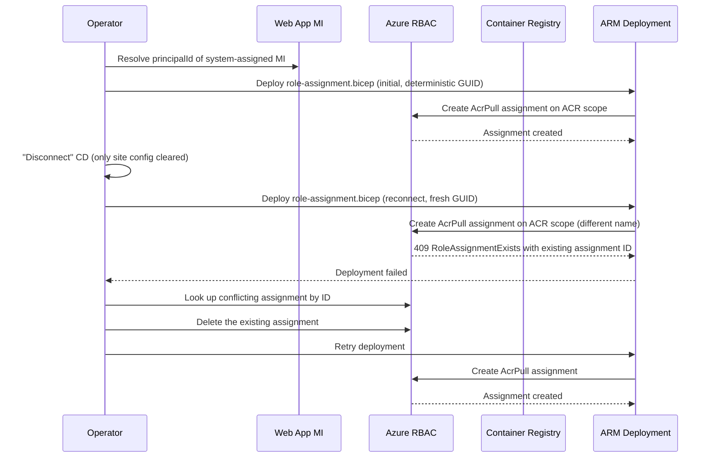

# Lab: CD Reconnect RBAC Conflict

Reproduce the `RoleAssignmentExists: The role assignment already exists` error that surfaces when App Service Deployment Center container continuous deployment is reconnected to a Web App that uses its system-assigned managed identity to pull images from Azure Container Registry, after a previous CD configuration left the AcrPull role assignment behind.

## Lab Metadata

| Attribute | Value |
|---|---|
| Difficulty | Intermediate |
| Estimated Duration | 20-30 minutes |
| Tier | Basic (B1 App Service Plan + Basic ACR) |
| Failure Mode | Deployment Center / ARM deployment failure with `RoleAssignmentExists` (HTTP 409) on AcrPull role |
| Skills Practiced | RBAC inspection, role assignment cleanup, App Service managed identity, container CD mechanics |

## 1) Background

Azure App Service can pull container images from Azure Container Registry using one of three credential models:

1. ACR admin credentials (username/password)
2. A service principal (`DOCKER_REGISTRY_SERVER_USERNAME` / `DOCKER_REGISTRY_SERVER_PASSWORD`)
3. The Web App's system-assigned (or user-assigned) **managed identity**, with the AcrPull role granted on the registry

When you choose option 3 in Deployment Center, the Portal sets `acrUseManagedIdentityCreds: true` on the Web App's site config and provisions a `Microsoft.Authorization/roleAssignments` resource that grants the Web App's managed identity the AcrPull role (built-in role ID `7f951dda-4ed3-4680-a7ca-43fe172d538d`) on the registry scope.

Disconnecting CD from the Portal removes the GitHub workflow and (optionally) clears the site config bindings, but the Azure-side AcrPull role assignment usually remains. Azure RBAC enforces a unique key on `(scope, principalId, roleDefinitionId)`, so when you reconnect using the same identity and the same registry, the deployment fails because the assignment it tries to create already exists with a different assignment GUID.

This lab reproduces the conflict by simulating exactly that lifecycle: deploy a Web App with system-assigned MI and a Container Registry, grant AcrPull via an ARM deployment (mirroring Deployment Center), "disconnect" by leaving the assignment in place, then attempt to recreate the same role assignment with a fresh GUID.

### Architecture

<!-- diagram-id: lab-architecture -->


## 2) Hypothesis

**IF** a Web App's managed identity already holds an `AcrPull` role assignment on an ACR scope, **THEN** any subsequent ARM deployment that creates a `Microsoft.Authorization/roleAssignments` resource with a *different* name but the *same* `(scope, principal, role)` will fail with `RoleAssignmentExists` and return the existing assignment ID, until the existing assignment is deleted.

| Variable | Control State | Experimental State |
|---|---|---|
| Existing AcrPull assignment | None on the registry for this MI | One pre-existing `AcrPull` assignment on the same registry for the same MI |
| ARM deployment with a fresh assignment GUID | Succeeds | Fails with `RoleAssignmentExists` returning the existing assignment ID |
| Recovery action | Not required | Delete the conflicting assignment before re-deploying |
| Web App identity state | System-assigned MI enabled in both states | System-assigned MI enabled in both states |

!!! note "Why ARM deployment, not the CLI directly"
    Modern `az role assignment create` is idempotent on the same `(scope, principal, role)` triple — it returns the existing assignment instead of erroring. The real Deployment Center failure comes from the ARM template that the Portal runs internally, which generates a *new* assignment GUID on each invocation. This lab reproduces the failure by mimicking the same ARM-level mechanism with a Bicep template.

## 3) Runbook

### Prerequisites

```bash
az login
az account show --output table
az --version | head -1   # Lab validated with Azure CLI 2.70.0
```

Expected output: active subscription metadata and CLI version.

### Deploy baseline infrastructure

```bash
export RG="rg-asp-lab-cd-rbac"
export LOCATION="koreacentral"

az group create --name "$RG" --location "$LOCATION"

az deployment group create \
    --name "lab-cd-rbac-base" \
    --resource-group "$RG" \
    --template-file "./labs/cd-reconnect-rbac-conflict/infra/main.bicep" \
    --parameters baseName="aspcdrbac"
```

Expected output pattern:

```text
"provisioningState": "Succeeded"
```

The template provisions:

- A Linux App Service Plan (B1)
- A Web App (`kind: app,linux,container`) with `linuxFxVersion: DOCKER|mcr.microsoft.com/appsvc/staticsite:latest`, system-assigned managed identity, and `acrUseManagedIdentityCreds: true`
- An Azure Container Registry (Basic tier, admin disabled)
- A Log Analytics workspace and diagnostic settings on the Web App

### Capture deployment outputs

```bash
export APP_NAME="$(az deployment group show \
    --resource-group "$RG" \
    --name "lab-cd-rbac-base" \
    --query "properties.outputs.webAppName.value" \
    --output tsv)"

export ACR_NAME="$(az deployment group show \
    --resource-group "$RG" \
    --name "lab-cd-rbac-base" \
    --query "properties.outputs.containerRegistryName.value" \
    --output tsv)"

export SUBSCRIPTION_ID="$(az account show --query id --output tsv)"
export ACR_ID="$(az acr show --name "$ACR_NAME" --resource-group "$RG" --query id --output tsv)"
```

Expected output: no output; variables are populated.

### Trigger the conflict

The trigger script resolves the Web App's system-assigned MI principal, then runs two ARM deployments of `infra/role-assignment.bicep` against the registry. The first deployment uses the deterministic GUID derived from `(scope, principal, role)`. The second deployment uses a freshly generated GUID, mimicking what Deployment Center does on each invocation.

```bash
./labs/cd-reconnect-rbac-conflict/trigger.sh
```

Key fragment from `trigger.sh`:

```bash
# Resolve the Web App's system-assigned MI - this is the principal Deployment Center
# grants AcrPull to when "Use managed identity" is selected for container CD.
APP_PRINCIPAL_ID=$(az webapp identity show --name "$APP_NAME" --resource-group "$RG" \
    --query principalId --output tsv | tr -d '\r')

# Initial CD setup: ARM deployment with the deterministic role assignment GUID
az deployment group create \
    --resource-group "$RG" \
    --name "lab-ra-initial" \
    --template-file "./labs/cd-reconnect-rbac-conflict/infra/role-assignment.bicep" \
    --parameters principalObjectId="$APP_PRINCIPAL_ID" registryName="$ACR_NAME"

# Simulated disconnect: no Azure-side cleanup performed.

# Reconnect: same scope + principal + role, but a fresh role assignment GUID
NEW_NAME=$(cat /proc/sys/kernel/random/uuid)
az deployment group create \
    --resource-group "$RG" \
    --name "lab-ra-reconnect" \
    --template-file "./labs/cd-reconnect-rbac-conflict/infra/role-assignment.bicep" \
    --parameters principalObjectId="$APP_PRINCIPAL_ID" \
                 registryName="$ACR_NAME" \
                 roleAssignmentName="$NEW_NAME"
```

The `infra/role-assignment.bicep` template creates a single `Microsoft.Authorization/roleAssignments@2022-04-01` resource on the registry scope with `roleDefinitionId` set to the AcrPull built-in role (`7f951dda-4ed3-4680-a7ca-43fe172d538d`).

Expected error output pattern from the second deployment:

```text
{"code": "RoleAssignmentExists", "message": "The role assignment already exists.
The ID of the existing role assignment is <32-char-hex>."}
```

The script extracts the 32-character hex ID from the error and prints both the raw form and its hyphenated GUID form. This is the same identifier the Portal surfaces in Deployment Center failures.

!!! info "Why the CLI alone does not reproduce this"
    `az role assignment create --assignee-object-id <id> --role AcrPull --scope <acr>` is idempotent — modern Azure CLI returns the existing assignment when the same `(scope, principal, role)` triple already exists. The conflict only surfaces through ARM deployments that try to create a `Microsoft.Authorization/roleAssignments` resource with a *different* name. Deployment Center uses ARM internally, which is why end users see the failure and CLI users following ad-hoc commands usually do not.

### Inspect the conflicting assignment

```bash
az role assignment list \
    --assignee "$APP_PRINCIPAL_ID" \
    --scope "$ACR_ID" \
    --query "[].{name:name, role:roleDefinitionName, scope:scope, principalType:principalType}" \
    --output table
```

Expected output pattern:

```text
Name                                  Role     Scope                                                 PrincipalType
------------------------------------  -------  ----------------------------------------------------  ----------------
<guid-of-existing-assignment>         AcrPull  /subscriptions/<sub>/resourceGroups/.../<acr>         ServicePrincipal
```

The `Name` field matches the GUID returned by the failed ARM deployment.

### Verify recovery

```bash
./labs/cd-reconnect-rbac-conflict/verify.sh
```

The verify script confirms the conflict still reproduces, deletes the existing assignment, then retries the same ARM deployment with the fresh GUID and confirms it now succeeds. Key fragment:

```bash
# Confirm conflict still reproduces
NEW_NAME=$(cat /proc/sys/kernel/random/uuid)
az deployment group create \
    --resource-group "$RG" --name "lab-ra-verify-conflict" \
    --template-file "./labs/cd-reconnect-rbac-conflict/infra/role-assignment.bicep" \
    --parameters principalObjectId="$APP_PRINCIPAL_ID" registryName="$ACR_NAME" \
                 roleAssignmentName="$NEW_NAME" 2>&1 | tee /tmp/cd-rbac-verify.log
grep -qE "RoleAssignmentExists|already exists" /tmp/cd-rbac-verify.log

# Apply recovery: delete the existing assignment
ASSIGNMENT_ID=$(az role assignment list --assignee "$APP_PRINCIPAL_ID" --scope "$ACR_ID" \
    --query "[0].name" --output tsv)
az role assignment delete \
    --ids "${ACR_ID}/providers/Microsoft.Authorization/roleAssignments/$ASSIGNMENT_ID"

# Retry the same deployment - should now succeed
az deployment group create \
    --resource-group "$RG" --name "lab-ra-verify-recovery" \
    --template-file "./labs/cd-reconnect-rbac-conflict/infra/role-assignment.bicep" \
    --parameters principalObjectId="$APP_PRINCIPAL_ID" registryName="$ACR_NAME" \
                 roleAssignmentName="$NEW_NAME"
```

Expected result: the second deployment fails with `RoleAssignmentExists`, the delete removes the existing assignment, and the retry succeeds. The script ends with `PASS: recovery successful - 1 active AcrPull assignment`.

## 4) Experiment Log

| Step | Action | Expected | Actual (2026-04-22) | Pass/Fail |
|---|---|---|---|---|
| 1 | Deploy `infra/main.bicep` | `provisioningState: Succeeded` | Web App `app-aspcdrbac-xslpiyghtnhze`, ACR `acraspcdrbacxslpiyghtnhze` provisioned; Web App MI principalId `d67ccf06-f18b-40f3-8f96-eacd723e580f` | Pass |
| 2 | Capture deployment outputs | `APP_NAME`, `ACR_NAME`, `ACR_ID` populated | All variables set from deployment outputs | Pass |
| 3 | Run `trigger.sh` | Second ARM deployment fails with `RoleAssignmentExists` and includes existing assignment ID | Failed with `existing role assignment is 561ed7ada306588a8d5f2746e0ae4fca` (GUID `561ed7ad-a306-588a-8d5f-2746e0ae4fca`) | Pass |
| 4 | Inspect conflicting assignment | One `AcrPull` assignment for the Web App MI on ACR scope | Single assignment matching the GUID returned by the failure | Pass |
| 5 | Run `verify.sh` (delete + redeploy) | Conflict reproduces, delete succeeds, retry deployment succeeds | Recovery completed; `PASS: recovery successful - 1 active AcrPull assignment` | Pass |
| 6 | Run `cleanup.sh` | Resource group removed | Resource group deletion initiated successfully | Pass |

## Expected Evidence

| Evidence Source | Expected State |
|---|---|
| Second `az deployment group create` of `infra/role-assignment.bicep` with a fresh `roleAssignmentName` | Fails with `RoleAssignmentExists`; error body contains `The ID of the existing role assignment is <32-char-hex>` |
| `az role assignment list --assignee "$APP_PRINCIPAL_ID" --scope "$ACR_ID" --output table` | Returns exactly one `AcrPull` assignment before recovery |
| `az role assignment delete --ids "${ACR_ID}/providers/Microsoft.Authorization/roleAssignments/$ASSIGNMENT_ID"` | Returns no error; assignment removed |
| Retry `az deployment group create` with the same fresh `roleAssignmentName` | Succeeds with `provisioningState: Succeeded` |
| `az webapp identity show --name "$APP_NAME" --resource-group "$RG" --query principalId --output tsv` | Returns the same MI principalId throughout the lab |

### Falsification

The hypothesis is falsified if any of the following occur:

- The second ARM deployment succeeds without error → contradicts the RBAC uniqueness constraint on `(scope, principal, role)`.
- Deleting the conflicting assignment does not allow the retried deployment to succeed → suggests a different blocking factor (for example, deny assignment, management lock, or policy assignment).
- The conflict reproduces even when no prior role assignment exists for the Web App MI on the registry scope → suggests an unrelated cause such as a deny assignment or a tenant-wide RBAC policy.
- A direct `az role assignment create` with the same triple returns success while the ARM deployment fails → expected; this confirms the ARM-vs-CLI behavior difference rather than falsifying the hypothesis.

If the trigger script does not produce `RoleAssignmentExists` on the second deployment, capture `/tmp/cd-rbac-conflict.log`, confirm the first deployment created the assignment (`az role assignment list --assignee "$APP_PRINCIPAL_ID" --scope "$ACR_ID"`), and rerun after a 30-second wait to allow RBAC propagation.

## Clean Up

```bash
RG=rg-asp-lab-cd-rbac ./labs/cd-reconnect-rbac-conflict/cleanup.sh
```

The cleanup script queues the resource group for deletion. Because the Web App's managed identity is owned by the Web App resource itself, deleting the resource group removes the MI principal and its role assignments together — no separate Microsoft Entra cleanup is required:

```bash
az group delete --name "$RG" --yes --no-wait
```

## Related Playbook

- [Continuous Deployment RBAC Role Assignment Conflict](../playbooks/cd-rbac-role-assignment-conflict.md)

## See Also

- [Authentication Failures Playbook](../playbooks/authentication-failures.md)
- [Deployment Failures Playbook](../playbooks/deployment-failures.md)

## Sources

- [Configure a custom container for App Service — use managed identity to pull from ACR](https://learn.microsoft.com/azure/app-service/configure-custom-container?tabs=debian&pivots=container-linux)
- [Deploy a custom container to App Service with GitHub Actions](https://learn.microsoft.com/azure/app-service/deploy-container-github-action)
- [Manage Azure role assignments using Azure CLI](https://learn.microsoft.com/azure/role-based-access-control/role-assignments-cli)
- [Troubleshoot Azure RBAC](https://learn.microsoft.com/azure/role-based-access-control/troubleshooting)
- [Azure built-in roles for Containers — AcrPull](https://learn.microsoft.com/azure/role-based-access-control/built-in-roles/containers#acrpull)
