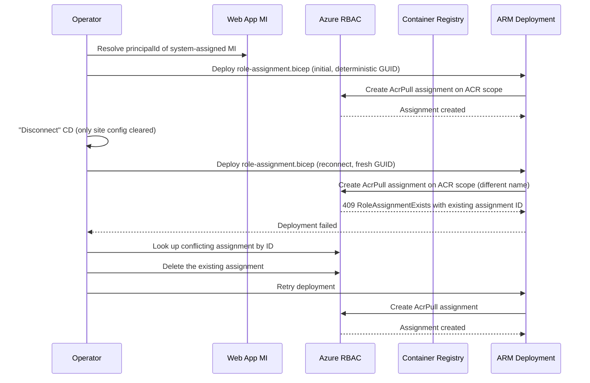

# Lab: CD Reconnect RBAC Conflict

Reproduce the `RoleAssignmentExists: The role assignment already exists` error that surfaces when App Service Deployment Center container continuous deployment is reconnected to a Web App that uses its system-assigned managed identity to pull images from Azure Container Registry, after a previous CD configuration left the AcrPull role assignment behind.

## Lab Metadata

| Attribute | Value |
|---|---|
| Difficulty | Intermediate |
| Estimated Duration | 20-30 minutes |
| Tier | Basic (B1 App Service Plan + Basic ACR) |
| Failure Mode | Deployment Center / ARM deployment failure with `RoleAssignmentExists` (HTTP 409) on AcrPull role |
| Skills Practiced | RBAC inspection, role assignment cleanup, App Service managed identity, container CD mechanics |

## 1) Background

Azure App Service can pull container images from Azure Container Registry using one of three credential models:

1. ACR admin credentials (username/password)
2. A service principal (`DOCKER_REGISTRY_SERVER_USERNAME` / `DOCKER_REGISTRY_SERVER_PASSWORD`)
3. The Web App's system-assigned (or user-assigned) **managed identity**, with the AcrPull role granted on the registry

When you choose option 3 in Deployment Center, the Portal sets `acrUseManagedIdentityCreds: true` on the Web App's site config and provisions a `Microsoft.Authorization/roleAssignments` resource that grants the Web App's managed identity the AcrPull role (built-in role ID `7f951dda-4ed3-4680-a7ca-43fe172d538d`) on the registry scope.

Disconnecting CD from the Portal removes the GitHub workflow and (optionally) clears the site config bindings, but the Azure-side AcrPull role assignment usually remains. Azure RBAC enforces a unique key on `(scope, principalId, roleDefinitionId)`, so when you reconnect using the same identity and the same registry, the deployment fails because the assignment it tries to create already exists with a different assignment GUID.

This lab reproduces the conflict by simulating exactly that lifecycle: deploy a Web App with system-assigned MI and a Container Registry, grant AcrPull via an ARM deployment (mirroring Deployment Center), "disconnect" by leaving the assignment in place, then attempt to recreate the same role assignment with a fresh GUID.

### Architecture

<!-- diagram-id: lab-architecture -->

```mermaid
sequenceDiagram
    participant Op as Operator
    participant Web as Web App MI
    participant RBAC as Azure RBAC
    participant ACR as Container Registry
    participant ARM as ARM Deployment
    Op->>Web: Resolve principalId of system-assigned MI
    Op->>ARM: Deploy role-assignment.bicep (initial, deterministic GUID)
    ARM->>RBAC: Create AcrPull assignment on ACR scope
    RBAC-->>ARM: Assignment created
    Op->>Op: "Disconnect" CD (only site config cleared)
    Op->>ARM: Deploy role-assignment.bicep (reconnect, fresh GUID)
    ARM->>RBAC: Create AcrPull assignment on ACR scope (different name)
    RBAC-->>ARM: 409 RoleAssignmentExists with existing assignment ID
    ARM-->>Op: Deployment failed
    Op->>RBAC: Look up conflicting assignment by ID
    Op->>RBAC: Delete the existing assignment
    Op->>ARM: Retry deployment
    ARM->>RBAC: Create AcrPull assignment
    RBAC-->>ARM: Assignment created
```

## 2) Hypothesis

**IF** a Web App's managed identity already holds an `AcrPull` role assignment on an ACR scope, **THEN** any subsequent ARM deployment that creates a `Microsoft.Authorization/roleAssignments` resource with a *different* name but the *same* `(scope, principal, role)` will fail with `RoleAssignmentExists` and return the existing assignment ID, until the existing assignment is deleted.

| Variable | Control State | Experimental State |
|---|---|---|
| Existing AcrPull assignment | None on the registry for this MI | One pre-existing `AcrPull` assignment on the same registry for the same MI |
| ARM deployment with a fresh assignment GUID | Succeeds | Fails with `RoleAssignmentExists` returning the existing assignment ID |
| Recovery action | Not required | Delete the conflicting assignment before re-deploying |
| Web App identity state | System-assigned MI enabled in both states | System-assigned MI enabled in both states |

!!! note "Why ARM deployment, not the CLI directly"
    Modern `az role assignment create` is idempotent on the same `(scope, principal, role)` triple — it returns the existing assignment instead of erroring. The real Deployment Center failure comes from the ARM template that the Portal runs internally, which generates a *new* assignment GUID on each invocation. This lab reproduces the failure by mimicking the same ARM-level mechanism with a Bicep template.

## 3) Runbook

### Prerequisites

```bash
az login
az account show --output table
az --version | head -1   # Lab validated with Azure CLI 2.70.0
```

| Command/Flag | Purpose |
|---|---|
| `az login` | Authenticate the CLI session with Azure |
| `az account show` | Verify the active subscription context |
| `--output table` | Display results in human-readable table format |
| `az --version` | Confirm CLI version meets lab requirements (2.70.0) |

Expected output: active subscription metadata and CLI version.

### Deploy baseline infrastructure

```bash
export RG="rg-asp-lab-cd-rbac"
export LOCATION="koreacentral"

az group create --name "$RG" --location "$LOCATION"

az deployment group create \
    --name "lab-cd-rbac-base" \
    --resource-group "$RG" \
    --template-file "./labs/cd-reconnect-rbac-conflict/infra/main.bicep" \
    --parameters baseName="aspcdrbac"
```

| Command/Flag | Purpose |
|---|---|
| `az group create` | Create the resource group for lab resources |
| `--name` | Resource group name |
| `--location` | Azure region for the resource group |
| `az deployment group create` | Deploy the Bicep template to provision lab infrastructure |
| `--template-file` | Path to the Bicep template that provisions App Service Plan, Web App, ACR, and Log Analytics |
| `--parameters baseName` | Base name prefix for all generated resource names |

Expected output pattern:

```text
"provisioningState": "Succeeded"
```

The template provisions:

- A Linux App Service Plan (B1)
- A Web App (`kind: app,linux,container`) with `linuxFxVersion: DOCKER|mcr.microsoft.com/appsvc/staticsite:latest`, system-assigned managed identity, and `acrUseManagedIdentityCreds: true`
- An Azure Container Registry (Basic tier, admin disabled)
- A Log Analytics workspace and diagnostic settings on the Web App

### Capture deployment outputs

```bash
export APP_NAME="$(az deployment group show \
    --resource-group "$RG" \
    --name "lab-cd-rbac-base" \
    --query "properties.outputs.webAppName.value" \
    --output tsv)"

export ACR_NAME="$(az deployment group show \
    --resource-group "$RG" \
    --name "lab-cd-rbac-base" \
    --query "properties.outputs.containerRegistryName.value" \
    --output tsv)"

export SUBSCRIPTION_ID="$(az account show --query id --output tsv)"
export ACR_ID="$(az acr show --name "$ACR_NAME" --resource-group "$RG" --query id --output tsv)"
```

| Command | Purpose |
|---------|---------|
| `az deployment group show --resource-group "$RG" --name "lab-cd-rbac-base" --query "properties.outputs.webAppName.value" --output tsv` | Reads the `webAppName` deployment output value from the `lab-cd-rbac-base` resource-group deployment. |
| `--resource-group "$RG" --name "lab-cd-rbac-base" --query "properties.outputs.webAppName.value" --output tsv` | Looks up the deployment in this resource group. |
| `--name "lab-cd-rbac-base" --query "properties.outputs.webAppName.value" --output tsv` | Targets the `lab-cd-rbac-base` deployment record. |
| `--query "properties.outputs.webAppName.value"` | Projects only the `webAppName` output's `value` field from the deployment result. |
| `--output tsv` | Returns the selected output value as plain text for shell variable assignment. |
| `az deployment group show --resource-group "$RG" --name "lab-cd-rbac-base" --query "properties.outputs.containerRegistryName.value" --output tsv` | Reads the `containerRegistryName` deployment output value from the `lab-cd-rbac-base` resource-group deployment. |
| `--resource-group "$RG" --name "lab-cd-rbac-base" --query "properties.outputs.containerRegistryName.value" --output tsv` | Looks up the deployment in this resource group. |
| `--name "lab-cd-rbac-base" --query "properties.outputs.containerRegistryName.value" --output tsv` | Targets the `lab-cd-rbac-base` deployment record. |
| `--query "properties.outputs.containerRegistryName.value"` | Projects only the `containerRegistryName` output's `value` field from the deployment result. |
| `--output tsv` | Returns the selected output value as plain text for shell variable assignment. |
| `az account show --query id --output tsv` | Retrieves the current Azure account context and emits only the active subscription ID. |
| `--query id --output tsv` | Projects only the top-level subscription `id` field from the current account context. |
| `--output tsv` | Returns the subscription ID as plain text for shell variable assignment. |
| `az acr show --name "$ACR_NAME" --resource-group "$RG" --query id --output tsv` | Retrieves the Azure Container Registry resource and emits only its ARM resource ID. |
| `--name "$ACR_NAME" --resource-group "$RG" --query id --output tsv` | Targets this container registry. |
| `--resource-group "$RG" --query id --output tsv` | Looks up the registry in this resource group. |
| `--query id` | Projects only the registry resource's top-level ARM `id`. |
| `--output tsv` | Returns the registry ID as plain text for shell variable assignment. |

Expected output: no output; variables are populated.

### Trigger the conflict

The trigger script resolves the Web App's system-assigned MI principal, then runs two ARM deployments of `infra/role-assignment.bicep` against the registry. The first deployment uses the deterministic GUID derived from `(scope, principal, role)`. The second deployment uses a freshly generated GUID, mimicking what Deployment Center does on each invocation.

```bash
./labs/cd-reconnect-rbac-conflict/trigger.sh
```

Key fragment from `trigger.sh`:

```bash
# Resolve the Web App's system-assigned MI - this is the principal Deployment Center
# grants AcrPull to when "Use managed identity" is selected for container CD.
APP_PRINCIPAL_ID=$(az webapp identity show --name "$APP_NAME" --resource-group "$RG" \
    --query principalId --output tsv | tr -d '\r')

# Initial CD setup: ARM deployment with the deterministic role assignment GUID
az deployment group create \
    --resource-group "$RG" \
    --name "lab-ra-initial" \
    --template-file "./labs/cd-reconnect-rbac-conflict/infra/role-assignment.bicep" \
    --parameters principalObjectId="$APP_PRINCIPAL_ID" registryName="$ACR_NAME"

# Simulated disconnect: no Azure-side cleanup performed.

# Reconnect: same scope + principal + role, but a fresh role assignment GUID
NEW_NAME=$(cat /proc/sys/kernel/random/uuid)
az deployment group create \
    --resource-group "$RG" \
    --name "lab-ra-reconnect" \
    --template-file "./labs/cd-reconnect-rbac-conflict/infra/role-assignment.bicep" \
    --parameters principalObjectId="$APP_PRINCIPAL_ID" \
                 registryName="$ACR_NAME" \
                 roleAssignmentName="$NEW_NAME"
```

| Command/Flag | Purpose |
|---|---|
| `az webapp identity show` | Retrieve the system-assigned managed identity principal ID for the Web App |
| `--query principalId` | Extract only the MI object ID used for role assignment |
| `az deployment group create` | Deploy the role-assignment Bicep template to create an AcrPull binding |
| `--template-file` | Points to the Bicep template that creates a `Microsoft.Authorization/roleAssignments` resource |
| `--parameters principalObjectId` | The Web App MI principal to receive the AcrPull role |
| `--parameters registryName` | Target ACR whose scope receives the role assignment |
| `--parameters roleAssignmentName` | Custom GUID for the assignment; a fresh GUID on reconnect triggers the conflict |

The `infra/role-assignment.bicep` template creates a single `Microsoft.Authorization/roleAssignments@2022-04-01` resource on the registry scope with `roleDefinitionId` set to the AcrPull built-in role (`7f951dda-4ed3-4680-a7ca-43fe172d538d`).

Expected error output pattern from the second deployment:

```text
{"code": "RoleAssignmentExists", "message": "The role assignment already exists.
The ID of the existing role assignment is <32-char-hex>."}
```

The script extracts the 32-character hex ID from the error and prints both the raw form and its hyphenated GUID form. This is the same identifier the Portal surfaces in Deployment Center failures.

!!! info "Why the CLI alone does not reproduce this"
    `az role assignment create --assignee-object-id <id> --role AcrPull --scope <acr>` is idempotent — modern Azure CLI returns the existing assignment when the same `(scope, principal, role)` triple already exists. The conflict only surfaces through ARM deployments that try to create a `Microsoft.Authorization/roleAssignments` resource with a *different* name. Deployment Center uses ARM internally, which is why end users see the failure and CLI users following ad-hoc commands usually do not.

### Inspect the conflicting assignment

#### Portal view: Activity log (RBAC operation audit)

![Azure portal Activity log blade for app-test-20251107 with toolbar Activity, Edit columns, Refresh, Export Activity Logs, Download as CSV, Insights, Feedback, Pin current filters, Reset filters. A "Looking for Log Analytics?" info banner offers a Visit Log Analytics cross-link. Below it: a Search box, a Quick Insights link, and filter chips Management Group: None, Subscription: Visual Studio Enterprise Subscription, Event severity: All, Timespan: Last 6 hours, Resource group: rg-test-20251107 (X), Resource: app-test-20251107 (X), plus an Add Filter button. The "11 items." count precedes a results table with columns Operation name, Status, Time, Time stamp, Subscription, Event initiated by - all 11 rows show Succeeded status, "Sun Jun 07 ..." time stamps, Visual Studio Enterprise Subscription, and user@example.com (PII masked) for Event initiated by.](../../assets/troubleshooting/activity-log/01-activity-log.png)

The `Activity log` blade is the Portal counterpart to the `az role assignment list` CLI query below - it shows the audit trail of every ARM operation against the app and its ACR, which is where Deployment Center's role-assignment attempts surface during a CD reconnect. This capture shows the correct scoping posture for the lab: `Event severity: All` (so warnings and errors are not hidden), `Timespan: Last 6 hours`, and `Resource group: rg-test-20251107` / `Resource: app-test-20251107` chips are applied, narrowing the table to `11 items.` of `Succeeded` operations from `user@example.com`. To diagnose this conflict, change the `Resource group` chip to your ACR's resource group, update the `Resource` chip to the ACR resource, and use the `Add Filter` button to scope to role-assignment operations - the conflicting GUID will appear inside the `Operation name` cell once those filter chips match. Once located, run the CLI query below to extract the existing assignment and reconcile.

```bash
az role assignment list \
    --assignee "$APP_PRINCIPAL_ID" \
    --scope "$ACR_ID" \
    --query "[].{name:name, role:roleDefinitionName, scope:scope, principalType:principalType}" \
    --output table
```

| Command/Flag | Purpose |
|---|---|
| `az role assignment list` | List all role assignments matching the specified principal and scope |
| `--assignee` | Filter by the Web App managed identity principal ID |
| `--scope` | Narrow results to the ACR resource scope where AcrPull is granted |
| `--query` | JMESPath filter to show assignment name, role, scope, and principal type |

Expected output pattern:

```text
Name                                  Role     Scope                                                 PrincipalType
------------------------------------  -------  ----------------------------------------------------  ----------------
<guid-of-existing-assignment>         AcrPull  /subscriptions/<sub>/resourceGroups/.../<acr>         ServicePrincipal
```

The `Name` field matches the GUID returned by the failed ARM deployment.

### Verify recovery

```bash
./labs/cd-reconnect-rbac-conflict/verify.sh
```

The verify script confirms the conflict still reproduces, deletes the existing assignment, then retries the same ARM deployment with the fresh GUID and confirms it now succeeds. Key fragment:

```bash
# Confirm conflict still reproduces
NEW_NAME=$(cat /proc/sys/kernel/random/uuid)
az deployment group create \
    --resource-group "$RG" --name "lab-ra-verify-conflict" \
    --template-file "./labs/cd-reconnect-rbac-conflict/infra/role-assignment.bicep" \
    --parameters principalObjectId="$APP_PRINCIPAL_ID" registryName="$ACR_NAME" \
                 roleAssignmentName="$NEW_NAME" 2>&1 | tee /tmp/cd-rbac-verify.log
grep -qE "RoleAssignmentExists|already exists" /tmp/cd-rbac-verify.log

# Apply recovery: delete the existing assignment
ASSIGNMENT_ID=$(az role assignment list --assignee "$APP_PRINCIPAL_ID" --scope "$ACR_ID" \
    --query "[0].name" --output tsv)
az role assignment delete \
    --ids "${ACR_ID}/providers/Microsoft.Authorization/roleAssignments/$ASSIGNMENT_ID"

# Retry the same deployment - should now succeed
az deployment group create \
    --resource-group "$RG" --name "lab-ra-verify-recovery" \
    --template-file "./labs/cd-reconnect-rbac-conflict/infra/role-assignment.bicep" \
    --parameters principalObjectId="$APP_PRINCIPAL_ID" registryName="$ACR_NAME" \
                 roleAssignmentName="$NEW_NAME"
```

| Command | Purpose |
|---------|---------|
| `az deployment group create --resource-group "$RG" --name "lab-ra-verify-conflict" --template-file "./labs/cd-reconnect-rbac-conflict/infra/role-assignment.bicep" --parameters principalObjectId="$APP_PRINCIPAL_ID" registryName="$ACR_NAME" roleAssignmentName="$NEW_NAME"` | Re-runs the role-assignment deployment with a fresh role-assignment name so the `RoleAssignmentExists` conflict is reproduced before cleanup. |
| `--resource-group "$RG" --name "lab-ra-verify-conflict" --template-file "./labs/cd-reconnect-rbac-conflict/infra/role-assignment.bicep" --parameters principalObjectId="$APP_PRINCIPAL_ID" registryName="$ACR_NAME" roleAssignmentName="$NEW_NAME"` | Runs the deployment in this resource group. |
| `--name "lab-ra-verify-conflict" --template-file "./labs/cd-reconnect-rbac-conflict/infra/role-assignment.bicep" --parameters principalObjectId="$APP_PRINCIPAL_ID" registryName="$ACR_NAME" roleAssignmentName="$NEW_NAME"` | Names this verification deployment record `lab-ra-verify-conflict`. |
| `--template-file "./labs/cd-reconnect-rbac-conflict/infra/role-assignment.bicep" --parameters principalObjectId="$APP_PRINCIPAL_ID" registryName="$ACR_NAME" roleAssignmentName="$NEW_NAME"` | Uses the lab's Bicep template that creates the `Microsoft.Authorization/roleAssignments` resource. |
| `--parameters principalObjectId="$APP_PRINCIPAL_ID" registryName="$ACR_NAME" roleAssignmentName="$NEW_NAME"` | Passes the managed-identity principal, target registry name, and fresh role-assignment GUID into the template. |
| `az role assignment list --assignee "$APP_PRINCIPAL_ID" --scope "$ACR_ID" --query "[0].name" --output tsv` | Lists Azure RBAC role assignments for this principal at the registry scope and returns the first assignment name so it can be deleted. |
| `--assignee "$APP_PRINCIPAL_ID" --scope "$ACR_ID" --query "[0].name" --output tsv` | Filters assignments to the Web App managed identity. |
| `--scope "$ACR_ID" --query "[0].name" --output tsv` | Narrows the list to assignments on this ACR resource scope. |
| `--query "[0].name" --output tsv` | Selects the `name` field from the first matching role assignment in the result array. |
| `--output tsv` | Returns the assignment name as plain text for shell variable assignment. |
| `az role assignment delete --ids "${ACR_ID}/providers/Microsoft.Authorization/roleAssignments/$ASSIGNMENT_ID"` | Deletes the existing AcrPull role assignment resource by its full ARM resource ID. |
| `--ids "${ACR_ID}/providers/Microsoft.Authorization/roleAssignments/$ASSIGNMENT_ID"` | Targets the exact role-assignment resource under the registry scope for deletion. |
| `az deployment group create --resource-group "$RG" --name "lab-ra-verify-recovery" --template-file "./labs/cd-reconnect-rbac-conflict/infra/role-assignment.bicep" --parameters principalObjectId="$APP_PRINCIPAL_ID" registryName="$ACR_NAME" roleAssignmentName="$NEW_NAME"` | Replays the same deployment after deleting the existing assignment to confirm the reconnect path now succeeds. |
| `--resource-group "$RG" --name "lab-ra-verify-recovery" --template-file "./labs/cd-reconnect-rbac-conflict/infra/role-assignment.bicep" --parameters principalObjectId="$APP_PRINCIPAL_ID" registryName="$ACR_NAME" roleAssignmentName="$NEW_NAME"` | Runs the recovery deployment in this resource group. |
| `--name "lab-ra-verify-recovery" --template-file "./labs/cd-reconnect-rbac-conflict/infra/role-assignment.bicep" --parameters principalObjectId="$APP_PRINCIPAL_ID" registryName="$ACR_NAME" roleAssignmentName="$NEW_NAME"` | Names this post-cleanup deployment record `lab-ra-verify-recovery`. |
| `--template-file "./labs/cd-reconnect-rbac-conflict/infra/role-assignment.bicep" --parameters principalObjectId="$APP_PRINCIPAL_ID" registryName="$ACR_NAME" roleAssignmentName="$NEW_NAME"` | Uses the same lab role-assignment template for the recovery verification. |
| `--parameters principalObjectId="$APP_PRINCIPAL_ID" registryName="$ACR_NAME" roleAssignmentName="$NEW_NAME"` | Passes the managed-identity principal, registry name, and the same fresh GUID back into the template. |

Expected result: the second deployment fails with `RoleAssignmentExists`, the delete removes the existing assignment, and the retry succeeds. The script ends with `PASS: recovery successful - 1 active AcrPull assignment`.

## 4) Experiment Log

| Step | Action | Expected | Actual (2026-04-22) | Pass/Fail |
|---|---|---|---|---|
| 1 | Deploy `infra/main.bicep` | `provisioningState: Succeeded` | Web App `app-aspcdrbac-<suffix>`, ACR `acraspcdrbac<suffix>` provisioned; Web App MI principalId `<principal-id>` | Pass |
| 2 | Capture deployment outputs | `APP_NAME`, `ACR_NAME`, `ACR_ID` populated | All variables set from deployment outputs | Pass |
| 3 | Run `trigger.sh` | Second ARM deployment fails with `RoleAssignmentExists` and includes existing assignment ID | Failed with `existing role assignment is <role-assignment-id-no-hyphens>` (GUID `<role-assignment-id>`) | Pass |
| 4 | Inspect conflicting assignment | One `AcrPull` assignment for the Web App MI on ACR scope | Single assignment matching the GUID returned by the failure | Pass |
| 5 | Run `verify.sh` (delete + redeploy) | Conflict reproduces, delete succeeds, retry deployment succeeds | Recovery completed; `PASS: recovery successful - 1 active AcrPull assignment` | Pass |
| 6 | Run `cleanup.sh` | Resource group removed | Resource group deletion initiated successfully | Pass |

### 4.1 Reproduction evidence

Two Portal captures corroborate the CLI table above: the deployment-side failure that surfaces to Deployment Center users, and the ACR-side recovery state after `verify.sh` reconciles the assignment set. Both captures are from this lab's own resource group (`rg-asp-lab-cd-rbac`) — the first blade was captured immediately after `trigger.sh` produced the `RoleAssignmentExists` failure, and the second blade was captured after `verify.sh` deleted the conflicting assignment and re-deployed the ARM template to reach the recovered state. PII has been substituted with documentation placeholders so the GUIDs shown do not correspond to real Azure identifiers.

#### Portal view: Deployment details (RoleAssignmentExists failure)

[[[ shot("troubleshooting--deployments--01-cdrecon-role-assignment-conflict") ]]]

The `Deployments` blade for a resource group is the Portal counterpart to `az deployment operation list` - it exposes the nested ARM operation that fails when the CD reconnect ARM template tries to create a `Microsoft.Authorization/roleAssignments` resource with a fresh GUID for a `(scope, principal, role)` triple that already has an assignment. This capture shows the exact failure shape a Deployment Center user sees during a re-linked CI/CD run: the outer deployment name (`lab-ra-reconnect`) is the ARM job that Deployment Center kicks off; the red banner surfaces the 32-character (no-hyphen) hex GUID of the *existing* assignment (the identifier the CLI recovery in step 3 will target); and the `Conflict` status on the `Microsoft.Authorization/roleAssignments` row confirms the failure originates in RBAC, not in the ACR pull operation itself. To locate this view for a real incident, open the target Web App's resource group, select `Deployments`, sort by `Timestamp` descending, and click the most recent `Failed` row whose `Deployment name` is prefixed by the CI/CD provider's template name.

#### Portal view: ACR Access control after recovery

[[[ shot("troubleshooting--iam--01-cdrecon-post-recovery-iam") ]]]

The `Access control (IAM)` blade with `Scope: This resource` applied is the Portal counterpart to the `az role assignment list` query in step 3, and it confirms the invariant the lab's hypothesis depends on: after `verify.sh` completes, the ACR carries exactly *one* AcrPull assignment for the Web App's managed identity - not zero (which would break `docker pull` from App Service), not two (which would recreate the conflict on the next ARM re-deploy). The `Scope: This resource` filter is essential; without it, this view drowns the AcrPull row in dozens of inherited Owner, Contributor, Reader, and platform-service assignments propagated from the management group and subscription. To validate a real recovery, apply the same `Scope: This resource` filter, confirm the `Showing 1 - 1 of 1 results.` count, and cross-check that the `Name` column value matches the Web App's own name (`app-<...>`) rather than any orphaned principal from a deleted Web App.

## Expected Evidence

| Evidence Source | Expected State |
|---|---|
| Second `az deployment group create` of `infra/role-assignment.bicep` with a fresh `roleAssignmentName` | Fails with `RoleAssignmentExists`; error body contains `The ID of the existing role assignment is <32-char-hex>` |
| `az role assignment list --assignee "$APP_PRINCIPAL_ID" --scope "$ACR_ID" --output table` | Returns exactly one `AcrPull` assignment before recovery |
| `az role assignment delete --ids "${ACR_ID}/providers/Microsoft.Authorization/roleAssignments/$ASSIGNMENT_ID"` | Returns no error; assignment removed |
| Retry `az deployment group create` with the same fresh `roleAssignmentName` | Succeeds with `provisioningState: Succeeded` |
| `az webapp identity show --name "$APP_NAME" --resource-group "$RG" --query principalId --output tsv` | Returns the same MI principalId throughout the lab |

### Falsification

The hypothesis is falsified if any of the following occur:

- The second ARM deployment succeeds without error → contradicts the RBAC uniqueness constraint on `(scope, principal, role)`.
- Deleting the conflicting assignment does not allow the retried deployment to succeed → suggests a different blocking factor (for example, deny assignment, management lock, or policy assignment).
- The conflict reproduces even when no prior role assignment exists for the Web App MI on the registry scope → suggests an unrelated cause such as a deny assignment or a tenant-wide RBAC policy.
- A direct `az role assignment create` with the same triple returns success while the ARM deployment fails → expected; this confirms the ARM-vs-CLI behavior difference rather than falsifying the hypothesis.

If the trigger script does not produce `RoleAssignmentExists` on the second deployment, capture `/tmp/cd-rbac-conflict.log`, confirm the first deployment created the assignment (`az role assignment list --assignee "$APP_PRINCIPAL_ID" --scope "$ACR_ID"`), and rerun after a 30-second wait to allow RBAC propagation.

## Clean Up

```bash
RG=rg-asp-lab-cd-rbac ./labs/cd-reconnect-rbac-conflict/cleanup.sh
```

The cleanup script queues the resource group for deletion. Because the Web App's managed identity is owned by the Web App resource itself, deleting the resource group removes the MI principal and its role assignments together — no separate Microsoft Entra cleanup is required:

```bash
az group delete --name "$RG" --yes --no-wait
```

| Command/Flag | Purpose |
|---|---|
| `az group delete` | Delete the resource group and all contained lab resources |
| `--yes` | Skip confirmation prompt for non-interactive execution |
| `--no-wait` | Return immediately without waiting for deletion to complete |

## Related Playbook

- [Continuous Deployment RBAC Role Assignment Conflict](../playbooks/cd-rbac-role-assignment-conflict.md)

## See Also

- [Authentication Failures Playbook](../playbooks/authentication-failures.md)
- [Deployment Failures Playbook](../playbooks/deployment-failures.md)

## Sources

- [Configure a custom container for App Service — use managed identity to pull from ACR](https://learn.microsoft.com/en-us/azure/app-service/configure-custom-container?tabs=debian&pivots=container-linux)
- [Deploy a custom container to App Service with GitHub Actions](https://learn.microsoft.com/en-us/azure/app-service/deploy-container-github-action)
- [Manage Azure role assignments using Azure CLI](https://learn.microsoft.com/en-us/azure/role-based-access-control/role-assignments-cli)
- [Troubleshoot Azure RBAC](https://learn.microsoft.com/en-us/azure/role-based-access-control/troubleshooting)
- [Azure built-in roles for Containers — AcrPull](https://learn.microsoft.com/en-us/azure/role-based-access-control/built-in-roles/containers#acrpull)
